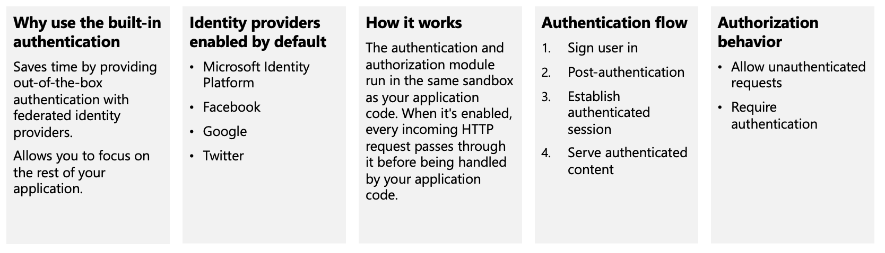
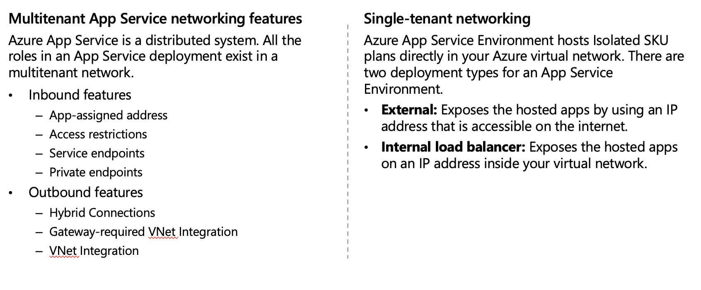
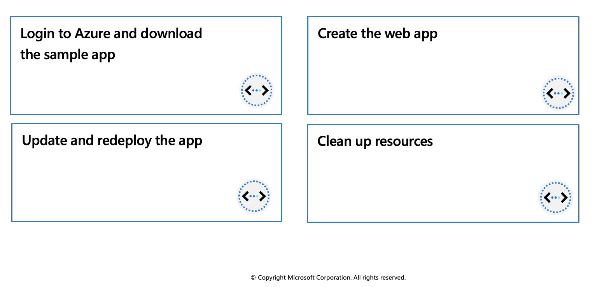

## Azure App Service

Azure App Service is an HTTP-based service for hosting web applications, REST APIs, and mobile back ends. You can develop in your favorite programming language, be it .NET, .NET Core, Java, Ruby, Node.js, PHP, or Python. Applications run and scale with ease on both Windows and Linux-based environments.


### Limitations

App Service on Linux does have some limitations:

 * App Service on Linux is not supported on Shared pricing tier.
 * You can't mix Windows and Linux apps in the same App Service plan.
 * Historically, you could not mix Windows and Linux apps in the same resource group. However, all resource groups created on or after January 21, 2021 do support this scenario. Support for resource groups created before January 21, 2021 will be rolled out across Azure regions (including National cloud regions) soon.
 * The Azure portal shows only features that currently work for Linux apps. As features are enabled, they're activated on the portal.

## Azure App Service plans

In App Service, an app (Web Apps, API Apps, or Mobile Apps) always runs in an App Service plan. An App Service plan defines a set of compute resources for a web app to run. One or more apps can be configured to run on the same computing resources (or in the same App Service plan). In addition, Azure Functions also has the option of running in an App Service plan.


Isolate your app into a new App Service plan when:

 * The app is resource-intensive.
 * You want to scale the app independently from the other apps in the existing plan.
 * The app needs resource in a different geographical region.

This way you can allocate a new set of resources for your app and gain greater control of your apps.

## Deploy to App Service

Every development team has unique requirements that can make implementing an efficient deployment pipeline difficult on any cloud service. App Service supports both automated and manual deployment.



## Authentication and authorization in App Service

Azure App Service provides built-in authentication and authorization support, so you can sign in users and access data by writing minimal or no code in your web app, API, and mobile back end, and also Azure Functions.


## App Service networking features

By default, apps hosted in App Service are accessible directly through the internet and can reach only internet-hosted endpoints. But for many applications, you need to control the inbound and outbound network traffic.

There are two main deployment types for Azure App Service. The multitenant public service hosts App Service plans in the Free, Shared, Basic, Standard, Premium, PremiumV2, and PremiumV3 pricing SKUs. There is also the single-tenant App Service Environment (ASE) hosts Isolated SKU App Service plans directly in your Azure virtual network.



## Exercise: Create a static HTML web app by using Azure Cloud Shell



In this exercise, you'll deploy a basic HTML+CSS site to Azure App Service by using the Azure CLI `az webapp up` command. You'll then update the code and redeploy it by using the same command.

The `az webapp up` command makes it easy to create and update web apps. When executed it performs the following actions:

* Create a default resource group if one isn't specified.
* Create a default app service plan.
* Create an app with the specified name.
* Zip deploy files from the current working directory to the web app.


### Prerequisites

  * An Azure account with an active subscription. If you don't already have one, [follow this instructions](https://docs.google.com/document/d/1XEkiGWUC4_AzngZQLQnVt8yWCb3dft1HzXglUnJcJzM/edit#heading=h.c96x7dxoz6ej).
   

### Login to Azure and start the Cloud Shell
1. Login to the [Azure Portal](https://portal.azure.com/) and open the Cloud Shell.


2. After the shell opens be sure to select the Bash environment.


### Download the sample app

In this section you'll use the sandbox to download the sample app and set variables to make some of the commands easier to enter.

1. In the sandbox create a directory and then navigate to it.

```azurecli-interactive
mkdir quickstart

cd $HOME/quickstart
```

2. Run the following `git` command to clone the sample app repository to your quickstart directory.

```azurecli-interactive
git clone https://github.com/Azure-Samples/html-docs-hello-world.git
```

3. Set variable to hold the app names by running the following commands.

```azurecli-interactive
appName=az204app$RANDOM
```

### Create the web app

1. Change to the directory that contains the sample code and run the `az webapp up` command.

```azurecli-interactive
cd html-docs-hello-world

az webapp up --location eastus -n $appName --html
```

The az webapp up command does the following actions:

 * Create a default resource group.
 * Create a default app service plan.
 * Create an app with the specified name.
 * Zip deploy files from the current working directory to the web app.

This command may take a few minutes to run. While running, it displays information similar to the example below.

```azurecli-interactive
{
"app_url": "https://<myAppName>.azurewebsites.net",
"location": "eastus",
"name": "<app_name>",
"os": "Windows",
"resourcegroup": "<resource_group_name>",
"serverfarm": "appsvc_asp_Windows_westeurope",
"sku": "FREE",
"src_path": "/home/<username>/demoHTML/html-docs-hello-world ",
< JSON data removed for brevity. >
}
```
> **Note**: Make a note of the `resourceGroup` value. You need it for the clean up resources section.

2. Open a new tab in your browser and navigate to the app URL (`https://<myAppName>.azurewebsites.net`) and verify the app is running - take note of the title at the top of the page. Leave the browser open on the app for the next section.


### Update and redeploy the app

1.In the Cloud Shell, type `code index.html` to open the editor. In the `<h1>` heading tag, change Azure App Service - Sample Static HTML Site to Azure App Service Updated - or to anything else that you'd like.

2. Use the commands ctrl-s to save and ctrl-q to exit.

3. Redeploy the app with the same az webapp up command you used earlier.

```azurecli-interactive
az webapp up -g $resourceGroup -n $appName --html
```

4. Once deployment is completed switch back to the browser from step 2 in the "Create the web app" section above and refresh the page.


### Clean up resources

You can now safely delete the `az204-vm-rg` resource group from your account by running the command below.

```azurecli-interactive
az group delete --name <resource_group_name>
```

> **Note**: This operation takes on average 5 - 10 minutes
