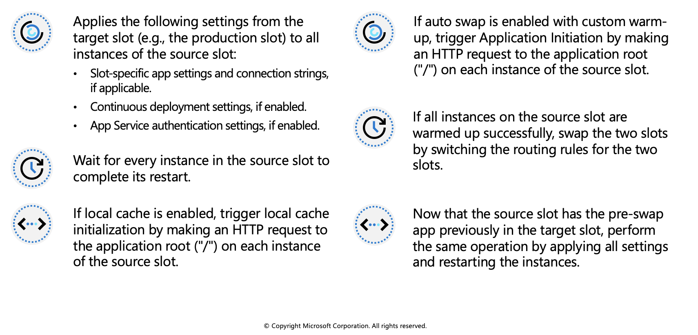
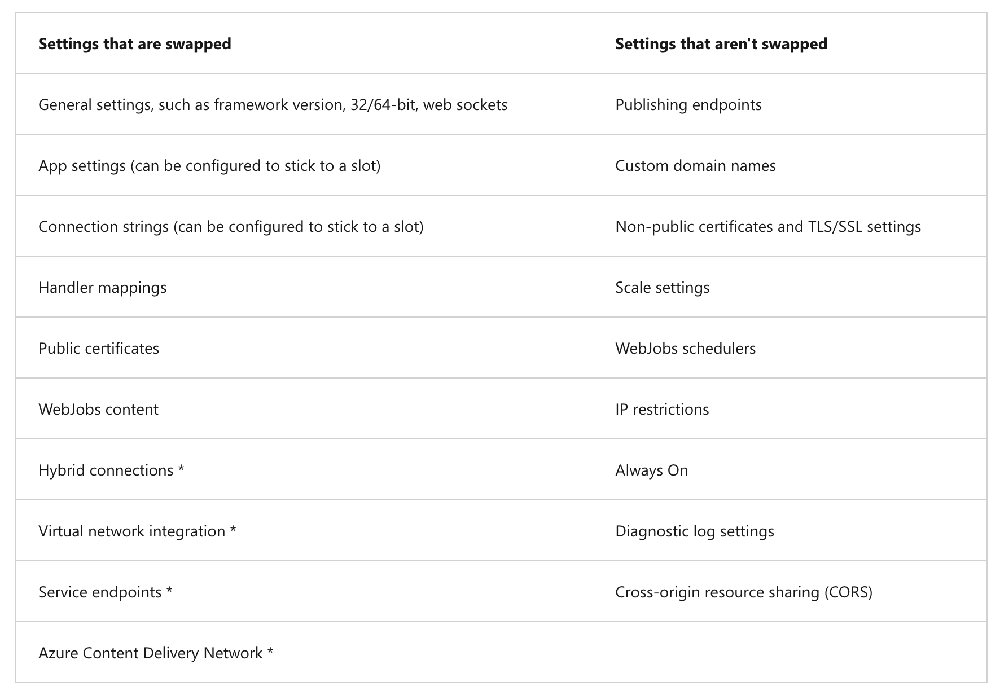
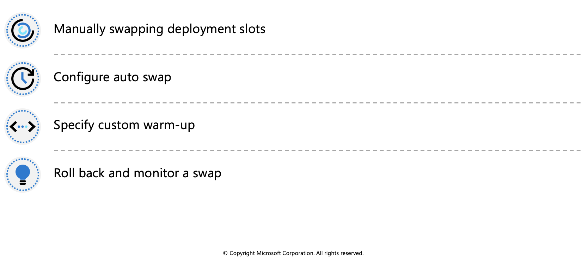
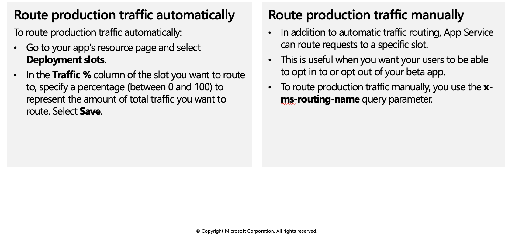

## Staging environments

When you deploy your web app, web app on Linux, mobile back end, or API app to Azure App Service, you can use a separate deployment slot instead of the default production slot when you're running in the **Standard**, **Premium**, or **Isolated** App Service plan tier. Deployment slots are live apps with their own host names. App content and configurations elements can be swapped between two deployment slots, including the production slot.

Deploying your application to a non-production slot has the following benefits:

 * You can validate app changes in a staging deployment slot before swapping it with the production slot.
 * Deploying an app to a slot first and swapping it into production makes sure that all instances of the slot are warmed up before being swapped into production. This eliminates downtime when you deploy your app. The traffic redirection is seamless, and no requests are dropped because of swap operations. You can automate this entire workflow by configuring auto swap when pre-swap validation isn't needed.
 * After a swap, the slot with previously staged app now has the previous production app. If the changes swapped into the production slot aren't as you expect, you can perform the same swap immediately to get your "last known good site" back.

 

## Slot swapping

When you swap slots (for example, from a staging slot to the production slot), App Service does the following to ensure that the target slot doesn't experience downtime:

At any point of the swap operation, all work of initializing the swapped apps happens on the source slot. The target slot remains online while the source slot is being prepared and warmed up, regardless of where the swap succeeds or fails. To swap a staging slot with the production slot, make sure that the production slot is always the target slot. This way, the swap operation doesn't affect your production app.

When you clone configuration from another deployment slot, the cloned configuration is editable. Some configuration elements follow the content across a swap (not slot specific), whereas other configuration elements stay in the same slot after a swap (slot specific). The following table shows the settings that change when you swap slots.

Features marked with an asterisk (*) are planned to be unswapped.

To configure an app setting or connection string to stick to a specific slot (not swapped), go to the Configuration page for that slot. Add or edit a setting, and then select **Deployment slot setting**. Selecting this check box tells App Service that the setting is not swappable.

 

## Swap deployment slots

You can swap deployment slots on your app's Deployment slots page and the Overview page. Before you swap an app from a deployment slot into production, make sure that production is your target slot and that all settings in the source slot are configured exactly as you want to have them in production.

### Manually swapping deployment slots

To swap deployment slots:

1. Go to your app's **Deployment slots** page and select **Swap**. The Swap dialog box shows settings in the selected source and target slots that will be changed.

2. Select the desired **Source** and **Target** slots. Usually, the target is the production slot. Also, select the **Source Changes** and **Target Changes** tabs and verify that the configuration changes are expected. When you're finished, you can swap the slots immediately by selecting **Swap**.

To see how your target slot would run with the new settings before the swap actually happens, don't select Swap, but follow the instructions in Swap with preview below.

3. When you're finished, close the dialog box by selecting Close.

### Configure auto swap

To configure auto swap:

1. Go to your app's resource page and select the deployment slot you want to configure to auto swap. The setting is on the **Configuration > General settings** page.

2. Set Auto swap enabled to On. Then select the desired target slot for Auto swap deployment slot, and select Save on the command bar.

3. Execute a code push to the source slot. Auto swap happens after a short time, and the update is reflected at your target slot's URL.

 

## Route traffic in App Service

By default, all client requests to the app's production URL (`http://<app_name>.azurewebsites.net`) are routed to the production slot. You can route a portion of the traffic to another slot. This feature is useful if you need user feedback for a new update, but you're not ready to release it to production.

