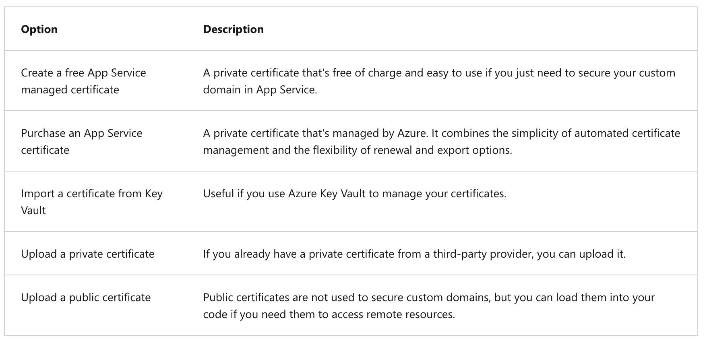
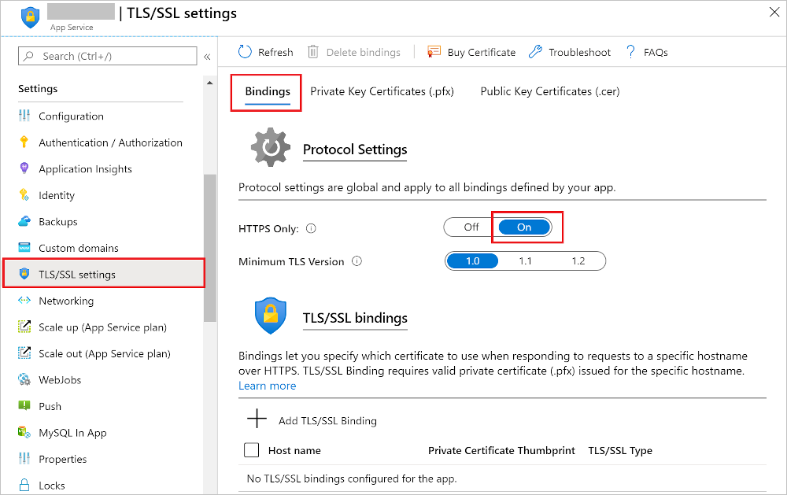

## Configure web app settings

In App Service, app settings are variables passed as environment variables to the application code. For Linux apps and custom containers, App Service passes app settings to the container using the `--env` flag to set the environment variable in the container.

Application settings can be accessed by navigating to your app's management page and selecting **Configuration > Application Settings.**


For ASP.NET and ASP.NET Core developers, setting app settings in App Service are like setting them in `<appSettings>` in Web.config or appsettings.json, but the values in App Service override the ones in Web.config or appsettings.json. You can keep development settings (for example, local MySQL password) in Web.config or appsettings.json, but production secrets (for example, Azure MySQL database password) safe in App Service. The same code uses your development settings when you debug locally, and it uses your production secrets when deployed to Azure.

App settings are always encrypted when stored (encrypted-at-rest).

### Adding and editing settings

To add a new app setting, click **New application setting**. If you are using deployment slots you can specify if your setting is swappable or not. In the dialog, you can stick the setting to the current slot.


To edit a setting, click the **Edit** button on the right side.

When finished, click **Update**. Don't forget to click Save back in the **Configuration page.**

### Editing application settings in bulk

To add or edit app settings in bulk, click the **Advanced** edit button. When finished, click **Update**. App settings have the following JSON formatting:

```azurecli-interactive
[
  {
    "name": "<key-1>",
    "value": "<value-1>",
    "slotSetting": false
  },
  {
    "name": "<key-2>",
    "value": "<value-2>",
    "slotSetting": false
  },
  ...
]
```

### Configure connection strings

For ASP.NET and ASP.NET Core developers, the values you set in App Service override the ones in Web.config. For other language stacks, it's better to use app settings instead, because connection strings require special formatting in the variable keys in order to access the values. Connection strings are always encrypted when stored (encrypted-at-rest).

Adding and editing connection strings follow the same principles as other app settings and they can also be tied to deployment slots. Below is an example of connection strings in JSON formatting that you would use for bulk adding or editing.

```azurecli-interactive
[
  {
    "name": "name-1",
    "value": "conn-string-1",
    "type": "SQLServer",
    "slotSetting": false
  },
  {
    "name": "name-2",
    "value": "conn-string-2",
    "type": "PostgreSQL",
    "slotSetting": false
  },
  ...
]
```

<br>

## Configure general settings

In the **Configuration > General settings** section you can configure some common settings for your app. Some settings require you to scale up to higher pricing tiers.

Below is a list of the currently available settings:


<br>

## Configure path mappings

In the **Configuration > Path mappings** section you can configure handler mappings, and virtual application and directory mappings. **The Path mappings** page will display different options based on the OS type.


<br>

## Enable diagnostic logging

There are built-in diagnostics to assist with debugging an App Service app. In this lesson, you will learn how to enable diagnostic logging and add instrumentation to your application, as well as how to access the information logged by Azure.

The table below shows the types of logging, the platforms supported, and where the logs can be stored and located for accessing the information.


### Enable application logging (Windows)

1. To enable application logging for Windows apps in the Azure portal, navigate to your app and select **App Service logs.**
2. Select **On** for either **Application Logging (Filesystem)** or **Application Logging (Blob)**, or both. The **Filesystem** option is for temporary debugging purposes, and turns itself off in 12 hours. The **Blob** option is for long-term logging, and needs a blob storage container to write logs to.
3. You can also set the **Level** of details.
4. When finished, select Save.

### Enable application logging (Linux/Container)

1. In **Application logging**, select **File System**.

2. In **Quota (MB)**, specify the disk quota for the application logs. In **Retention Period (Days)**, set the number of days the logs should be retained.

3. When finished, select **Save**.

### Enable web server logging

1. In **App Service logs** set the **Application logging** option to **File System**.

2. In **Quota (MB)**, specify the disk quota for the application logs. In **Retention Period (Days)**, set the number of days the logs should be retained.

3. When finished, select **Save**.

### Add log messages in code

In your application code, you use the usual logging facilities to send log messages to the application logs. For example:

 * ASP.NET applications can use the System.Diagnostics.Trace class to log information to the application diagnostics log. For example:

```azurecli-interactive
System.Diagnostics.Trace.TraceError("If you're seeing this, something bad happened");
```

 * By default, ASP.NET Core uses the `Microsoft.Extensions.Logging.AzureAppServices` logging provider.

### Stream logs

Before you stream logs in real time, enable the log type that you want. Any information written to files ending in .txt, .log, or .htm that are stored in the `/LogFiles` directory (`d:/home/logfiles`) is streamed by App Service.

* Azure Portal - To stream logs in the Azure portal, navigate to your app and select **Log stream**.

* Azure CLI - To stream logs live in Cloud Shell, use the following command:

```azurecli-interactive
az webapp log tail --name appname --resource-group myResourceGroup
```

* Local console - To stream logs in the local console, install Azure CLI and sign in to your account. Once signed in, follow the instructions for Azure CLI above.

### Access log files

If you configure the Azure Storage blobs option for a log type, you need a client tool that works with Azure Storage.

For logs stored in the App Service file system, the easiest way is to download the ZIP file in the browser at:

 * Linux/container apps: `https://<app-name>.scm.azurewebsites.net/api/logs/docker/zip`

 * Windows apps: `https://<app-name>.scm.azurewebsites.net/api/dump`

For Linux/container apps, the ZIP file contains console output logs for both the docker host and the docker container. For a scaled-out app, the ZIP file contains one set of logs for each instance. In the App Service file system, these log files are the contents of the /home/LogFiles directory.

<br>

## Configure security certificates

You have been asked to help secure information being transmitted between your companies app and the customer. Azure App Service has tools that let you create, upload, or import a private certificate or a public certificate into App Service.

A certificate uploaded into an app is stored in a deployment unit that is bound to the app service plan's resource group and region combination (internally called a webspace). This makes the certificate accessible to other apps in the same resource group and region combination.

The table below details the options you have for adding certificates in App Service:



### Enforce HTTPS

By default, anyone can still access your app using HTTP. You can redirect all HTTP requests to the HTTPS port by navigating to your app page and, in the left navigation, select **TLS/SSL settings**. Then, in **HTTPS Only**, select **On**.



<br>

## Manage app features

Feature management is a modern software-development practice that decouples feature release from code deployment and enables quick changes to feature availability on demand. It uses a technique called feature flags (also known as feature toggles, feature switches, and so on) to dynamically administer a feature's lifecycle.


