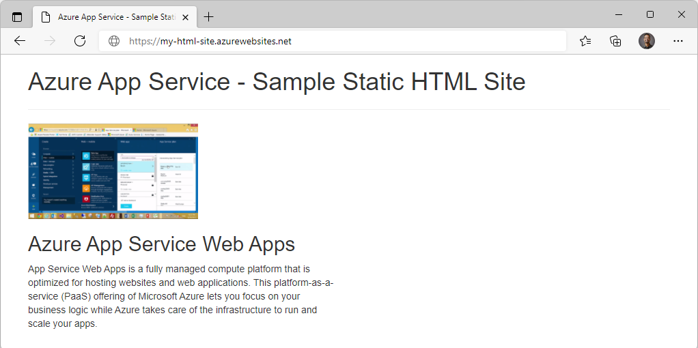

## Create Azure App Service Web Apps

## Configure web app settings

In App Service, app settings are variables passed as environment variables to the application code. For Linux apps and custom containers, App Service passes app settings to the container using the `--env` flag to set the environment variable in the container.

Application settings can be accessed by navigating to your app's management page and selecting **Configuration > Application Settings.**


For ASP.NET and ASP.NET Core developers, setting app settings in App Service are like setting them in `<appSettings>` in Web.config or appsettings.json, but the values in App Service override the ones in Web.config or appsettings.json. You can keep development settings (for example, local MySQL password) in Web.config or appsettings.json, but production secrets (for example, Azure MySQL database password) safe in App Service. The same code uses your development settings when you debug locally, and it uses your production secrets when deployed to Azure.

App settings are always encrypted when stored (encrypted-at-rest).

### Adding and editing settings

To add a new app setting, click **New application setting**. If you are using deployment slots you can specify if your setting is swappable or not. In the dialog, you can stick the setting to the current slot.


To edit a setting, click the **Edit** button on the right side.

When finished, click **Update**. Don't forget to click Save back in the **Configuration page.**

### Editing application settings in bulk

To add or edit app settings in bulk, click the **Advanced** edit button. When finished, click **Update**. App settings have the following JSON formatting:

```azurecli-interactive
[
  {
    "name": "<key-1>",
    "value": "<value-1>",
    "slotSetting": false
  },
  {
    "name": "<key-2>",
    "value": "<value-2>",
    "slotSetting": false
  },
  ...
]
```

### Configure connection strings

For ASP.NET and ASP.NET Core developers, the values you set in App Service override the ones in Web.config. For other language stacks, it's better to use app settings instead, because connection strings require special formatting in the variable keys in order to access the values. Connection strings are always encrypted when stored (encrypted-at-rest).

Adding and editing connection strings follow the same principles as other app settings and they can also be tied to deployment slots. Below is an example of connection strings in JSON formatting that you would use for bulk adding or editing.

```azurecli-interactive
[
  {
    "name": "name-1",
    "value": "conn-string-1",
    "type": "SQLServer",
    "slotSetting": false
  },
  {
    "name": "name-2",
    "value": "conn-string-2",
    "type": "PostgreSQL",
    "slotSetting": false
  },
  ...
]
```

## Exercise: Create a static HTML web app by using Azure Cloud Shell


In this exercise, you'll deploy a basic HTML+CSS site to Azure App Service by using the Azure CLI `az webapp up` command. You'll then update the code and redeploy it by using the same command.

The `az webapp up` command makes it easy to create and update web apps. When executed it performs the following actions:

* Create a default resource group if one isn't specified.
* Create a default app service plan.
* Create an app with the specified name.
* Zip deploy files from the current working directory to the web app.


### Prerequisites

  * An Azure account with an active subscription. If you don't already have one, [follow this instructions](https://docs.google.com/document/d/1XEkiGWUC4_AzngZQLQnVt8yWCb3dft1HzXglUnJcJzM/edit#heading=h.c96x7dxoz6ej).
   

### Login to Azure and start the Cloud Shell
1. Login to the [Azure Portal](https://portal.azure.com/) and open the Cloud Shell.


2. After the shell opens be sure to select the Bash environment.


### Download the sample app

In this section you'll use the sandbox to download the sample app and set variables to make some of the commands easier to enter.

1. In the sandbox create a directory and then navigate to it.

```azurecli-interactive
mkdir quickstart

cd $HOME/quickstart
```

2. Run the following `git` command to clone the sample app repository to your quickstart directory.

```azurecli-interactive
git clone https://github.com/Azure-Samples/html-docs-hello-world.git
```

3. Set variable to hold the app names by running the following commands.

```azurecli-interactive
appName=az204app$RANDOM
```

### Create the web app

1. Change to the directory that contains the sample code and run the `az webapp up` command.

```azurecli-interactive
cd html-docs-hello-world

az webapp up --location eastus -n $appName --html
```

The az webapp up command does the following actions:

 * Create a default resource group.
 * Create a default app service plan.
 * Create an app with the specified name.
 * Zip deploy files from the current working directory to the web app.

This command may take a few minutes to run. While running, it displays information similar to the example below.

```azurecli-interactive
{
"app_url": "https://<myAppName>.azurewebsites.net",
"location": "eastus",
"name": "<app_name>",
"os": "Windows",
"resourcegroup": "<resource_group_name>",
"serverfarm": "appsvc_asp_Windows_westeurope",
"sku": "FREE",
"src_path": "/home/<username>/demoHTML/html-docs-hello-world ",
< JSON data removed for brevity. >
}
```
> **Note**: Make a note of the `resourceGroup` value. You need it for the clean up resources section.

2. Open a new tab in your browser and navigate to the app URL (`https://<myAppName>.azurewebsites.net`) and verify the app is running - take note of the title at the top of the page. Leave the browser open on the app for the next section.



### Update and redeploy the app

1.In the Cloud Shell, type `code index.html` to open the editor. In the `<h1>` heading tag, change Azure App Service - Sample Static HTML Site to Azure App Service Updated - or to anything else that you'd like.

2. Use the commands ctrl-s to save and ctrl-q to exit.

3. Redeploy the app with the same az webapp up command you used earlier.

```azurecli-interactive
az webapp up -g $resourceGroup -n $appName --html
```

4. Once deployment is completed switch back to the browser from step 2 in the "Create the web app" section above and refresh the page.


### Clean up resources

You can now safely delete the `az204-vm-rg` resource group from your account by running the command below.

```azurecli-interactive
az group delete --name <resource_group_name>
```

> **Note**: This operation takes on average 5 - 10 minutes
