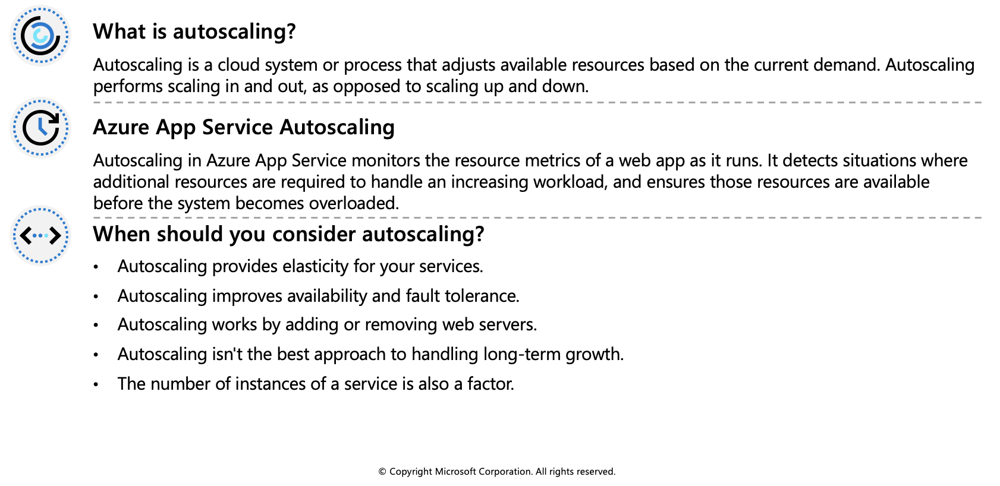
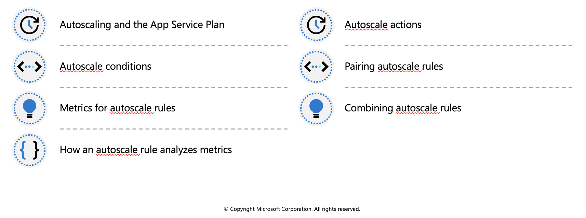
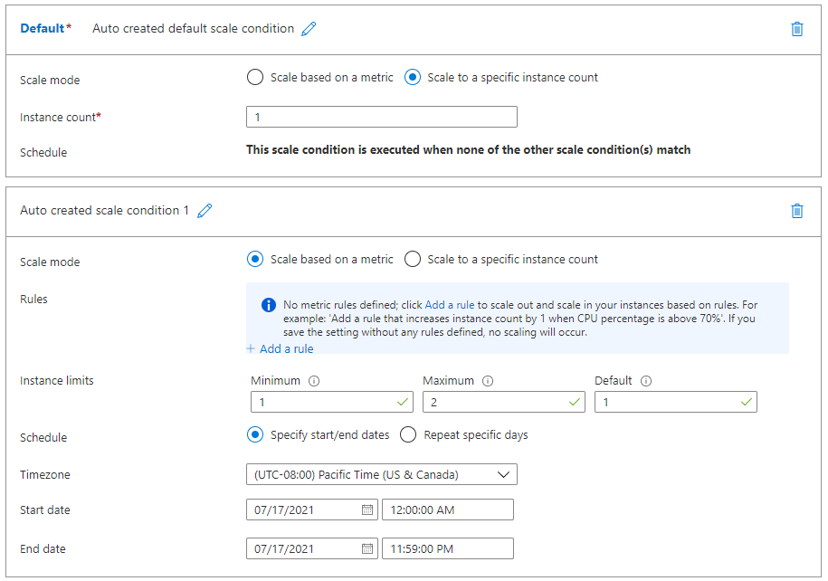
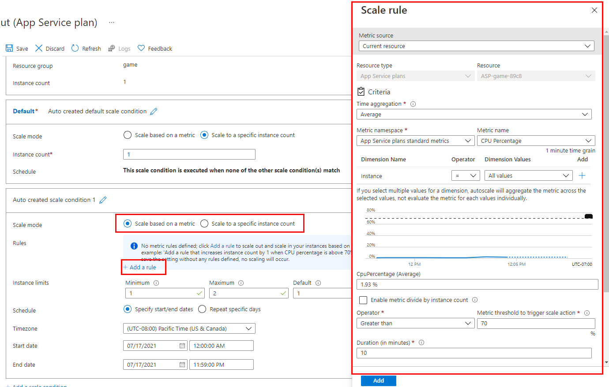
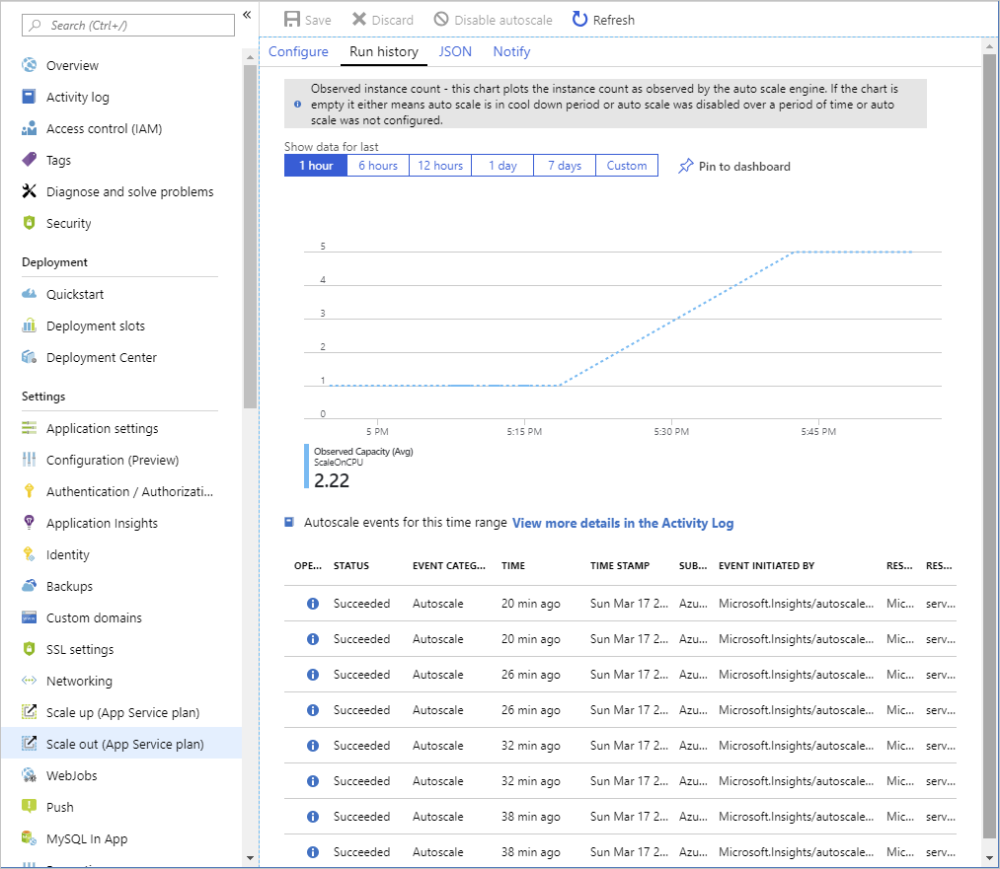
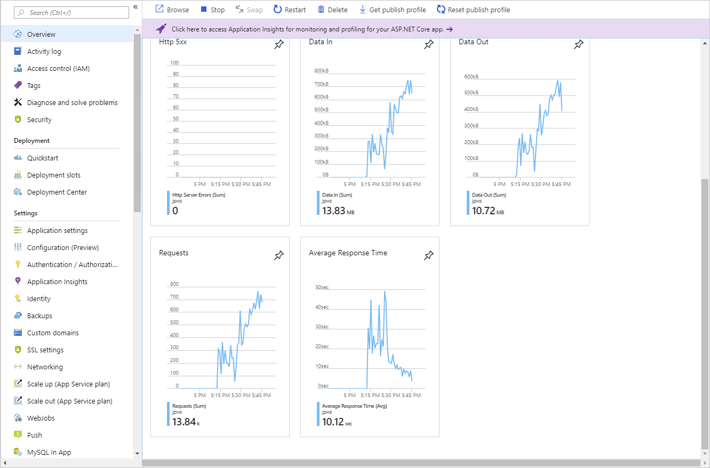
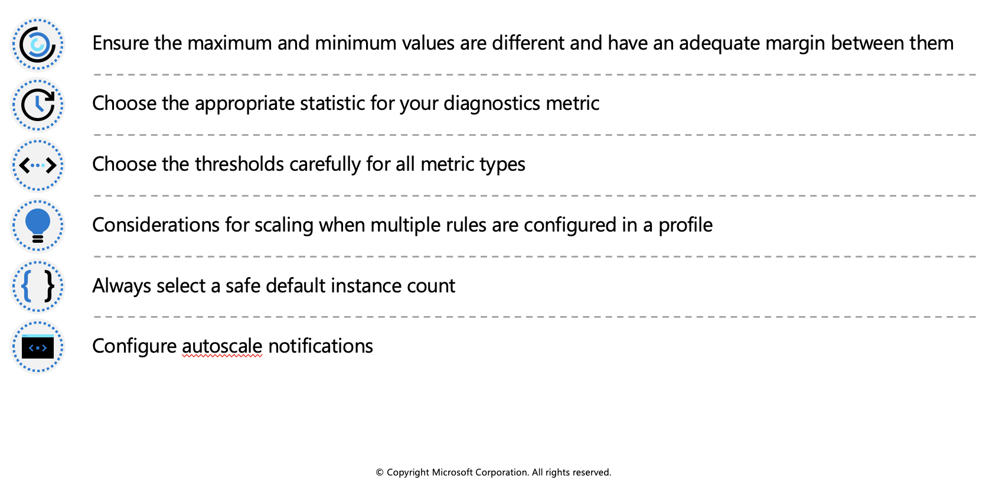

## Autoscale factors

Autoscaling can be triggered according to a schedule, or by assessing whether the system is running short on resources. For example, autoscaling could be triggered if CPU utilization grows, memory occupancy increases, the number of incoming requests to a service appears to be surging, or some combination of factors.

### Autoscaling rules

Autoscaling makes its decisions based on rules that you define. A rule specifies the threshold for a metric, and triggers an autoscale event when this threshold is crossed. Autoscaling can also deallocate resources when the workload has diminished.

Define your autoscaling rules carefully. For example, a Denial of Service attack will likely result in a large-scale influx of incoming traffic. Trying to handle a surge in requests caused by a DoS attack would be fruitless and expensive. These requests aren't genuine, and should be discarded rather than processed. A better solution is to implement detection and filtering of requests that occur during such an attack before they reach your service.

 

## Identify autoscale factors

Autoscaling enables you to specify the conditions under which a web app should be scaled out, and back in again. Effective autoscaling ensures sufficient resources are available to handle large volumes of requests at peak times, while managing costs when the demand drops.

### Autoscale conditions

You indicate how to autoscale by creating autoscale conditions. Azure provides two options for autoscaling:

 * Scale based on a metric, such as the length of the disk queue, or the number of HTTP requests awaiting processing.
 * Scale to a specific instance count according to a schedule. For example, you can arrange to scale out at a particular time of day, or on a specific date or day of the week. You also specify an end date, and the system will scale back in at this time.

### Metrics for autoscale rules

Autoscaling by metric requires that you define one or more autoscale rules. An autoscale rule specifies a metric to monitor, and how autoscaling should respond when this metric crosses a defined threshold. The metrics you can monitor for a web app are:

 * **CPU Percentage**. This metric is an indication of the CPU utilization across all instances. A high value shows that instances are becoming CPU-bound, which could cause delays in processing client requests.
 * **Memory Percentage**. This metric captures the memory occupancy of the application across all instances. A high value indicates that free memory could be running low, and could cause one or more instances to fail.
 * **Disk Queue Length**. This metric is a measure of the number of outstanding I/O requests across all instances. A high value means that disk contention could be occurring.
 * **Http Queue Length**. This metric shows how many client requests are waiting for processing by the web app. If this number is large, client requests might fail with HTTP 408 (Timeout) errors.
 * **Data In**. This metric is the number of bytes received across all instances.
 * **Data Out**. This metric is the number of bytes sent by all instances.

### Combining autoscale rules

A single autoscale condition can contain several autoscale rules (for example, a scale-out rule and the corresponding scale-in rule). However, the autoscale rules in an autoscale condition don't have to be directly related. You could define the following four rules in the same autoscale condition:

 * If the HTTP queue length exceeds 10, scale out by 1
 * If the CPU utilization exceeds 70%, scale out by 1
 * If the HTTP queue length is zero, scale in by 1
 * If the CPU utilization drops below 50%, scale in by 1

 

## Enable autoscale in App Service

To get started with autoscaling navigate to your App Service plan in the Azure portal and select Scale out (App Service plan) in the Settings group in the left navigation pane.

By default, an App Service Plan only implements manual scaling. Selecting **Custom autoscale** reveals condition groups you can use to manage your scale settings.

### Add scale conditions

Once you enable autoscaling, you can edit the automatically created default scale condition, and you can add your own custom scale conditions. Remember that each scale condition can either scale based on a metric, or scale to a specific instance count.

The Default scale condition is executed when none of the other scale conditions are active.

A metric-based scale condition can also specify the minimum and maximum number of instances to create. The maximum number can't exceed the limits defined by the pricing tier. Additionally, all scale conditions other than the default may include a schedule indicating when the condition should be applied.

### Create scale rules

A metric-based scale condition contains one or more scale rules. You use the **Add a rule** link to add your own custom rules. You define the criteria that indicate when a rule should trigger an autoscale action, and the autoscale action to be performed (scale out or scale in) using the metrics, aggregations, operators, and thresholds described earlier.

### Monitor autoscaling activity

The Azure portal enables you to track when autoscaling has occurred through the **Run history** chart. This chart shows how the number of instances varies over time, and which autoscale conditions caused each change.

You can use the **Run history** chart in conjunction with the metrics shown on the **Overview** page to correlate the autoscaling events with resource utilization.

 

## Autoscale best practices

