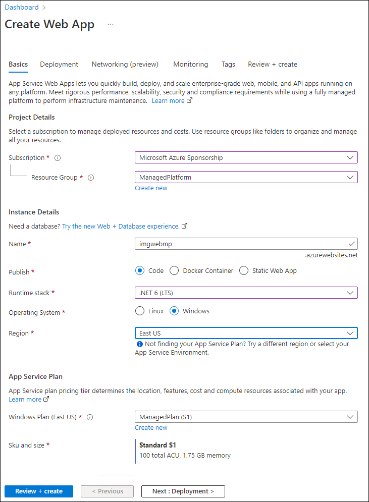

## Lab 2: Build a front-end web application by using Azure Web Apps

### Task 1: Create a web app

1. On the Azure portal's **navigation** pane, select **Create a resource**.

1. On the **Create a resource** blade, in the **Search services and marketplace** text box, enter **Web App**, and then select Enter.

1. On the **Marketplace** search results blade, select **Web App**.

1. On the **Web App** blade, select **Create**.

1. On the **Create Web App** blade, on the **Basics** tab, perform the following actions, and then select the **Monitoring** tab:

   | Setting | Action |
   | -- | -- |
   | **Subscription** drop-down list | Retain the default value |
   | **Resource group** section | Select **ManagedPlatform** |
   | **Name** text box | Enter **imgweb**_[yourname]_ |
   | **Publish** section | Select **Code** |
   | **Runtime stack** drop-down list | Select **.NET 6 (LTS)** |
   | **Operating System** section | Select **Windows** |
   | **Region** drop-down list | Select the **East US** region |
   | **Windows Plan (East US)** section | Select **ManagedPlan (S1)** |

The following screenshot displays the configured settings on the **Create web app** blade.

   

1. On the **Monitoring** tab, in the **Enable Application Insights** section, select **No**, and then select **Review + create**.

1. From the **Review + create** tab, review the options that you selected during the previous steps.

1. Select **Create** to create the web app by using your specified configuration. 

   > **Note**: Wait for the creation task to complete before you continue with this lab.

1. On the **Overview** blade, select the **Go to resource** button to navigate to the blade of the newly created web app.

### Task 2: Configure a web app

1. On the **App Service** blade, in the **Settings** section, select the **Configuration** link.

1. In the **Configuration** section, perform the following actions, select **Save**, and then select **Continue**:

    | Setting | Action |
    | -- | -- |
    | **Application settings** tab | Select **New application setting** |
    | **Add/Edit application setting** pop-up dialog | In the **Name** text box, enter **ApiUrl** |
    | **Value** text box | Enter the web app URL that you copied previously in this lab. **Note**: Make sure you include the protocol **https://**, in the URL that you copy into the **Value** text box for this application setting |
    | **Deployment slot setting** text box | Retain the default value, and then select **OK** |

    > **Note**: Wait for the application settings to save before you continue with this lab.

### Task 3: Deploy an `ASP.NET` web application to Web Apps

1. On the taskbar, select the **Visual Studio Code** icon.

1. On the **File** menu, select **Open Folder**.

1. In the **File Explorer** window, browse to **Allfiles (F):\\Allfiles\\Labs\\01\\Starter\\Web**, and then select **Select Folder**.

    > **Note**: Ignore any prompts to add required assets to build and debug and to run the restore command to address unresolved dependencies.

1. On the **Explorer** pane of the **Visual Studio Code** window, expand the **Pages** folder, and then select the **Index.cshtml.cs** file to open the file in the editor.

1. In the editor, in the **IndexModel** class on line 30, observe the **OnGetAsync** method and the code used to retrieve the list of images from the API.

1. In the **IndexModel** class on line 41, observe the **OnPostAsync** method and the code used to stream an uploaded image to the backend API.

1. On the taskbar, select the **Windows Terminal** icon.

1. At the open command prompt, enter the following command, and then select Enter to sign in to the Azure CLI:

    ```
    az login
    ```

1. In the **Microsoft Edge** browser window, enter the email address and password for your Microsoft account, and then select **Sign in**.

1. Return to the currently open Windows Terminal **Command Prompt** window. Wait for the sign-in process to finish.

1. Enter the following command, and then select Enter to list all the apps in your **ManagedPlatform** resource group:

    ```
    az webapp list --resource-group ManagedPlatform
    ```

1. Enter the following command, and then select Enter to find the apps that have the **imgweb\*** prefix:

    ```
    az webapp list --resource-group ManagedPlatform --query "[?starts_with(name, 'imgweb')]"
    ```

1. Enter the following command, and then select Enter to render only the name of the single app that has the **imgweb\*** prefix:

    ```
    az webapp list --resource-group ManagedPlatform --query "[?starts_with(name, 'imgweb')].{Name:name}" --output tsv
    ```

1. Enter the following command, and then select Enter to change the current directory to the **Allfiles (F):\\Allfiles\\Labs\\01\\Starter\\Web** directory that contains the lab files:

    ```
    cd F:\Allfiles\Labs\01\Starter\Web\
    ```

1. Enter the following command, and then select Enter to deploy the **web.zip** file to the web app that you created previously in this lab:

    ```
    az webapp deployment source config-zip --resource-group ManagedPlatform --src web.zip --name <name-of-your-web-app>
    ```

    > **Note**: Replace the *\<name-of-your-web-app\>* placeholder with the name of the web app that you created previously in this lab. You recently queried this app’s name in the previous steps.

    Wait for the deployment to complete before you continue with this lab.

1. On the Azure portal's **navigation** pane, select **Resource groups**.

1. On the **Resource groups** blade, select the **ManagedPlatform** resource group that you created previously in this lab.

1. On the **ManagedPlatform** blade, select the **imgweb**_[yourname]_ web app that you created previously in this lab.

1. On the **App Service** blade, select **Browse**.

1. Observe the list of images in the gallery. The gallery should list a single image that was uploaded to Storage previously in the lab.

1. In the **Contoso Photo Gallery** webpage, in the **Upload a new image** section, perform the following actions:

    a.  Select **Browse**.

    b.  In the **File Explorer** window, browse to **Allfiles (F):\\Allfiles\\Labs\\01\\Starter\\Images**, select the **bahnmi.jpg** file, and then select **Open**.

    c.  Select **Upload**.

1. Observe that the list of gallery images has updated with your new image.

    > **Note**: In some rare cases, you might need to refresh your browser window to retrieve the new image.

1. Return to the browser window that contains the Azure portal.

1. Close the currently running Visual Studio Code and Windows Terminal applications.

## Review

In this exercise, you created an Azure web app and deployed an existing web application’s code to the resource in the cloud.
