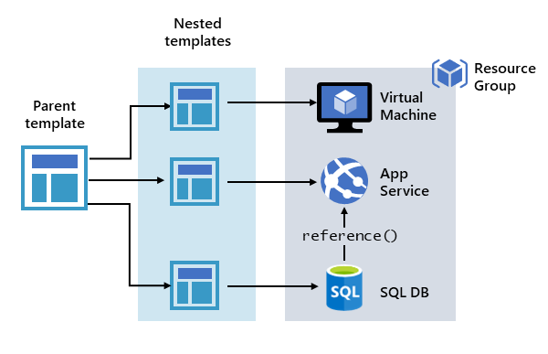
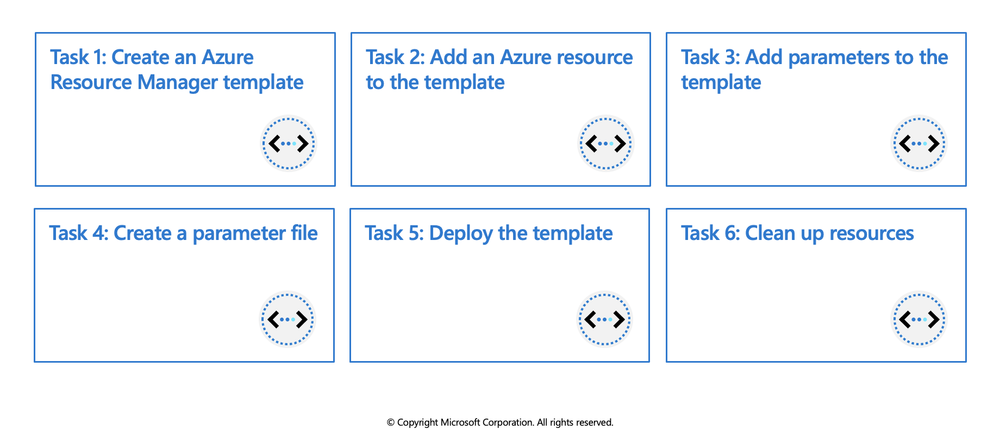
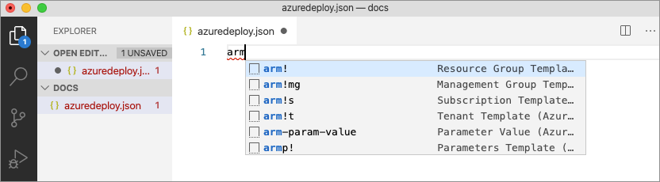

## Create and deploy Azure Resource Manager templates

### ARM Template: Azure Resource Manager Template

ARM (Azure Resource Manager) template is a block of code that defines the infrastructure and configuration for your project. These templates use a declarative syntax to let you define your deployment in the form of JSON (JavaScript Object Notation) files. All the resources and their properties are defined in this template. This helps in automating the deployment process in a constant flow.


### Explore Azure Resource Manager

When a user sends a request from any of the Azure tools, APIs, or SDKs, Resource Manager receives the request. It authenticates and authorizes the request. Resource Manager sends the request to the Azure service, which takes the requested action. Because all requests are handled through the same API, you see consistent results and capabilities in all the different tools.

The following image shows the role Azure Resource Manager plays in handling Azure requests.


### Why choose Azure Resource Manager templates?

If you're trying to decide between using Azure Resource Manager templates and one of the other infrastructure as code services, consider the following advantages of using templates:

   * **Declarative syntax:** Azure Resource Manager templates allow you to create and deploy an entire Azure infrastructure declaratively. For example, you can deploy not only virtual machines, but also the network infrastructure, storage systems, and any other resources you may need.

   * **Repeatable results:** Repeatedly deploy your infrastructure throughout the development lifecycle and have confidence your resources are deployed in a consistent manner. Templates are idempotent, which means you can deploy the same template many times and get the same resource types in the same state. You can develop one template that represents the desired state, rather than developing lots of separate templates to represent updates.

   * **Orchestration:** You don't have to worry about the complexities of ordering operations. Resource Manager orchestrates the deployment of interdependent resources so they're created in the correct order. When possible, Resource Manager deploys resources in parallel so your deployments finish faster than serial deployments. You deploy the template through one command, rather than through multiple imperative commands.
   
### Template file

Within your template, you can write template expressions that extend the capabilities of JSON. These expressions make use of the [functions](https://learn.microsoft.com/en-us/azure/azure-resource-manager/templates/template-functions) provided by Resource Manager.

The template has the following sections:

   * Parameters - Provide values during deployment that allow the same template to be used with different environments.

   * Variables - Define values that are reused in your templates. They can be constructed from parameter values.

   * User-defined functions - Create customized functions that simplify your template.

   * Resources- Specify the resources to deploy.

   * Outputs - Return values from the deployed resources.


### Parameters

Parameters in a templates define the configuration. These parameters are used in run time or during deployment. In a parameter, we need to define the name, type, values and properties. We can also set some allowed values and default values to the parameters, so when a value is not passed during deployment, then the default or allowed values will be used. Below is an example of parameters that defines the type and the default value of username and password for the VM (Virtual Machine).

```azurecli-interactive
"parameters": {
 "adminUsername": {
  "type": "string",
  "defaultValue": "Admin",
  "metadata": {
   "description": "Username for the Virtual Machine."
    }
  },
  "adminPassword": {
   "type": "securestring",
   "defaultValue": "12345",
   "metadata": {
    "description": "Password for the Virtual Machine."
    }
  }
}
```

### Variables

Variables define values used throughout the template. In simple words, you can define a short name for a specific value that can be used anywhere in the template. Variables also become an advantage when you want to update all the values and reference in a template. Then you can update the variable and its value only.

```azurecli-interactive
"variables": {
 "nicName": "myVMNic",
 "addressPrefix": "10.0.0.0/16",
 "subnetName": "Subnet",
 "subnetPrefix": "10.0.0.0/24",
 "publicIPAddressName": "myPublicIP",
 "virtualNetworkName": "MyVNet"
}
```

### Functions

In a template, the function contains the steps and procedures to be followed. It is just like a variable that defines the steps performed when called in a templates. The below example of the function defines the unique name for the resources.

```azurecli-interactive
"functions": [
 {
  "namespace": "contoso",
  "members": {
   "uniqueName": {
    "parameters": [
      {
       "name": "namePrefix",
       "type": "string"
      }
    ],
    "output": {
     "type": "string",
     "value": "[concat(toLower(parameters('namePrefix')), uniqueString(resourceGroup().id))]"
         }
       }
     }}],
```

### Resources

All the azure resources are defined here that makes the deployment. For creating a resource, we need to set up the type, name, location, version and properties of the resource that needs to be deployed. We can also use the variables and parameters here that are defined in the ‘variables’ section. Below is the example of declaring the resources in a templates.


```azurecli-interactive
"resources": [
 {
  "type": "Microsoft.Network/publicIPAddresses",
  "name": "[variables('publicIPAddressName')]",
  "location": "[parameters('location')]",
  "apiVersion": "2018-08-01",
  "properties": {
    "publicIPAllocationMethod": "Dynamic",
    "dnsSettings": {
    "domainNameLabel": "[parameters('dnsLabelPrefix')]"
    }
  }
}
],
```

### Outputs

Output defines the result that you want to see when a template runs. In simple words, the final words that you want to see when a template is successfully deployed. In the below example, the hostname with a value fetched from the public IP address name.

```azurecli-interactive
"outputs": {
 "hostname": {
  "type": "string",
  "value": "[reference(variables('publicIPAddressName')).dnsSettings.fqdn]"
 }
}
```


### Deploy multi-tiered solutions

With Resource Manager, you can create a template (in JSON format) that defines the infrastructure and configuration of your Azure solution. By using a template, you can repeatedly deploy your solution throughout its lifecycle and have confidence your resources are deployed in a consistent state.

When you deploy a template, Resource Manager converts the template into REST API operations. For example, when Resource Manager receives a template with the following resource definition:

```azurecli-interactive
"resources": [
  {
    "type": "Microsoft.Storage/storageAccounts",
    "apiVersion": "2019-04-01",
    "name": "mystorageaccount",
    "location": "westus",
    "sku": {
      "name": "Standard_LRS"
    },
    "kind": "StorageV2",
    "properties": {}
  }
]
```

It converts the definition to the following REST API operation, which is sent to the `Microsoft.Storage` resource provider:

```azurecli-interactive
PUT
https://management.azure.com/subscriptions/{subscriptionId}/resourceGroups/{resourceGroupName}/providers/Microsoft.Storage/storageAccounts/mystorageaccount?api-version=2019-04-01
REQUEST BODY
{
  "location": "westus",
  "sku": {
    "name": "Standard_LRS"
  },
  "kind": "StorageV2",
  "properties": {}
}
```

Notice that the apiVersion you set in the template for the resource is used as the API version for the REST operation. You can repeatedly deploy the template and have confidence it will continue to work. By using the same API version, you don't have to worry about breaking changes that might be introduced in later versions.

You can deploy a template using any of the following options:

   * Azure portal
   * Azure CLI
   * PowerShell
   * REST API
   * Button in GitHub repository
   * Azure Cloud Shell

### Defining multi-tiered templates
How you define templates and resource groups is entirely up to you and how you want to manage your solution. For example, you can deploy a three tier application through a single template to a single resource group.


But, you don't have to define your entire infrastructure in a single template. Often, it makes sense to divide your deployment requirements into a set of targeted, purpose-specific templates. You can easily reuse these templates for different solutions. To deploy a particular solution, you create a master template that links all the required templates. The following image shows how to deploy a three tier solution through a parent template that includes three nested templates.



If you envision your tiers having separate lifecycles, you can deploy your three tiers to separate resource groups. The resources can still be linked to resources in other resource groups.

Azure Resource Manager analyzes dependencies to ensure resources are created in the correct order. If one resource relies on a value from another resource (such as a virtual machine needing a storage account for disks), you set a dependency. For more information, see Defining dependencies in Azure Resource Manager templates.

You can also use the template for updates to the infrastructure. For example, you can add a resource to your solution and add configuration rules for the resources that are already deployed. If the template specifies creating a resource but that resource already exists, Azure Resource Manager performs an update instead of creating a new asset. Azure Resource Manager updates the existing asset to the same state as it would be as new.

Resource Manager provides extensions for scenarios when you need additional operations such as installing particular software that isn't included in the setup. If you're already using a configuration management service, like DSC, Chef or Puppet, you can continue working with that service by using extensions.

Finally, the template becomes part of the source code for your app. You can check it in to your source code repository and update it as your app evolves. You can edit the template through Visual Studio.

### Share templates

After creating your template, you may wish to share it with other users in your organization. [Template specs](https://learn.microsoft.com/en-us/azure/azure-resource-manager/templates/template-specs) enable you to store a template as a resource type. You use role-based access control to manage access to the template spec. Users with read access to the template spec can deploy it, but not change the template.

This approach means you can safely share templates that meet your organization's standards.

---
<br>

# Exercise: Create and deploy Azure Resource Manager templates by using Visual Studio Code



In this exercise you will learn how to use Visual Studio Code, and the Azure Resource Manager Tools extension, to create and edit Azure Resource Manager templates.

 * Create an Azure Resource Manager template
 * Add an Azure resource to the template
 * Add parameters to the template
 * Create a parameter file
 * Deploy the template
 * Clean up resources


## Prerequisites

  * An Azure account with an active subscription. If you don't already have one, [follow this instructions](https://docs.google.com/document/d/1XEkiGWUC4_AzngZQLQnVt8yWCb3dft1HzXglUnJcJzM/edit#heading=h.c96x7dxoz6ej).
  * [Visual Studio Code](https://code.visualstudio.com/) with the [Azure Resource Manager Tools](https://marketplace.visualstudio.com/items?itemName=msazurermtools.azurerm-vscode-tools) installed.
  * [Azure CLI](https://learn.microsoft.com/en-us/cli/azure/) installed locally
   

## Create an Azure Resource Manager template

1. Create and open a new file named `azuredeploy.json` with Visual Studio Code.

2. Enter **arm** in the azuredeploy.json file and select **arm!** from the autocomplete options. This will insert a snippet with the basic building blocks for an Azure resource group deployment.



Your file should contain something similar to the example below.

```azurecli-interactive
{
    "$schema": "https://schema.management.azure.com/schemas/2019-04-01/deploymentTemplate.json#",
    "contentVersion": "1.0.0.0",
    "parameters": {},
    "functions": [],
    "variables": {},
    "resources": [],
    "outputs": {}
}
```

## Add an Azure resource to the template

In this section you will add a snippet to support the creation of an Azure storage account to the template.

Place the cursor in the template `resources` block, type in `storage`, and select the **arm-storage** snippet.


The `resources` block should look similar to the example below.


```azurecli-interactive
"resources": [{
    "name": "storageaccount1",
    "type": "Microsoft.Storage/storageAccounts",
    "apiVersion": "2019-06-01",
    "tags": {
        "displayName": "storageaccount1"
    },
    "location": "[resourceGroup().location]",
    "kind": "StorageV2",
    "sku": {
        "name": "Premium_LRS",
        "tier": "Premium"
    }
}],
```

## Add parameters to the template

Now you will create and use a parameter to specify the storage account name.

Place your cursor in the parameters block, add a carriage return, type `"`, and then select the `new-parameter` snippet. This action adds a generic parameter to the template.


Make the following changes to the new parameter you just added:

1. Update the name of the parameter to `storageAccountName` and the description to `Storage Account Name`.

2. Azure storage account names have a minimum length of 3 characters and a maximum of 24. Add both `minLength` and `maxLength` to the parameter and provide appropriate values.

The `parameters` block should look similar to the example below.

```azurecli-interactive
"parameters": {
    "storageAccountName": {
        "type": "string",
        "metadata": {
            "description": "Storage Account Name"
        },
        "minLength": 3,
        "maxLength": 24
    }
},
```

Follow the steps below to update the name property of the storage resource to use the parameter.

1. In the `resources` block, delete the current default name which is `storageaccount1` in the examples above. Leave the quotes (`""`) around the name in place.

2. Enter a square bracket `[`, which produces a list of Azure Resource Manager template functions. Select parameters from the list.

3. Add `()` at the end of parameters and select storageAccountName from the pop-up. If the list of parameters does not show up automatically you can enter a single quote `'` inside of the round brackets to display the list.

The resources block of the template should now be similar to the example below.

```azurecli-interactive
"resources": [{
    "name": "[parameters('storageAccountName')]",
    "type": "Microsoft.Storage/storageAccounts",
    "apiVersion": "2019-06-01",
    "tags": {
        "displayName": "storageaccount1"
    },
    "location": "[resourceGroup().location]",
    "kind": "StorageV2",
    "sku": {
        "name": "Premium_LRS",
        "tier": "Premium"
    }
}],
```

## Create a parameter file

An Azure Resource Manager template parameter file allows you to store environment-specific parameter values and pass these values in as a group at deployment time. This is useful if you want to have values specific to a test or production environment, for example. The extension makes it easy to create a parameter file that is mapped to your existing template. Follow the steps below to create a parameter file.

1. With the azuredeploy.json file in focus open the Command Palette by selecting View > Command Palette from the menu bar.

2. In the Command Palette enter "parameter" in the search bar and select Azure Resource Manager Tools:Select/Create Parameter File.

   

3. A new dialog box will open at the top of the editor. From those options select New, then select All Parameters. Accept the default name for the new file.

4. Edit the `value` parameter and type in a name that meets the naming requirements. The azuredeploy.parameters.json file should be similar to the example below.

```azurecli-interactive
{
    "$schema": "https://schema.management.azure.com/schemas/2019-04-01/deploymentParameters.json#",
    "contentVersion": "1.0.0.0",
    "parameters": {
        "storageAccountName": {
            "value": "az204storageacctarm" 
        }
    }
}
```

## Deploy the template

It's time to deploy the template. Follow the steps below, in the VS Code terminal, to connect to Azure and deploy the new storage account resource.

1. Connect to Azure by using the `az login` command.

```azurecli-interactive
az login
```
   
2. Create a resource group to contain the new resource. 
 
```azurecli-interactive
az group create --name az204-arm-rg --location eastus
```

3. Use the `az deployment group create` command to deploy your template. The deployment will take a few minutes to complete, progress will be shown in the terminal.
 
```azurecli-interactive
az  deployment group create --resource-group az204-arm-rg --template-file azuredeploy.json --parameters azuredeploy.parameters.json
```

4. You can verify the deployment by running the command below. Replace `<myStorageAccount>` with the name you used earlier.
 
```azurecli-interactive
az storage account show --resource-group az204-arm-rg --name <myStorageAccount>
```

## Clean up resources

When the Azure resources are no longer needed use the Azure CLI command below to delete the resource group.

```azurecli-interactive
az group delete --name az204-arm-rg --no-wait
```
> **Note**: This operation takes on average 5 - 10 minutes
