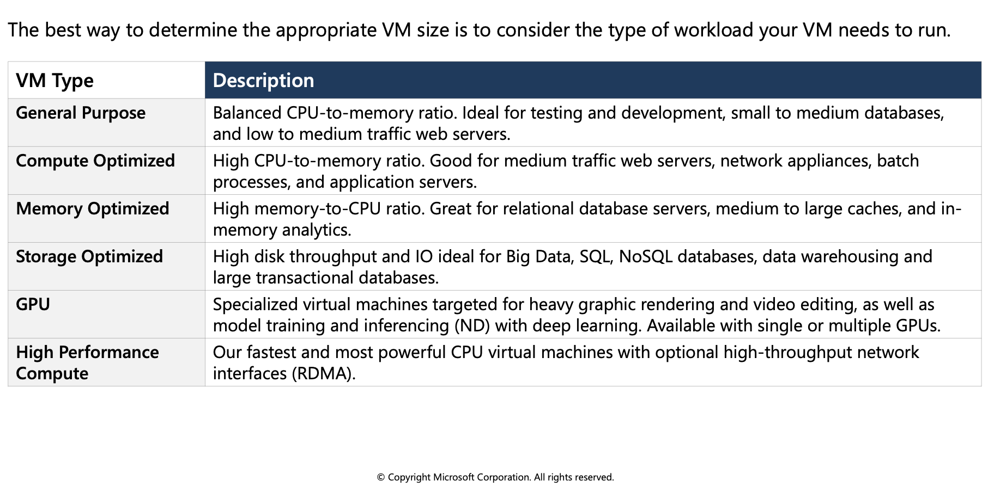
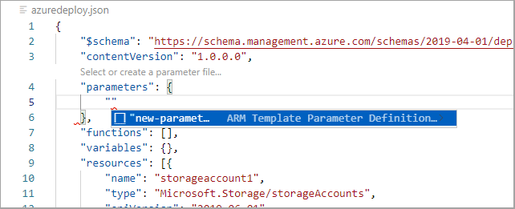

## Create and deploy Azure Resource Manager templates

### ARM Template: Azure Resource Manager Template

ARM (Azure Resource Manager) template is a block of code that defines the infrastructure and configuration for your project. These templates use a declarative syntax to let you define your deployment in the form of JSON (JavaScript Object Notation) files. All the resources and their properties are defined in this template. This helps in automating the deployment process in a constant flow.


#### Azure virtual machines can be used in various ways. Some examples are:

* **Development and test** – Azure VMs offer a quick and easy way to create a computer with specific configurations required to code and test an application.
* **Applications in the cloud** – Because demand for your application can fluctuate, it might make economic sense to run it on a VM in Azure.
* **Extended datacenter** – Virtual machines in an Azure virtual network can easily be connected to your organization’s network.

#### Design considerations for virtual machine creation:
* **Availability:** Azure supports a single instance virtual machine Service Level Agreement of 99.9% provided you deploy the VM with premium storage for all disks.
* **VM size:** The size of the VM that you use is determined by the workload that you want to run. The size that you choose then determines factors such as processing power, memory, and storage capacity.
* **VM limits:** Your subscription has default quota limits in place that could impact the deployment of many VMs for your project.
* **VM image:** You can either use your own image, or you can use one of the images in the Azure Marketplace.
* **VM disks:** There are two components that make up this area. The type of disks which determines the performance level and the storage account type that contains the disks. Azure provides two types of disks:
Standard disks: Backed by HDDs, and delivers cost-effective storage while still being performant. Standard disks are ideal for a cost effective dev and test workload.
  * **Premium disks:** Backed by SSD-based, high-performance, low-latency disk. Perfect for VMs running production workload.
And, there are two options for the disk storage:
  * **Managed disks:** Managed disks are the newer and recommended disk storage model and they are managed by Azure.
  * **Unmanaged disks:** With unmanaged disks, you’re responsible for the storage accounts that hold the virtual hard disks (VHDs) that correspond to your VM disks.

#### Virtual machine extensions

Windows VMs have extensions which give your VM additional capabilities through post deployment configuration and automated tasks.

* **Run custom scripts:** The Custom Script Extension helps you configure workloads on the VM by running your script when the VM is provisioned.
* **Deploy and manage configurations:** The PowerShell Desired State Configuration (DSC) Extension helps you set up DSC on a VM to manage configurations and environments.
* **Collect diagnostics data:** The Azure Diagnostics Extension helps you configure the VM to collect diagnostics data that can be used to monitor the health of your application.

For Linux VMs, Azure supports cloud-init across most Linux distributions that support it and works with all the major automation tooling like Ansible, Chef, SaltStack, and Puppet.
<br>
<br> 


#### Availability zones
* A physically separate zone, within an Azure region. There are three Availability Zones per supported Azure region.
* Azure services that support Availability Zones fall into two categories:
  * Zonal services: Where a resource is pinned to a specific zone (for example, virtual machines, managed disks, Standard IP addresses), or
  * Zone-redundant services: When the Azure platform replicates automatically across zones (for example, zone-redundant storage, SQL Database).

#### Availability sets
* Composed of two additional groupings that protect against hardware failures and allow updates to safely be applied - fault domains (FDs) and update domains (UDs).

#### VM scale sets
* Visit https://docs.microsoft.com/azure/virtual-machine-scale-sets/overview?context=/azure/virtual-machines/context/context

#### Load balancer
* Combine the Azure Load Balancer with an availability zone or availability set to get the most application resiliency.
* Define a front-end IP configuration that contains one or more public IP addresses.
* Virtual machines connect to a load balancer using their virtual network interface card (NIC).
* Define load balancer rules for specific ports and protocols that map to your VMs to control traffic flow
<br>
<br>


### What is a fault domain?
A fault domain is a logical group of hardware in Azure that shares a common power source and network switch. You can think of it as a rack within an on-premises datacenter. The first two VMs in an availability set will be provisioned into two different racks so that if the network or the power failed in a rack, only one VM would be affected. Fault domains are also defined for managed disks attached to VMs.
<br>
<br> 


Each virtual machine in your availability set is assigned an update domain and a fault domain by the underlying Azure platform.

For a given availability set, five non-user-configurable update domains are assigned by to indicate groups of virtual machines and underlying physical hardware that can be rebooted at the same time.
<br>
<br> 


### What if my size needs change?
Azure allows you to change the VM size when the existing size no longer meets your needs. You can resize the VM - as long as your current hardware configuration is allowed in the new size. This provides a fully agile and elastic approach to VM management.
If you stop and deallocate the VM, you can then select any size available in your region since this removes your VM from the cluster it was running on.

**Caution:** Be cautious when resizing production VMs - they will be rebooted automatically which can cause a temporary outage and change some configuration settings such as the IP address.

<br>
<br> 


# Exercise: Create and deploy Azure Resource Manager templates by using Visual Studio Code

In this exercise you will learn how to use Visual Studio Code, and the Azure Resource Manager Tools extension, to create and edit Azure Resource Manager templates.

 * Create an Azure Resource Manager template
 * Add an Azure resource to the template
 * Add parameters to the template
 * Create a parameter file
 * Deploy the template
 * Clean up resources


## Prerequisites

  * An Azure account with an active subscription. If you don't already have one, [follow this instructions](https://docs.google.com/document/d/1XEkiGWUC4_AzngZQLQnVt8yWCb3dft1HzXglUnJcJzM/edit#heading=h.c96x7dxoz6ej).
  * [Visual Studio Code](https://code.visualstudio.com/) with the [Azure Resource Manager Tools](https://marketplace.visualstudio.com/items?itemName=msazurermtools.azurerm-vscode-tools) installed.
  * [Azure CLI](https://learn.microsoft.com/en-us/cli/azure/) installed locally
   

## Create an Azure Resource Manager template

1. Create and open a new file named `azuredeploy.json` with Visual Studio Code.

2. Enter **arm** in the azuredeploy.json file and select **arm!** from the autocomplete options. This will insert a snippet with the basic building blocks for an Azure resource group deployment.


Your file should contain something similar to the example below.

```azurecli-interactive
{
    "$schema": "https://schema.management.azure.com/schemas/2019-04-01/deploymentTemplate.json#",
    "contentVersion": "1.0.0.0",
    "parameters": {},
    "functions": [],
    "variables": {},
    "resources": [],
    "outputs": {}
}
```

## Add an Azure resource to the template

In this section you will add a snippet to support the creation of an Azure storage account to the template.

Place the cursor in the template `resources` block, type in `storage`, and select the **arm-storage** snippet.


The `resources` block should look similar to the example below.


```azurecli-interactive
"resources": [{
    "name": "storageaccount1",
    "type": "Microsoft.Storage/storageAccounts",
    "apiVersion": "2019-06-01",
    "tags": {
        "displayName": "storageaccount1"
    },
    "location": "[resourceGroup().location]",
    "kind": "StorageV2",
    "sku": {
        "name": "Premium_LRS",
        "tier": "Premium"
    }
}],
```

## Add parameters to the template

Now you will create and use a parameter to specify the storage account name.

Place your cursor in the parameters block, add a carriage return, type `"`, and then select the `new-parameter` snippet. This action adds a generic parameter to the template.



Make the following changes to the new parameter you just added:

1. Update the name of the parameter to `storageAccountName` and the description to `Storage Account Name`.

2. Azure storage account names have a minimum length of 3 characters and a maximum of 24. Add both `minLength` and `maxLength` to the parameter and provide appropriate values.

The `parameters` block should look similar to the example below.

```azurecli-interactive
"parameters": {
    "storageAccountName": {
        "type": "string",
        "metadata": {
            "description": "Storage Account Name"
        },
        "minLength": 3,
        "maxLength": 24
    }
},
```

Follow the steps below to update the name property of the storage resource to use the parameter.

1. In the `resources` block, delete the current default name which is `storageaccount1` in the examples above. Leave the quotes (`""`) around the name in place.

2. Enter a square bracket `[`, which produces a list of Azure Resource Manager template functions. Select parameters from the list.

3. Add `()` at the end of parameters and select storageAccountName from the pop-up. If the list of parameters does not show up automatically you can enter a single quote `'` inside of the round brackets to display the list.

The resources block of the template should now be similar to the example below.

```azurecli-interactive
"resources": [{
    "name": "[parameters('storageAccountName')]",
    "type": "Microsoft.Storage/storageAccounts",
    "apiVersion": "2019-06-01",
    "tags": {
        "displayName": "storageaccount1"
    },
    "location": "[resourceGroup().location]",
    "kind": "StorageV2",
    "sku": {
        "name": "Premium_LRS",
        "tier": "Premium"
    }
}],
```

## Create a parameter file

An Azure Resource Manager template parameter file allows you to store environment-specific parameter values and pass these values in as a group at deployment time. This is useful if you want to have values specific to a test or production environment, for example. The extension makes it easy to create a parameter file that is mapped to your existing template. Follow the steps below to create a parameter file.

1. With the azuredeploy.json file in focus open the Command Palette by selecting View > Command Palette from the menu bar.

2. In the Command Palette enter "parameter" in the search bar and select Azure Resource Manager Tools:Select/Create Parameter File.

   

3. A new dialog box will open at the top of the editor. From those options select New, then select All Parameters. Accept the default name for the new file.

4. Edit the `value` parameter and type in a name that meets the naming requirements. The azuredeploy.parameters.json file should be similar to the example below.

```azurecli-interactive
{
    "$schema": "https://schema.management.azure.com/schemas/2019-04-01/deploymentParameters.json#",
    "contentVersion": "1.0.0.0",
    "parameters": {
        "storageAccountName": {
            "value": "az204storageacctarm" 
        }
    }
}
```

## Deploy the template

It's time to deploy the template. Follow the steps below, in the VS Code terminal, to connect to Azure and deploy the new storage account resource.

1. Connect to Azure by using the `az login` command.

```azurecli-interactive
az login
```
   
2. Create a resource group to contain the new resource. 
 
```azurecli-interactive
az group create --name az204-arm-rg --location eastus
```

3. Use the `az deployment group create` command to deploy your template. The deployment will take a few minutes to complete, progress will be shown in the terminal.
 
```azurecli-interactive
az  deployment group create --resource-group az204-arm-rg --template-file azuredeploy.json --parameters azuredeploy.parameters.json
```

4. You can verify the deployment by running the command below. Replace `<myStorageAccount>` with the name you used earlier.
 
```azurecli-interactive
az storage account show --resource-group az204-arm-rg --name <myStorageAccount>
```

## Clean up resources

When the Azure resources are no longer needed use the Azure CLI command below to delete the resource group.

```azurecli-interactive
az group delete --name az204-arm-rg --no-wait
```
> **Note**: This operation takes on average 5 - 10 minutes
