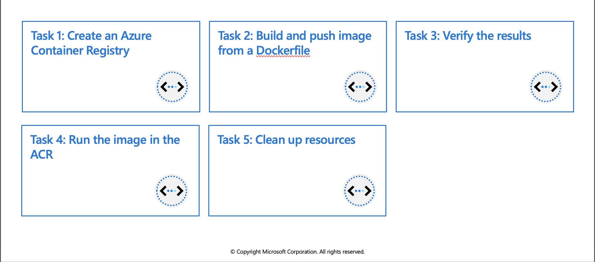

## Manage container images in Azure Container Registry

### Discover the Azure Container Registry

Use the Azure Container Registry (ACR) service with your existing container development and deployment pipelines, or use Azure Container Registry Tasks to build container images in Azure. Build on demand, or fully automate builds with triggers such as source code commits and base image updates.

### Use cases

Pull images from an Azure container registry to various deployment targets:

      * Scalable orchestration systems that manage containerized applications across clusters of hosts, including Kubernetes, DC/OS, and Docker Swarm.
      * Azure services that support building and running applications at scale, including Azure Kubernetes Service (AKS), App Service, Batch, Service Fabric, and others.

Developers can also push to a container registry as part of a container development workflow. For example, target a container registry from a continuous integration and delivery tool such as Azure Pipelines or Jenkins.

Configure ACR Tasks to automatically rebuild application images when their base images are updated, or automate image builds when your team commits code to a Git repository. Create multi-step tasks to automate building, testing, and patching multiple container images in parallel in the cloud.

### Azure Container Registry service tiers

Azure Container Registry is available in multiple service tiers. These tiers provide predictable pricing and several options for aligning to the capacity and usage patterns of your private Docker registry in Azure.

   * **Basic** - A cost-optimized entry point for developers learning about Azure Container Registry. Basic registries have the same programmatic capabilities as Standard and Premium (such as Azure Active Directory authentication integration, image deletion, and webhooks). However, the included storage and image throughput are most appropriate for lower usage scenarios.
   * **Standard** - Standard registries offer the same capabilities as Basic, with increased included storage and image throughput. Standard registries should satisfy the needs of most production scenarios.
   * **Premium** - Premium registries provide the highest amount of included storage and concurrent operations, enabling high-volume scenarios. In addition to higher image throughput, Premium adds features such as geo-replication for managing a single registry across multiple regions, content trust for image tag signing, private link with private endpoints to restrict access to the registry.

### Supported images and artifacts

Grouped in a repository, each image is a read-only snapshot of a Docker-compatible container. Azure container registries can include both Windows and Linux images. In addition to Docker container images, Azure Container Registry stores related content formats such as Helm charts and images built to the Open Container Initiative (OCI) Image Format Specification.

### Automated image builds

Use Azure Container Registry Tasks (ACR Tasks) to streamline building, testing, pushing, and deploying images in Azure. Configure build tasks to automate your container OS and framework patching pipeline, and build images automatically when your team commits code to source control.
Windows VMs have extensions which give your VM additional capabilities through post deployment configuration and automated tasks.

### Explore storage capabilities

Every Basic, Standard, and Premium Azure container registry benefits from advanced Azure storage features like encryption-at-rest for image data security and geo-redundancy for image data protection.

   * **Encryption-at-rest:** All container images in your registry are encrypted at rest. Azure automatically encrypts an image before storing it, and decrypts it on-the-fly when you or your applications and services pull the image.
   * **Regional storage:** Azure Container Registry stores data in the region where the registry is created, to help customers meet data residency and compliance requirements. In all regions except Brazil South and Southeast Asia, Azure may also store registry data in a paired region in the same geography. In the Brazil South and Southeast Asia regions, registry data is always confined to the region, to accommodate data residency requirements for those regions.

If a regional outage occurs, the registry data may become unavailable and is not automatically recovered. Customers who wish to have their registry data stored in multiple regions for better performance across different geographies or who wish to have resiliency in the event of a regional outage should enable geo-replication.

   * **Zone redundancy:** A feature of the Premium service tier, zone redundancy uses Azure availability zones to replicate your registry to a minimum of three separate zones in each enabled region.
   * **Scalable storage:** Azure Container Registry allows you to create as many repositories, images, layers, or tags as you need, up to the registry storage limit.

Very high numbers of repositories and tags can impact the performance of your registry. Periodically delete unused repositories, tags, and images as part of your registry maintenance routine. Deleted registry resources like repositories, images, and tags cannot be recovered after deletion.


# Exercise: Build and run a container image by using Azure Container Registry Tasks



In this exercise you will use ACR Tasks to perform the following actions:

   * Create an Azure Container Registry
   * Build and push image from a Dockerfile
   * Verify the results
   * Run the image in the ACR


## Prerequisites

  * An Azure account with an active subscription. If you don't already have one, [follow this instructions](https://docs.google.com/document/d/1XEkiGWUC4_AzngZQLQnVt8yWCb3dft1HzXglUnJcJzM/edit#heading=h.c96x7dxoz6ej).
   

## Login to Azure and start the Cloud Shell
1. Login to the [Azure Portal](https://portal.azure.com/) and open the Cloud Shell.


2. After the shell opens be sure to select the Bash environment.


## Create an Azure Container Registry

1. Create a resource group for the registry. 


```azurecli-interactive
az group create --name az204-acr-rg --location --location eastus
```

2. Create a basic container registry. The registry name must be unique within Azure, and contain 5-50 alphanumeric characters. Replace <myContainerRegistry> in the command below with a unique value.

```azurecli-interactive
az acr create --resource-group az204-acr-rg \
    --name <myContainerRegistry> --sku Basic
```

  > **Note**: The command above creates a Basic registry, a cost-optimized option for developers learning about Azure Container Registry.

## Build and push image from a Dockerfile
  
Now use Azure Container Registry to build and push an image based on a local Dockerfile.

1. Create, or navigate, to a local directory and then use the command below to create the Dockerfile. The Dockerfile will contain a single line that references the `hello-world` image hosted at the Microsoft Container Registry.

```azurecli-interactive
echo FROM mcr.microsoft.com/hello-world > Dockerfile
```

2. Run the az acr build command, which builds the image and, after the image is successfully built, pushes it to your registry. Replace <myContainerRegistry> with the name you used earlier.

```azurecli-interactive
az acr build --image sample/hello-world:v1  \
    --registry <myContainerRegistry> \
    --file Dockerfile .
```
  
The command above will generate a lot of output, below is shortened sample of that output showing the last few lines with the final results. You can see in the `repository` field the `sample/hello-word` image is listed.

```azurecli-interactive
- image:
    registry: <myContainerRegistry>.azurecr.io
    repository: sample/hello-world
    tag: v1
    digest: sha256:92c7f9c92844bbbb5d0a101b22f7c2a7949e40f8ea90c8b3bc396879d95e899a
  runtime-dependency:
    registry: mcr.microsoft.com
    repository: hello-world
    tag: latest
    digest: sha256:92c7f9c92844bbbb5d0a101b22f7c2a7949e40f8ea90c8b3bc396879d95e899a
  git: {}


Run ID: cf1 was successful after 11s
```

## Verify the results

1. Use the `az acr repository list` command to list the repositories in your registry. Replace `<myContainerRegistry>` with the name you used earlier.

```azurecli-interactive
az acr repository list --name <myContainerRegistry> --output table
```

Output:
  
```azurecli-interactive
Result
----------------
sample/hello-world
```
  
2. Use the `az acr repository show-tags` command to list the tags on the sample/hello-world repository. Replace `<myContainerRegistry>` with the name you used earlier.

```azurecli-interactive
az acr repository show-tags --name <myContainerRegistry> \
    --repository sample/hello-world --output table
```

Output:   

```azurecli-interactive
Result
--------
v1
```

## Run the image in the ACR

1. Run the sample/hello-world:v1 container image from your container registry by using the `az acr run` command. The following example uses `$Registry` to specify the registry where you run the command. Replace `<myContainerRegistry>` with the name you used earlier.

```azurecli-interactive
az acr run --registry <myContainerRegistry> \
    --cmd '$Registry/sample/hello-world:v1' /dev/null
```

The cmd parameter in this example runs the container in its default configuration, but `cmd` supports additional `docker` `run` parameters or even other `docker` commands.

Below is shortened sample of the output:

```azurecli-interactive
Packing source code into tar to upload...
Uploading archived source code from '/tmp/run_archive_ebf74da7fcb04683867b129e2ccad5e1.tar.gz'...
Sending context (1.855 KiB) to registry: mycontainerre...
Queued a run with ID: cab
Waiting for an agent...
2019/03/19 19:01:53 Using acb_vol_60e9a538-b466-475f-9565-80c5b93eaa15 as the home volume
2019/03/19 19:01:53 Creating Docker network: acb_default_network, driver: 'bridge'
2019/03/19 19:01:53 Successfully set up Docker network: acb_default_network
2019/03/19 19:01:53 Setting up Docker configuration...
2019/03/19 19:01:54 Successfully set up Docker configuration
2019/03/19 19:01:54 Logging in to registry: mycontainerregistry008.azurecr.io
2019/03/19 19:01:55 Successfully logged into mycontainerregistry008.azurecr.io
2019/03/19 19:01:55 Executing step ID: acb_step_0. Working directory: '', Network: 'acb_default_network'
2019/03/19 19:01:55 Launching container with name: acb_step_0

Hello from Docker!
This message shows that your installation appears to be working correctly.

2019/03/19 19:01:56 Successfully executed container: acb_step_0
2019/03/19 19:01:56 Step ID: acb_step_0 marked as successful (elapsed time in seconds: 0.843801)

Run ID: cab was successful after 6s
``` 

## Clean up resources

When no longer needed, you can use the `az group delete` command to remove the resource group, the container registry, and the container images stored there.

```azurecli-interactive
az group delete --name az204-acr-rg --no-wait
```
> **Note**: This operation takes on average 5 - 10 minutes
