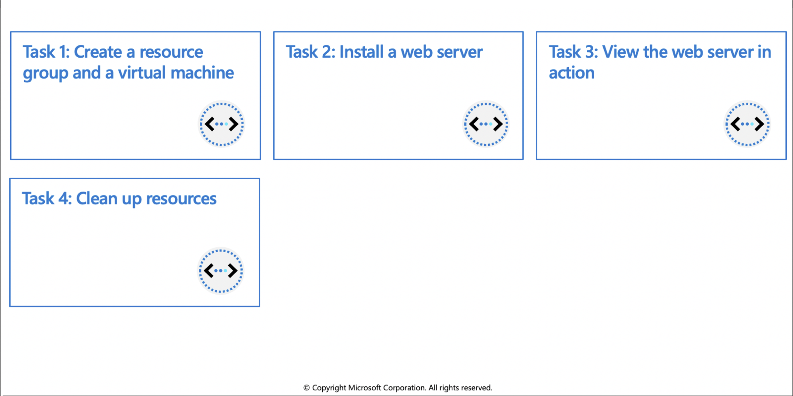
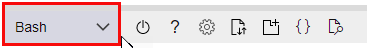

## Manage container images in Azure Container Registry

### Discover the Azure Container Registry

Use the Azure Container Registry (ACR) service with your existing container development and deployment pipelines, or use Azure Container Registry Tasks to build container images in Azure. Build on demand, or fully automate builds with triggers such as source code commits and base image updates.

### Azure virtual machines can be used in various ways. Some examples are:

* **Development and test** – Azure VMs offer a quick and easy way to create a computer with specific configurations required to code and test an application.
* **Applications in the cloud** – Because demand for your application can fluctuate, it might make economic sense to run it on a VM in Azure.
* **Extended datacenter** – Virtual machines in an Azure virtual network can easily be connected to your organization’s network.

#### Design considerations for virtual machine creation:
* **Availability:** Azure supports a single instance virtual machine Service Level Agreement of 99.9% provided you deploy the VM with premium storage for all disks.
* **VM size:** The size of the VM that you use is determined by the workload that you want to run. The size that you choose then determines factors such as processing power, memory, and storage capacity.
* **VM limits:** Your subscription has default quota limits in place that could impact the deployment of many VMs for your project.
* **VM image:** You can either use your own image, or you can use one of the images in the Azure Marketplace.
* **VM disks:** There are two components that make up this area. The type of disks which determines the performance level and the storage account type that contains the disks. Azure provides two types of disks:
   * **Standard disks:** Backed by HDDs, and delivers cost-effective storage while still being performant. Standard disks are ideal for a cost effective dev and test workload.
    * **Premium disks:** Backed by SSD-based, high-performance, low-latency disk. Perfect for VMs running production workload.
    
      And, there are two options for the disk storage:
       * **Managed disks:** Managed disks are the newer and recommended disk storage model and they are managed by Azure.
       * **Unmanaged disks:** With unmanaged disks, you’re responsible for the storage accounts that hold the virtual hard disks (VHDs) that correspond to your VM disks.

#### Virtual machine extensions

Windows VMs have extensions which give your VM additional capabilities through post deployment configuration and automated tasks.

* **Run custom scripts:** The Custom Script Extension helps you configure workloads on the VM by running your script when the VM is provisioned.
* **Deploy and manage configurations:** The PowerShell Desired State Configuration (DSC) Extension helps you set up DSC on a VM to manage configurations and environments.
* **Collect diagnostics data:** The Azure Diagnostics Extension helps you configure the VM to collect diagnostics data that can be used to monitor the health of your application.

For Linux VMs, Azure supports cloud-init across most Linux distributions that support it and works with all the major automation tooling like Ansible, Chef, SaltStack, and Puppet.
<br>
<br> 

#### Availability zones
* A physically separate zone, within an Azure region. There are three Availability Zones per supported Azure region.
* Azure services that support Availability Zones fall into two categories:
  * Zonal services: Where a resource is pinned to a specific zone (for example, virtual machines, managed disks, Standard IP addresses), or
  * Zone-redundant services: When the Azure platform replicates automatically across zones (for example, zone-redundant storage, SQL Database).

#### Availability sets
* Composed of two additional groupings that protect against hardware failures and allow updates to safely be applied - fault domains (FDs) and update domains (UDs).

#### VM scale sets
* Visit https://docs.microsoft.com/azure/virtual-machine-scale-sets/overview?context=/azure/virtual-machines/context/context

#### Load balancer
* Combine the Azure Load Balancer with an availability zone or availability set to get the most application resiliency.
* Define a front-end IP configuration that contains one or more public IP addresses.
* Virtual machines connect to a load balancer using their virtual network interface card (NIC).
* Define load balancer rules for specific ports and protocols that map to your VMs to control traffic flow
<br>
<br>


### What is a fault domain?
A fault domain is a logical group of underlying hardware that share a common power source and network switch, similar to a rack within an on-premises datacenter. As you create VMs within an availability set, the Azure platform automatically distributes your VMs across these fault domains. This approach limits the impact of potential physical hardware failures, network outages, or power interruptions.


<br>
<br> 

### Update domains
An update domain is a logical group of underlying hardware that can undergo maintenance or be rebooted at the same time. As you create VMs within an availability set, the Azure platform automatically distributes your VMs across these update domains. This approach ensures that at least one instance of your application always remains running as the Azure platform undergoes periodic maintenance. The order of update domains being rebooted may not proceed sequentially during planned maintenance, but only one update domain is rebooted at a time.


Each virtual machine in your availability set is assigned an update domain and a fault domain by the underlying Azure platform.

For a given availability set, five non-user-configurable update domains are assigned by to indicate groups of virtual machines and underlying physical hardware that can be rebooted at the same time.
<br>
<br> 


### What if my size needs change?
Azure allows you to change the VM size when the existing size no longer meets your needs. You can resize the VM - as long as your current hardware configuration is allowed in the new size. This provides a fully agile and elastic approach to VM management.
If you stop and deallocate the VM, you can then select any size available in your region since this removes your VM from the cluster it was running on.

**Caution:** Be cautious when resizing production VMs - they will be rebooted automatically which can cause a temporary outage and change some configuration settings such as the IP address.

<br>
<br> 


# Exercise: Build and run a container image by using Azure Container Registry Tasks


In this exercise you will use ACR Tasks to perform the following actions:

   * Create an Azure Container Registry
   * Build and push image from a Dockerfile
   * Verify the results
   * Run the image in the ACR


## Prerequisites

  * An Azure account with an active subscription. If you don't already have one, [follow this instructions](https://docs.google.com/document/d/1XEkiGWUC4_AzngZQLQnVt8yWCb3dft1HzXglUnJcJzM/edit#heading=h.c96x7dxoz6ej).
   

## Login to Azure and start the Cloud Shell
1. Login to the [Azure Portal](https://portal.azure.com/) and open the Cloud Shell.


2. After the shell opens be sure to select the Bash environment.




## Create an Azure Container Registry

1. Create a resource group for the registry. 


```azurecli-interactive
az group create --name az204-acr-rg --location --location eastus
```

2. Create a basic container registry. The registry name must be unique within Azure, and contain 5-50 alphanumeric characters. Replace <myContainerRegistry> in the command below with a unique value.

```azurecli-interactive
az acr create --resource-group az204-acr-rg \
    --name <myContainerRegistry> --sku Basic
```

  > **Note**: The command above creates a Basic registry, a cost-optimized option for developers learning about Azure Container Registry.

## Build and push image from a Dockerfile
  
Now use Azure Container Registry to build and push an image based on a local Dockerfile.

1. Create, or navigate, to a local directory and then use the command below to create the Dockerfile. The Dockerfile will contain a single line that references the `hello-world` image hosted at the Microsoft Container Registry.

```azurecli-interactive
echo FROM mcr.microsoft.com/hello-world > Dockerfile
```

2. Run the az acr build command, which builds the image and, after the image is successfully built, pushes it to your registry. Replace <myContainerRegistry> with the name you used earlier.

```azurecli-interactive
az acr build --image sample/hello-world:v1  \
    --registry <myContainerRegistry> \
    --file Dockerfile .
```
  
The command above will generate a lot of output, below is shortened sample of that output showing the last few lines with the final results. You can see in the `repository` field the `sample/hello-word` image is listed.

```azurecli-interactive
- image:
    registry: <myContainerRegistry>.azurecr.io
    repository: sample/hello-world
    tag: v1
    digest: sha256:92c7f9c92844bbbb5d0a101b22f7c2a7949e40f8ea90c8b3bc396879d95e899a
  runtime-dependency:
    registry: mcr.microsoft.com
    repository: hello-world
    tag: latest
    digest: sha256:92c7f9c92844bbbb5d0a101b22f7c2a7949e40f8ea90c8b3bc396879d95e899a
  git: {}


Run ID: cf1 was successful after 11s
```

## Verify the results

1. Use the `az acr repository list` command to list the repositories in your registry. Replace `<myContainerRegistry>` with the name you used earlier.

```azurecli-interactive
az acr repository list --name <myContainerRegistry> --output table
```

Output:
  
```azurecli-interactive
Result
----------------
sample/hello-world
```
  
2. Use the `az acr repository show-tags` command to list the tags on the sample/hello-world repository. Replace `<myContainerRegistry>` with the name you used earlier.

```azurecli-interactive
az acr repository show-tags --name <myContainerRegistry> \
    --repository sample/hello-world --output table
```

Output:   

```azurecli-interactive
Result
--------
v1
```

## Run the image in the ACR

1. Run the sample/hello-world:v1 container image from your container registry by using the `az acr run` command. The following example uses `$Registry` to specify the registry where you run the command. Replace `<myContainerRegistry>` with the name you used earlier.

```azurecli-interactive
az acr run --registry <myContainerRegistry> \
    --cmd '$Registry/sample/hello-world:v1' /dev/null
```

The cmd parameter in this example runs the container in its default configuration, but `cmd` supports additional `docker` `run` parameters or even other `docker` commands.

Below is shortened sample of the output:

```azurecli-interactive
Packing source code into tar to upload...
Uploading archived source code from '/tmp/run_archive_ebf74da7fcb04683867b129e2ccad5e1.tar.gz'...
Sending context (1.855 KiB) to registry: mycontainerre...
Queued a run with ID: cab
Waiting for an agent...
2019/03/19 19:01:53 Using acb_vol_60e9a538-b466-475f-9565-80c5b93eaa15 as the home volume
2019/03/19 19:01:53 Creating Docker network: acb_default_network, driver: 'bridge'
2019/03/19 19:01:53 Successfully set up Docker network: acb_default_network
2019/03/19 19:01:53 Setting up Docker configuration...
2019/03/19 19:01:54 Successfully set up Docker configuration
2019/03/19 19:01:54 Logging in to registry: mycontainerregistry008.azurecr.io
2019/03/19 19:01:55 Successfully logged into mycontainerregistry008.azurecr.io
2019/03/19 19:01:55 Executing step ID: acb_step_0. Working directory: '', Network: 'acb_default_network'
2019/03/19 19:01:55 Launching container with name: acb_step_0

Hello from Docker!
This message shows that your installation appears to be working correctly.

2019/03/19 19:01:56 Successfully executed container: acb_step_0
2019/03/19 19:01:56 Step ID: acb_step_0 marked as successful (elapsed time in seconds: 0.843801)

Run ID: cab was successful after 6s
``` 

## Clean up resources

When no longer needed, you can use the `az group delete` command to remove the resource group, the container registry, and the container images stored there.

```azurecli-interactive
az group delete --name az204-acr-rg --no-wait
```
> **Note**: This operation takes on average 5 - 10 minutes
