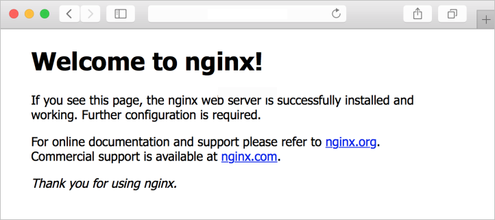

## Provision Virtual Machines in Azure

### Azure virtual machines

Azure Virtual Machine is a Scalable Computing resource that host the Operating system like macOS, Linux, and Windows. you can access Virtual machines within seconds for deployment or development of your applications.


#### Azure virtual machines can be used in various ways. Some examples are:

* **Development and test** – Azure VMs offer a quick and easy way to create a computer with specific configurations required to code and test an application.
* **Applications in the cloud** – Because demand for your application can fluctuate, it might make economic sense to run it on a VM in Azure.
* **Extended datacenter** – Virtual machines in an Azure virtual network can easily be connected to your organization’s network.

#### Design considerations for virtual machine creation:
* **Availability:** Azure supports a single instance virtual machine Service Level Agreement of 99.9% provided you deploy the VM with premium storage for all disks.
* **VM size:** The size of the VM that you use is determined by the workload that you want to run. The size that you choose then determines factors such as processing power, memory, and storage capacity.
* **VM limits:** Your subscription has default quota limits in place that could impact the deployment of many VMs for your project.
* **VM image:** You can either use your own image, or you can use one of the images in the Azure Marketplace.
* **VM disks:** There are two components that make up this area. The type of disks which determines the performance level and the storage account type that contains the disks. Azure provides two types of disks:
Standard disks: Backed by HDDs, and delivers cost-effective storage while still being performant. Standard disks are ideal for a cost effective dev and test workload.
  * **Premium disks:** Backed by SSD-based, high-performance, low-latency disk. Perfect for VMs running production workload.
And, there are two options for the disk storage:
  * **Managed disks:** Managed disks are the newer and recommended disk storage model and they are managed by Azure.
  * **Unmanaged disks:** With unmanaged disks, you’re responsible for the storage accounts that hold the virtual hard disks (VHDs) that correspond to your VM disks.

#### Virtual machine extensions

Windows VMs have extensions which give your VM additional capabilities through post deployment configuration and automated tasks.

* **Run custom scripts:** The Custom Script Extension helps you configure workloads on the VM by running your script when the VM is provisioned.
* **Deploy and manage configurations:** The PowerShell Desired State Configuration (DSC) Extension helps you set up DSC on a VM to manage configurations and environments.
* **Collect diagnostics data:** The Azure Diagnostics Extension helps you configure the VM to collect diagnostics data that can be used to monitor the health of your application.

For Linux VMs, Azure supports cloud-init across most Linux distributions that support it and works with all the major automation tooling like Ansible, Chef, SaltStack, and Puppet.
<br>
<br> 


#### Availability zones
* A physically separate zone, within an Azure region. There are three Availability Zones per supported Azure region.
* Azure services that support Availability Zones fall into two categories:
  * Zonal services: Where a resource is pinned to a specific zone (for example, virtual machines, managed disks, Standard IP addresses), or
  * Zone-redundant services: When the Azure platform replicates automatically across zones (for example, zone-redundant storage, SQL Database).

#### Availability sets
* Composed of two additional groupings that protect against hardware failures and allow updates to safely be applied - fault domains (FDs) and update domains (UDs).

#### VM scale sets
* Visit https://docs.microsoft.com/azure/virtual-machine-scale-sets/overview?context=/azure/virtual-machines/context/context

#### Load balancer
* Combine the Azure Load Balancer with an availability zone or availability set to get the most application resiliency.
* Define a front-end IP configuration that contains one or more public IP addresses.
* Virtual machines connect to a load balancer using their virtual network interface card (NIC).
* Define load balancer rules for specific ports and protocols that map to your VMs to control traffic flow
<br>
<br>


### What is a fault domain?
A fault domain is a logical group of hardware in Azure that shares a common power source and network switch. You can think of it as a rack within an on-premises datacenter. The first two VMs in an availability set will be provisioned into two different racks so that if the network or the power failed in a rack, only one VM would be affected. Fault domains are also defined for managed disks attached to VMs.


Each virtual machine in your availability set is assigned an update domain and a fault domain by the underlying Azure platform.

For a given availability set, five non-user-configurable update domains are assigned by to indicate groups of virtual machines and underlying physical hardware that can be rebooted at the same time.


### What if my size needs change?
Azure allows you to change the VM size when the existing size no longer meets your needs. You can resize the VM - as long as your current hardware configuration is allowed in the new size. This provides a fully agile and elastic approach to VM management.
If you stop and deallocate the VM, you can then select any size available in your region since this removes your VM from the cluster it was running on.

**Caution:** Be cautious when resizing production VMs - they will be rebooted automatically which can cause a temporary outage and change some configuration settings such as the IP address.

<br>


# Exercise: Create a virtual machine by using the Azure CLI

In this exercise you'll create a Linux virtual machine by performing the following operations using Azure CLI commands:
  * Create a resource group and a virtual machine
  * Install a web server
  * View the web server in action
  * Clean up resources


# Prerequisites

  * An Azure account with an active subscription. If you don't already have one, [follow this instructions](https://docs.google.com/document/d/1XEkiGWUC4_AzngZQLQnVt8yWCb3dft1HzXglUnJcJzM/edit#heading=h.c96x7dxoz6ej).
   

# Login to Azure and start the Cloud Shell
1. Login to the [Azure Portal](https://portal.azure.com/) and open the Cloud Shell.



2. After the shell opens be sure to select the Bash environment.


## Create a resource group and virtual machine

1. Create a resource group with the `az group create` command. The command below creates a resource group named az204-vm-rg. 


```azurecli-interactive
az group create --name az204-vm-rg --location eastus
```

2. Create a VM with the `az vm create` command. The command below creates a Linux VM named az204vm with an admin user named azureuser.
## Create virtual machine

```azurecli-interactive
az vm create \
    --resource-group az204-vm-rg \
    --name az204vm \
    --image UbuntuLTS \
    --generate-ssh-keys \
    --admin-username azureuser \
    --public-ip-sku Standard
```

It will take a few minutes for the operation to complete. When it is finished note the `publicIpAddress` in the output, you'll use it in the next step.
<br> 

## Install web server

1. By default, only SSH connections are opened when you create a Linux VM in Azure. Use `az vm open-port` to open TCP port 80 for use with the NGINX web server:

```azurecli-interactive
az vm open-port --port 80 \
--resource-group az204-vm-rg \
--name az204vm
```

2. Connect to your VM by using SSH. Replace `<publicIPAddress>` in the example with the public IP address of your VM as noted in the previous output:

```azurecli-interactive
ssh azureuser@<publicIPAddress>
```

3. To see your VM in action, install the NGINX web server. Update your package sources and then install the latest NGINX package.

```azurecli-interactive
sudo apt-get -y update
sudo apt-get -y install nginx
```

4. When done type `exit` to leave the SSH session.

## View the web server in action

Use a web browser of your choice to view the default NGINX welcome page. Use the public IP address of your VM as the web address. The following example shows the default NGINX web site:


## Clean up resources

You can now safely delete the `az204-vm-rg` resource group from your account by running the command below.

```azurecli-interactive
az group delete --name az204-vm-rg --no-wait
```
