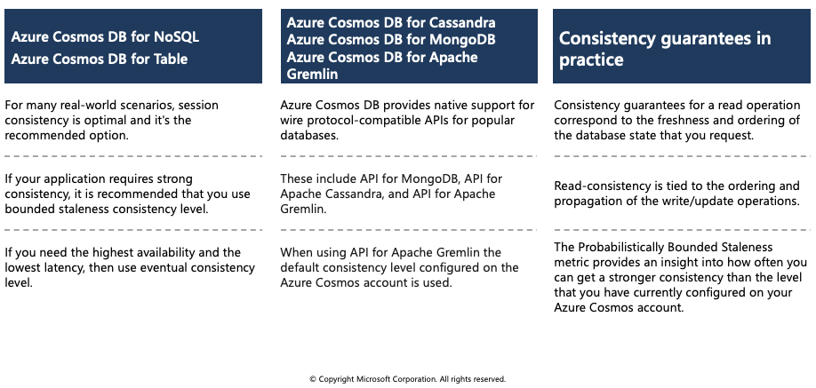
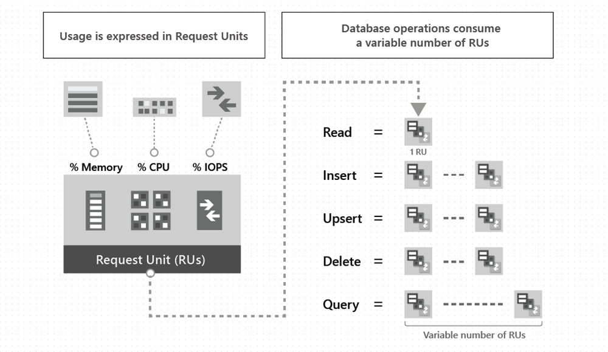
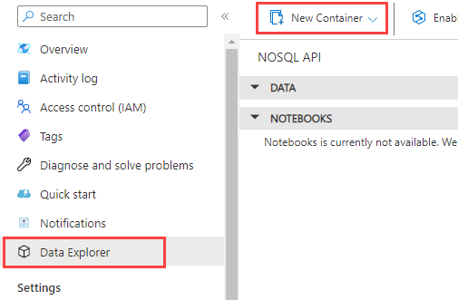
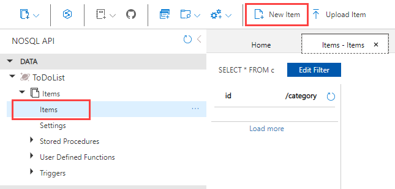

## Azure Cosmos DB

Azure Cosmos DB is a globally distributed database system that allows you to read and write data from the local replicas of your database and it transparently replicates the data to all the regions associated with your Cosmos account.

## Identify key benefits of Azure Cosmos DB


Azure Cosmos DB is a fully managed NoSQL database designed to provide low latency, elastic scalability of throughput, well-defined semantics for data consistency, and high availability.

You can configure your databases to be globally distributed and available in any of the Azure regions. To lower the latency, place the data close to where your users are. Choosing the required regions depends on the global reach of your application and where your users are located.

With Azure Cosmos DB, you can add or remove the regions associated with your account at any time. Your application doesn't need to be paused or redeployed to add or remove a region.

### Key benefits of global distribution

With its novel multi-master replication protocol, every region supports both writes and reads. The multi-master capability also enables:

  * Unlimited elastic write and read scalability.
  * 99.999% read and write availability all around the world.
  * Guaranteed reads and writes served in less than 10 milliseconds at the 99th percentile.

Your application can perform near real-time reads and writes against all the regions you chose for your database. Azure Cosmos DB internally handles the data replication between regions with consistency level guarantees of the level you've selected.

Running a database in multiple regions worldwide increases the availability of a database. If one region is unavailable, other regions automatically handle application requests. Azure Cosmos DB offers 99.999% read and write availability for multi-region databases.

## The resource hierarchy

The Azure Cosmos DB account is the fundamental unit of global distribution and high availability. Your Azure Cosmos DB account contains a unique DNS name and you can manage an account by using the Azure portal or the Azure CLI, or by using different language-specific SDKs. For globally distributing your data and throughput across multiple Azure regions, you can add and remove Azure regions to your account at any time.

### Elements in an Azure Cosmos DB account


An Azure Cosmos DB container is the fundamental unit of scalability. You can virtually have an unlimited provisioned throughput (RU/s) and storage on a container. Azure Cosmos DB transparently partitions your container using the logical partition key that you specify in order to elastically scale your provisioned throughput and storage.

Currently, you can create a maximum of 50 Azure Cosmos DB accounts under an Azure subscription (this is a soft limit that can be increased via support request). After you create an account under your Azure subscription, you can manage the data in your account by creating databases, containers, and items.

The following image shows the hierarchy of different entities in an Azure Cosmos DB account:


## Consistency levels

Azure Cosmos DB approaches data consistency as a spectrum of choices instead of two extremes. Strong consistency and eventual consistency are at the ends of the spectrum, but there are many consistency choices along the spectrum. Developers can use these options to make precise choices and granular tradeoffs with respect to high availability and performance.

Azure Cosmos DB offers five well-defined levels. From strongest to weakest, the levels are:

|**Consistency Level** | **Description** |
| -------- | --------- |
|**Strong**	| When a write operation is performed on your primary database, the write operation is replicated to the replica instances. The write operation is committed (and visible) on the primary only after it has been committed and confirmed by all replicas.|
|**Bounded staleness**	| This level is similar to the Strong level with the major difference that you can configure how stale documents can be within replicas. Staleness refers to the quantity of time (or the version count) a replica document can be behind the primary document. |
|**Session**	|This level guarantees that all read and write operations are consistent within a user session. Within the user session, all reads and writes are monotonic and guaranteed to be consistent across primary and replica instances. |
|**Consistent prefix** | This level has loose consistency but guarantees that when updates show up in replicas, they will show up in the correct order (that is, as prefixes of other updates) without any gaps.|
|**Eventual** | This level has the loosest consistency and essentially commits any write operation against the primary immediately. Replica transactions are asynchronously handled and will eventually (over time) be consistent with the primary. This tier has the best performance, because the primary database does not need to wait for replicas to commit to finalize its transactions.. |

Each level provides availability and performance tradeoffs. The following image shows the different consistency levels as a spectrum.


The consistency levels are region-agnostic and are guaranteed for all operations regardless of the region from which the reads and writes are served, the number of regions associated with your Azure Cosmos DB account, or whether your account is configured with a single or multiple write regions.

Read consistency applies to a single read operation scoped within a partition-key range or a logical partition. The read operation can be issued by a remote client or a stored procedure.

## Choose the right consistency level

Each of the consistency models can be used for specific real-world scenarios. Each provides precise availability and performance tradeoffs and is backed by comprehensive SLAs. The following simple considerations will help you make the right choice in many common scenarios.



### Configure the default consistency level

You can configure the default consistency level on your Azure Cosmos DB account at any time. The default consistency level configured on your account applies to all Azure Cosmos DB databases and containers under that account. All reads and queries issued against a container or a database use the specified consistency level by default.

Read consistency applies to a single read operation scoped within a logical partition. The read operation can be issued by a remote client or a stored procedure.

### Guarantees associated with consistency levels

Azure Cosmos DB guarantees that 100 percent of read requests meet the consistency guarantee for the consistency level chosen. The precise definitions of the five consistency levels in Azure Cosmos DB using the TLA+ specification language are provided in the azure-cosmos-tla GitHub repo.

### Strong consistency

Strong consistency offers a linearizability guarantee. Linearizability refers to serving requests concurrently. The reads are guaranteed to return the most recent committed version of an item. A client never sees an uncommitted or partial write. Users are always guaranteed to read the latest committed write.

### Bounded staleness consistency

In bounded staleness consistency, the reads are guaranteed to honor the consistent-prefix guarantee. The reads might lag behind writes by at most "K" versions (that is, "updates") of an item or by "T" time interval, whichever is reached first. In other words, when you choose bounded staleness, the "staleness" can be configured in two ways:

  * The number of versions (K) of the item
  * The time interval (T) reads might lag behind the writes

For a single region account, the minimum value of K and T is 10 write operations or 5 seconds. For multi-region accounts the minimum value of K and T is 100,000 write operations or 300 seconds.

### Session consistency

In session consistency, within a single client session reads are guaranteed to honor the consistent-prefix, monotonic reads, monotonic writes, read-your-writes, and write-follows-reads guarantees. This assumes a single "writer" session or sharing the session token for multiple writers.

### Consistent prefix consistency

In consistent prefix, updates made as single document writes see eventual consistency. Updates made as a batch within a transaction, are returned consistent to the transaction in which they were committed. Write operations within a transaction of multiple documents are always visible together.

Assume two write operations are performed on documents Doc1 and Doc2, within transactions T1 and T2. When client does a read in any replica, the user will see either “Doc1 v1 and Doc2 v1” or “ Doc1 v2 and Doc2 v2”, but never “Doc1 v1 and Doc2 v2” or “Doc1 v2 and Doc2 v1” for the same read or query operation.

### Eventual consistency

In eventual consistency, there's no ordering guarantee for reads. In the absence of any further writes, the replicas eventually converge.

Eventual consistency is the weakest form of consistency because a client may read the values that are older than the ones it had read before. Eventual consistency is ideal where the application does not require any ordering guarantees. Examples include count of Retweets, Likes, or non-threaded comments

## Supported APIs

Azure Cosmos DB offers multiple database APIs, which include:

  * Azure Cosmos DB for NoSQL
  * Azure Cosmos DB for MongoDB
  * Azure Cosmos DB for PostgreSQL
  * Azure Cosmos DB for Apache Cassandra
  * Azure Cosmos DB for Table
  * Azure Cosmos DB for Apache Gremlin

By using these APIs, you can model real world data using documents, key-value, graph, and column-family data models. These APIs allow your applications to treat Azure Cosmos DB as if it were various other databases technologies, without the overhead of management, and scaling approaches.

### Considerations when choosing an API

API for NoSQL is native to Azure Cosmos DB.

API for MongoDB, PostgreSQL, Cassandra, Gremlin, and Table implement the wire protocol of open-source database engines. These APIs are best suited if the following conditions are true:

  * If you have existing MongoDB, PostgreSQL Cassandra, or Gremlin applications
  * If you don't want to rewrite your entire data access layer
  * If you want to use the open-source developer ecosystem, client-drivers, expertise, and resources for your database


## Discover request units

With Azure Cosmos DB, you pay for the throughput you provision and the storage you consume on an hourly basis. Throughput must be provisioned to ensure that sufficient system resources are available for your Azure Cosmos database at all times.

The cost of all database operations is normalized by Azure Cosmos DB and is expressed by request units (or RUs, for short). A request unit represents the system resources such as CPU, IOPS, and memory that are required to perform the database operations supported by Azure Cosmos DB.

The cost to do a point read, which is fetching a single item by its ID and partition key value, for a 1KB item is 1RU. All other database operations are similarly assigned a cost using RUs. No matter which API you use to interact with your Azure Cosmos container, costs are always measured by RUs. Whether the database operation is a write, point read, or query, costs are always measured in RUs.

The following image shows the high-level idea of RUs:



The type of Azure Cosmos DB account you're using determines the way consumed RUs get charged. There are three modes in which you can create an account:

  * **Provisioned throughput mode**: In this mode, you provision the number of RUs for your application on a per-second basis in increments of 100 RUs per second. To scale the provisioned throughput for your application, you can increase or decrease the number of RUs at any time in increments or decrements of 100 RUs. You can make your changes either programmatically or by using the Azure portal. You can provision throughput at container and database granularity level.

  * **Serverless mode**: In this mode, you don't have to provision any throughput when creating resources in your Azure Cosmos DB account. At the end of your billing period, you get billed for the amount of request units that has been consumed by your database operations.

  * **Autoscale mode**: In this mode, you can automatically and instantly scale the throughput (RU/s) of your database or container based on its usage. This mode is well suited for mission-critical workloads that have variable or unpredictable traffic patterns, and require SLAs on high performance and scale.

## Exercise: Create Azure Cosmos DB resources by using the Azure portal


In this exercise you'll learn how to perform the following actions in the Azure portal:

  * Create an Azure Cosmos DB account
  * Add a database and a container
  * Add data to your database
  * Clean up resources

### Prerequisites

 * **Azure Account** (https://docs.google.com/document/d/1XEkiGWUC4_AzngZQLQnVt8yWCb3dft1HzXglUnJcJzM/edit)

### Create an Azure Cosmos DB account

1. Log in to the Azure portal.

2. From the Azure portal navigation pane, select + **Create a resource**.

3. Search for **Azure Cosmos DB**, then select **Create/Azure Cosmos DB** to get started.

4. On the **Which API best suits your workload?** page, select **Create** in the **Azure Cosmos DB for NoSQL** box.

5. In the **Create Azure Cosmos DB Account - Azure Cosmos DB for NoSQL** page, enter the basic settings for the new Azure Cosmos DB account.

  * **Subscription**: Select the subscription you want to use.
  * **Resource Group**: Select Create new, then enter az204-cosmos-rg.
  * **Account Name**: Enter a unique name to identify your Azure Cosmos account. The name can only contain lowercase letters, numbers, and the hyphen (-) character. It must be between 3-31 characters in length.
  * **Location**: Use the location that is closest to your users to give them the fastest access to the data.
  * **Capacity mode**: Select Serverless.

6. Select Review + create.

7. Review the account settings, and then select Create. It takes a few minutes to create the account. Wait for the portal page to display Your deployment is complete.

8. Select Go to resource to go to the Azure Cosmos DB account page.

### Add a database and a container

You can use the Data Explorer in the Azure portal to create a database and container.

1. Select **Data Explorer** from the left navigation on your Azure Cosmos DB account page, and then select **New Container**.



2. In the **New container** pane, enter the settings for the new container.

  * **Database ID**: Select **Create new**, and enter ToDoList.
  * **Container ID**: Enter Items
  * **Partition key**: Enter /category. The samples in this demo use /category as the partition key.

3. Select **OK**. The Data Explorer displays the new database and the container that you created.

### Add data to your database

Add data to your new database using Data Explorer.

1. In **Data Explorer**, expand the **ToDoList** database, and expand the **Items** container. Next, select **Items**, and then select **New Item**.



2. Add the following structure to the item on the right side of the Items pane:

```azurecli-interactive
{
    "id": "1",
    "category": "personal",
    "name": "groceries",
    "description": "Pick up apples and strawberries.",
    "isComplete": false
}
```

3. Select Save.

4. Select **New Item** again, and create and save another item with a unique id, and any other properties and values you want. Your items can have any structure, because Azure Cosmos DB doesn't impose any schema on your data.

### Clean up resources

1. Select **Overview** from the left navigation on your Azure Cosmos DB account page.

2. Select the **az204-cosmos-rg** resource group link in the Essentials group.

3. Select **Delete** resource group and follow the directions to delete the resource group and all of the resources it contains.
