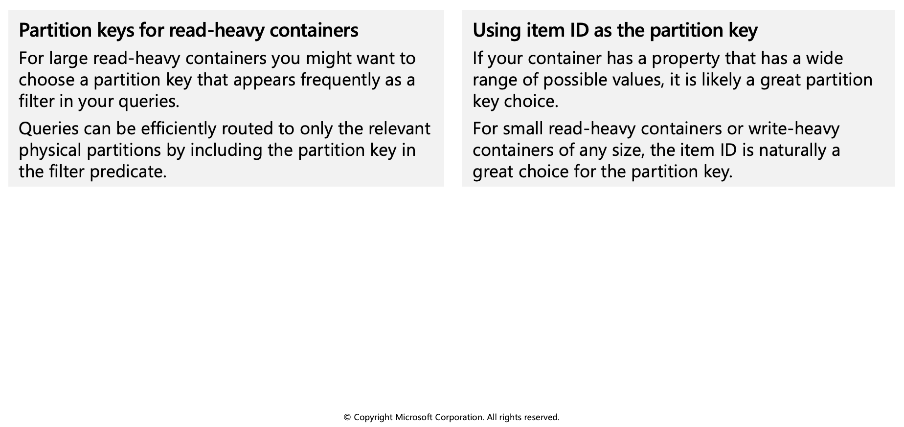
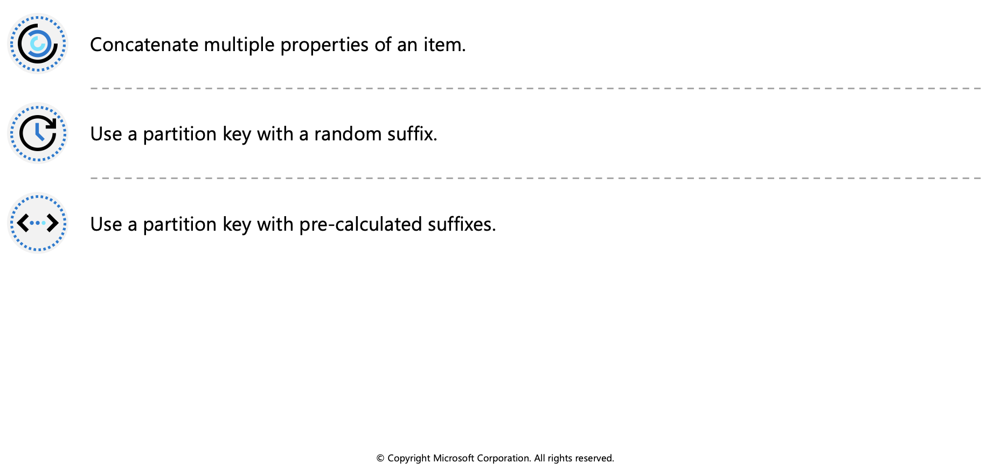

## Partitioning in Azure Cosmos DB

Azure Cosmos DB uses partitioning to scale individual containers in a database to meet the performance needs of your application.

## Partitions

In partitioning, the items in a container are divided into distinct subsets called logical partitions. Logical partitions are formed based on the value of a partition key that is associated with each item in a container. All the items in a logical partition have the same partition key value.

For example, a container holds items. Each item has a unique value for the `UserID` property. If `UserID` serves as the partition key for the items in the container and there are 1,000 unique `UserID` values, 1,000 logical partitions are created for the container.

In addition to a partition key that determines the item's logical partition, each item in a container has an item ID which is unique within a logical partition. Combining the partition key and the item ID creates the item's index, which uniquely identifies the item. Choosing a partition key is an important decision that will affect your application's performance.

### Logical partitions

A logical partition consists of a set of items that have the same partition key. For example, in a container that contains data about food nutrition, all items contain a `foodGroup` property. You can use `foodGroup` as the partition key for the container. Groups of items that have specific values for `foodGroup`, such as `Beef Products`, `Baked Products`, and `Sausages and Luncheon Meats`, form distinct logical partitions.

A logical partition also defines the scope of database transactions. You can update items within a logical partition by using a transaction with snapshot isolation. When new items are added to a container, new logical partitions are transparently created by the system. You don't have to worry about deleting a logical partition when the underlying data is deleted.

### Physical partitions

A container is scaled by distributing data and throughput across physical partitions. Internally, one or more logical partitions are mapped to a single physical partition. Typically smaller containers have many logical partitions but they only require a single physical partition. Unlike logical partitions, physical partitions are an internal implementation of the system and they are entirely managed by Azure Cosmos DB.

The number of physical partitions in your container depends on the following:

  * The number of throughput provisioned (each individual physical partition can provide a throughput of up to 10,000 request units per second). The 10,000 RU/s limit for physical partitions implies that logical partitions also have a 10,000 RU/s limit, as each logical partition is only mapped to one physical partition.

  * The total data storage (each individual physical partition can store up to 50GB data).

Throughput provisioned for a container is divided evenly among physical partitions. A partition key design that doesn't distribute requests evenly might result in too many requests directed to a small subset of partitions that become "hot." Hot partitions lead to inefficient use of provisioned throughput, which might result in rate-limiting and higher costs.


## Choose a partition key

A partition key has two components: **partition key path** and the **partition key value**. For example, consider an item `{ "userId" : "Andrew", "worksFor": "Microsoft" }` if you choose "userId" as the partition key, the following are the two partition key components:

  * The partition key path (for example: "/userId"). The partition key path accepts alphanumeric and underscore(_) characters. You can also use nested objects by using the standard path notation(/).
  * The partition key value (for example: "Andrew"). The partition key value can be of string or numeric types.
  
Selecting your partition key is a simple but important design choice in Azure Cosmos DB. Once you select your partition key, it is not possible to change it in-place. If you need to change your partition key, you should move your data to a new container with your new desired partition key.

For **all** containers, your partition key should:

  * Be a property that has a value which does not change. If a property is your partition key, you can't update that property's value.
  * Have a high cardinality. In other words, the property should have a wide range of possible values.
  * Spread request unit (RU) consumption and data storage evenly across all logical partitions. This ensures even RU consumption and storage distribution across your physical partitions.



## Create a synthetic partition key

It's the best practice to have a partition key with many distinct values, such as hundreds or thousands. The goal is to distribute your data and workload evenly across the items associated with these partition key values. If such a property doesn’t exist in your data, you can construct a synthetic partition key. This unit describes several basic techniques for generating a synthetic partition key for your Cosmos container.



### Concatenate multiple properties of an item

You can form a partition key by concatenating multiple property values into a single artificial `partitionKey` property. These keys are referred to as synthetic keys. For example, consider the following example document:

```azurecli-interactive
{
"deviceId": "abc-123",
"date": 2018
}
```

For the previous document, one option is to set /deviceId or /date as the partition key. Use this option, if you want to partition your container based on either device ID or date. Another option is to concatenate these two values into a synthetic partitionKey property that's used as the partition key.

```azurecli-interactive
{
"deviceId": "abc-123",
"date": 2018,
"partitionKey": "abc-123-2018"
}
```

In real-time scenarios, you can have thousands of items in a database. Instead of adding the synthetic key manually, define client-side logic to concatenate values and insert the synthetic key into the items in your Cosmos containers.

### Use a partition key with a random suffix

Another possible strategy to distribute the workload more evenly is to append a random number at the end of the partition key value. When you distribute items in this way, you can perform parallel write operations across partitions.

An example is if a partition key represents a date. You might choose a random number between 1 and 400 and concatenate it as a suffix to the date. This method results in partition key values like `2018-08-09.1,2018-08-09.2`, and so on, through `2018-08-09.400`. Because you randomize the partition key, the write operations on the container on each day are spread evenly across multiple partitions. This method results in better parallelism and overall higher throughput.

### Use a partition key with pre-calculated suffixes

The random suffix strategy can greatly improve write throughput, but it's difficult to read a specific item. You don't know the suffix value that was used when you wrote the item. To make it easier to read individual items, use the pre-calculated suffixes strategy. Instead of using a random number to distribute the items among the partitions, use a number that is calculated based on something that you want to query.

Consider the previous example, where a container uses a date as the partition key. Now suppose that each item has a `Vehicle-Identification-Number` (`VIN`) attribute that we want to access. Further, suppose that you often run queries to find items by the `VIN`, in addition to date. Before your application writes the item to the container, it can calculate a hash suffix based on the VIN and append it to the partition key date. The calculation might generate a number between 1 and 400 that is evenly distributed. This result is similar to the results produced by the random suffix strategy method. The partition key value is then the date concatenated with the calculated result.

With this strategy, the writes are evenly spread across the partition key values, and across the partitions. You can easily read a particular item and date, because you can calculate the partition key value for a specific `Vehicle-Identification-Number`. The benefit of this method is that you can avoid creating a single hot partition key, i.e., a partition key that takes all the workload.
