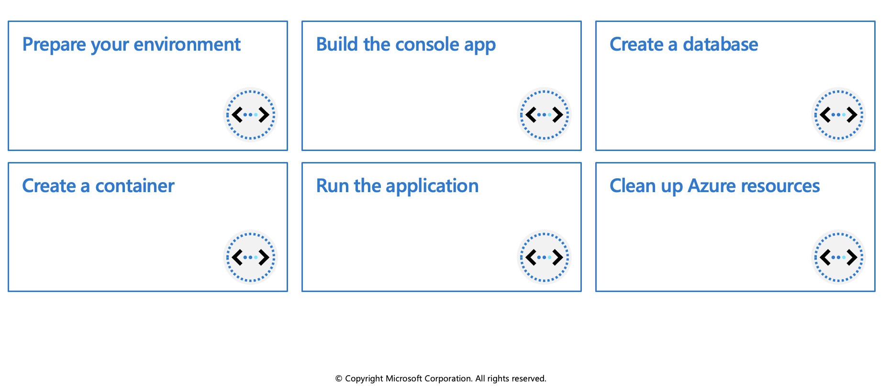
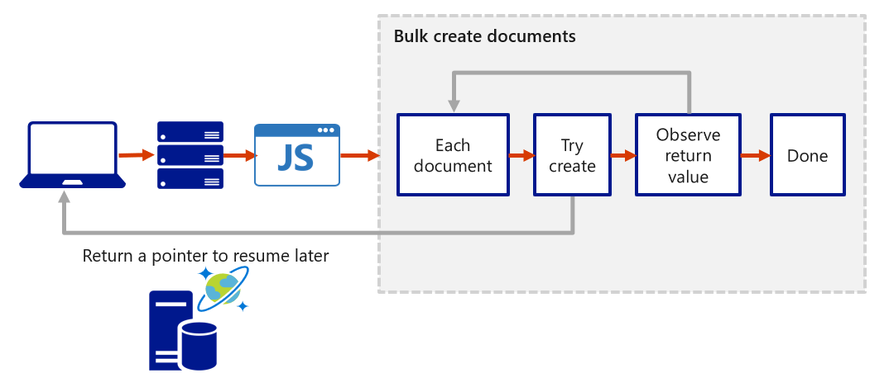

## Work with Azure Cosmos DB 

This module is an introduction to both client and server-side programming on Azure Cosmos DB.

## Microsoft .NET SDK v3 for Azure Cosmos DB

This unit focuses on Azure Cosmos DB .NET SDK v3 for API for NoSQL. (**Microsoft.Azure.Cosmos** NuGet package.) If you're familiar with the previous version of the .NET SDK, you may be used to the terms collection and document.

The [azure-cosmos-dotnet-v3](https://github.com/Azure/azure-cosmos-dotnet-v3/tree/master/Microsoft.Azure.Cosmos.Samples/Usage) GitHub repository includes the latest .NET sample solutions. You use these solutions to perform CRUD (create, read, update, and delete) and other common operations on Azure Cosmos DB resources.

Because Azure Cosmos DB supports multiple API models, version 3 of the .NET SDK uses the generic terms "container" and "item". A **container** can be a collection, graph, or table. An **item** can be a document, edge/vertex, or row, and is the content inside a container.

Below are examples showing some of the key operations you should be familiar with. For more examples please visit the GitHub link above. The examples below all use the async version of the methods.

### CosmosClient

Creates a new `CosmosClient` with a connection string. `CosmosClient` is thread-safe. Its recommended to maintain a single instance of `CosmosClient` per lifetime of the application which enables efficient connection management and performance.

```azurecli-interactive
CosmosClient client = new CosmosClient(endpoint, key);
```

## Database examples

### Create a database

The `CosmosClient.CreateDatabaseIfNotExistsAsync` checks if a database exists, and if it doesn't, creates it. Only the database `id` is used to verify if there is an existing database.

```azurecli-interactive
// An object containing relevant information about the response
DatabaseResponse databaseResponse = await client.CreateDatabaseIfNotExistsAsync(databaseId, 10000);
```

### Read a database by ID

Reads a database from the Azure Cosmos DB service as an asynchronous operation.

```azurecli-interactive
DatabaseResponse readResponse = await database.ReadAsync();
```

### Delete a database

Delete a Database as an asynchronous operation.

```azurecli-interactive
await database.DeleteAsync();
```

## Container examples

### Create a container

The `Database.CreateContainerIfNotExistsAsync` method checks if a container exists, and if it doesn't, it creates it. Only the container `id` is used to verify if there is an existing container.

```azurecli-interactive
// Set throughput to the minimum value of 400 RU/s
ContainerResponse simpleContainer = await database.CreateContainerIfNotExistsAsync(
    id: containerId,
    partitionKeyPath: partitionKey,
    throughput: 400);
```

### Get a container by ID

```azurecli-interactive
Container container = database.GetContainer(containerId);
ContainerProperties containerProperties = await container.ReadContainerAsync();
```

### Delete a container

Delete a Container as an asynchronous operation.

```azurecli-interactive
await database.GetContainer(containerId).DeleteContainerAsync();
```

## Item examples

### Create an item

Use the `Container.CreateItemAsync` method to create an item. The method requires a JSON serializable object that must contain an `id` property, and a `partitionKey`.

```azurecli-interactive
ItemResponse<SalesOrder> response = await container.CreateItemAsync(salesOrder, new PartitionKey(salesOrder.AccountNumber));
```

### Read an item

Use the `Container.ReadItemAsync` method to read an item. The method requires type to serialize the item to along with an `id` property, and a `partitionKey`.

```azurecli-interactive
string id = "[id]";
string accountNumber = "[partition-key]";
ItemResponse<SalesOrder> response = await container.ReadItemAsync(id, new PartitionKey(accountNumber));
```

### Query an item

The `Container.GetItemQueryIterator` method creates a query for items under a container in an Azure Cosmos database using a SQL statement with parameterized values. It returns a `FeedIterator`.

```azurecli-interactive
QueryDefinition query = new QueryDefinition(
    "select * from sales s where s.AccountNumber = @AccountInput ")
    .WithParameter("@AccountInput", "Account1");

FeedIterator<SalesOrder> resultSet = container.GetItemQueryIterator<SalesOrder>(
    query,
    requestOptions: new QueryRequestOptions()
    {
        PartitionKey = new PartitionKey("Account1"),
        MaxItemCount = 1
    });
```

## Exercise: Create resources by using the Microsoft .NET SDK v3



In this exercise you'll create a console app to perform the following operations in Azure Cosmos DB:

  * Connect to an Azure Cosmos DB account
  * Create a database
  * Create a container

### Prerequisites

 * **Azure Account** (https://docs.google.com/document/d/1XEkiGWUC4_AzngZQLQnVt8yWCb3dft1HzXglUnJcJzM/edit)
 * [Visual Studio Code](https://code.visualstudio.com/) on one of the supported platforms.
 * [.NET 6](https://dotnet.microsoft.com/download/dotnet/6.0) is the target framework for the steps below.
 * The [C# extension](https://marketplace.visualstudio.com/items?itemName=ms-dotnettools.csharp) for Visual Studio Code.

### Connecting to Azure

1. Start Visual Studio Code and open a terminal window by selecting **Terminal** from the top application bar, then choosing **New Terminal**.

2. Log in to Azure by using the command below. A browser window should open letting you choose which account to log in with.

```azurecli-interactive
az login
```

## Create resources in Azure

1. Create a resource group for the resources needed for this exercise.

```azurecli-interactive
az group create --location eastus --name az204-cosmos-rg
```

2. Create the Azure Cosmos DB account. Replace `<myCosmosDBacct>` with a unique name to identify your Azure Cosmos DB account. The name can only contain lowercase letters, numbers, and the hyphen (-) character. It must be between 3-31 characters in length. This command will take a few minutes to complete.
  
```azurecli-interactive
az cosmosdb create --name <myCosmosDBacct> --resource-group az204-cosmos-rg
```  

Record the `documentEndpoint` shown in the JSON response, it will be used below.
  
3. Retrieve the primary key for the account by using the command below. Record the primaryMasterKey from the command results it will be used in the code below.

```azurecli-interactive
# Retrieve the primary key
az cosmosdb keys list --name <myCosmosDBacct> --resource-group az204-cosmos-rg
``` 

### Set up the console application

Now that the needed resources are deployed to Azure the next step is to set up the console application using the same terminal window in Visual Studio Code.

1. Create a folder for the project and change in to the folder.

```azurecli-interactive
md az204-cosmos
cd az204-cosmos
```

2. Create the .NET console app.

```azurecli-interactive
dotnet new console
```

3. Open the current folder in VS Code using the command below. The -r option will open the folder without launching a new VS Code window.

```azurecli-interactive
code . -r
```

Select the Program.cs file in the **Explorer** pane to open the file in the editor.

## Build the console app

It's time to start adding the packages and code to the project.

### Add packages and using statements

1. Open the terminal in VS Code and use the command below to add the `Microsoft.Azure.Cosmos` package to the project.

```azurecli-interactive
dotnet add package Microsoft.Azure.Cosmos
```

### Add code to connect to an Azure Cosmos DB account

1. Add the code snippet below after the `using` statement. The code snippet adds constants and variables into the class and adds some error checking. Be sure to replace the placeholder values for EndpointUri and PrimaryKey following the directions in the code comments.

```azurecli-interactive
dotnet add package Microsoft.Azure.Cosmos
```

2. Delete any existing code in the Program.cs file and add the using Microsoft.Azure statement.

```azurecli-interactive
using Microsoft.Azure.Cosmos;
```

### Add code to connect to an Azure Cosmos DB account

1. Add the code snippet below after the `using` statement. The code snippet adds constants and variables into the class and adds some error checking. Be sure to replace the placeholder values for `EndpointUri` and `PrimaryKey following the directions in the code comments.

```azurecli-interactive
public class Program
{
    // Replace <documentEndpoint> with the information created earlier
    private static readonly string EndpointUri = "<documentEndpoint>";

    // Set variable to the Primary Key from earlier.
    private static readonly string PrimaryKey = "<your primary key>";

    // The Cosmos client instance
    private CosmosClient cosmosClient;

    // The database we will create
    private Database database;

    // The container we will create.
    private Container container;

    // The names of the database and container we will create
    private string databaseId = "az204Database";
    private string containerId = "az204Container";

    public static async Task Main(string[] args)
    {
        try
        {
            Console.WriteLine("Beginning operations...\n");
            Program p = new Program();
            await p.CosmosAsync();

        }
        catch (CosmosException de)
        {
            Exception baseException = de.GetBaseException();
            Console.WriteLine("{0} error occurred: {1}", de.StatusCode, de);
        }
        catch (Exception e)
        {
            Console.WriteLine("Error: {0}", e);
        }
        finally
        {
            Console.WriteLine("End of program, press any key to exit.");
            Console.ReadKey();
        }
    }
    //The sample code below gets added below this line
}
```

2. Below the `Main` method, add a new asynchronous task called `CosmosAsync`, which instantiates our new `CosmosClient` and adds code to call the methods you'll add later to create a database and a container.

```azurecli-interactive
public async Task CosmosAsync()
{
    // Create a new instance of the Cosmos Client
    this.cosmosClient = new CosmosClient(EndpointUri, PrimaryKey);

    // Runs the CreateDatabaseAsync method
    await this.CreateDatabaseAsync();

    // Run the CreateContainerAsync method
    await this.CreateContainerAsync();
}
```

### Create a database

Copy and paste the `CreateContainerAsync` method below the `CreateDatabaseAsync` method.

```azurecli-interactive
private async Task CreateContainerAsync()
{
    // Create a new container
    this.container = await this.database.CreateContainerIfNotExistsAsync(containerId, "/LastName");
    Console.WriteLine("Created Container: {0}\n", this.container.Id);
}
```

### Run the application

1. Save your work and, in a terminal in VS Code, run the `dotnet run` command. The console will display the following messages.

```azurecli-interactive
Beginning operations...

Created Database: az204Database

Created Container: az204Container

End of program, press any key to exit.
```

2. Verify the results by opening the Azure portal, navigating to your Azure Cosmos DB resource, and use the Data Explorer to view the database and container.

### Clean up Azure resources

You can now safely delete the az204-cosmos-rg resource group from your account by running the command below.

```azurecli-interactive
az group delete --name az204-cosmos-rg --no-wait
```

## Create stored procedures

Azure Cosmos DB provides language-integrated, transactional execution of JavaScript that lets you write stored procedures, triggers, and user-defined functions (UDFs). To call a stored procedure, trigger, or user-defined function, you need to register it. For more information, see [How to work with stored procedures, triggers, user-defined functions in Azure Cosmos DB](https://learn.microsoft.com/en-us/azure/cosmos-db/sql/how-to-use-stored-procedures-triggers-udfs).

### Writing stored procedures

Stored procedures can create, update, read, query, and delete items inside an Azure Cosmos container. Stored procedures are registered per collection, and can operate on any document or an attachment present in that collection.

Here's a simple stored procedure that returns a "Hello World" response.

```azurecli-interactive
var helloWorldStoredProc = {
    id: "helloWorld",
    serverScript: function () {
        var context = getContext();
        var response = context.getResponse();

        response.setBody("Hello, World");
    }
}
```

The context object provides access to all operations that can be performed in Azure Cosmos DB, and access to the request and response objects. In this case, you use the response object to set the body of the response to be sent back to the client.

### Create an item using stored procedure

When you create an item by using stored procedure it's inserted into the Azure Cosmos container and an ID for the newly created item is returned. Creating an item is an asynchronous operation and depends on the JavaScript callback functions. The callback function has two parameters:

  * The error object in case the operation fails
  * A return value

Inside the callback, you can either handle the exception or throw an error. In case a callback isn't provided and there's an error, the Azure Cosmos DB runtime will throw an error.

The stored procedure also includes a parameter to set the description, it's a boolean value. When the parameter is set to true and the description is missing, the stored procedure will throw an exception. Otherwise, the rest of the stored procedure continues to run.

This stored procedure takes as input `documentToCreate`, the body of a document to be created in the current collection. All such operations are asynchronous and depend on JavaScript function callbacks. The callback function has two parameters, one for the error object in case the operation fails, and one for the created object. Inside the callback, users can either handle the exception or throw an error. In case a callback isn't provided and there's an error, the DocumentDB runtime throws an error.

```azurecli-interactive
var createDocumentStoredProc = {
    id: "createMyDocument",
    body: function createMyDocument(documentToCreate) {
        var context = getContext();
        var collection = context.getCollection();
        var accepted = collection.createDocument(collection.getSelfLink(),
              documentToCreate,
              function (err, documentCreated) {
                  if (err) throw new Error('Error' + err.message);
                  context.getResponse().setBody(documentCreated.id)
              });
        if (!accepted) return;
    }
}
```

### Arrays as input parameters for stored procedures

When defining a stored procedure in the Azure portal, input parameters are always sent as a string to the stored procedure. Even if you pass an array of strings as an input, the array is converted to string and sent to the stored procedure. To work around this, you can define a function within your stored procedure to parse the string as an array. The following code shows how to parse a string input parameter as an array:

```azurecli-interactive
function sample(arr) {
    if (typeof arr === "string") arr = JSON.parse(arr);

    arr.forEach(function(a) {
        // do something here
        console.log(a);
    });
}
```

### Bounded execution

All Azure Cosmos DB operations must complete within a limited amount of time. Stored procedures have a limited amount of time to run on the server. All collection functions return a Boolean value that represents whether that operation will complete or not

### Transactions within stored procedures

You can implement transactions on items within a container by using a stored procedure. JavaScript functions can implement a continuation-based model to batch or resume execution. The continuation value can be any value of your choice and your applications can then use this value to resume a transaction from a new starting point. The diagram below depicts how the transaction continuation model can be used to repeat a server-side function until the function finishes its entire processing workload.



## Create triggers and user-defined functions

Azure Cosmos DB supports pre-triggers and post-triggers. Pre-triggers are executed before modifying a database item and post-triggers are executed after modifying a database item. Triggers are not automatically executed, they must be specified for each database operation where you want them to execute. After you define a trigger, you should register it by using the Azure Cosmos DB SDKs.

### Pre-triggers

The following example shows how a pre-trigger is used to validate the properties of an Azure Cosmos item that is being created, it adds a timestamp property to a newly added item if it doesn't contain one.

```azurecli-interactive
function validateToDoItemTimestamp() {
    var context = getContext();
    var request = context.getRequest();

    // item to be created in the current operation
    var itemToCreate = request.getBody();

    // validate properties
    if (!("timestamp" in itemToCreate)) {
        var ts = new Date();
        itemToCreate["timestamp"] = ts.getTime();
    }

    // update the item that will be created
    request.setBody(itemToCreate);
}
```

Pre-triggers cannot have any input parameters. The request object in the trigger is used to manipulate the request message associated with the operation. In the previous example, the pre-trigger is run when creating an Azure Cosmos item, and the request message body contains the item to be created in JSON format.

When triggers are registered, you can specify the operations that it can run with. This trigger should be created with a `TriggerOperation` value of `TriggerOperation.Create`, which means using the trigger in a replace operation is not permitted.

### Post-triggers

The following example shows a post-trigger. This trigger queries for the metadata item and updates it with details about the newly created item.

```azurecli-interactive
function updateMetadata() {
var context = getContext();
var container = context.getCollection();
var response = context.getResponse();

// item that was created
var createdItem = response.getBody();

// query for metadata document
var filterQuery = 'SELECT * FROM root r WHERE r.id = "_metadata"';
var accept = container.queryDocuments(container.getSelfLink(), filterQuery,
    updateMetadataCallback);
if(!accept) throw "Unable to update metadata, abort";

function updateMetadataCallback(err, items, responseOptions) {
    if(err) throw new Error("Error" + err.message);
        if(items.length != 1) throw 'Unable to find metadata document';

        var metadataItem = items[0];

        // update metadata
        metadataItem.createdItems += 1;
        metadataItem.createdNames += " " + createdItem.id;
        var accept = container.replaceDocument(metadataItem._self,
            metadataItem, function(err, itemReplaced) {
                    if(err) throw "Unable to update metadata, abort";
            });
        if(!accept) throw "Unable to update metadata, abort";
        return;
    }
}
```

One thing that is important to note is the transactional execution of triggers in Azure Cosmos DB. The post-trigger runs as part of the same transaction for the underlying item itself. An exception during the post-trigger execution will fail the whole transaction. Anything committed will be rolled back and an exception returned.

### User-defined functions

The following sample creates a UDF to calculate income tax for various income brackets. This user-defined function would then be used inside a query. For the purposes of this example assume there is a container called "Incomes" with properties as follows:

```azurecli-interactive
{
   "name": "User One",
   "country": "USA",
   "income": 70000
}
```

The following is a function definition to calculate income tax for various income brackets:

```azurecli-interactive
function tax(income) {

        if(income == undefined)
            throw 'no input';

        if (income < 1000)
            return income * 0.1;
        else if (income < 10000)
            return income * 0.2;
        else
            return income * 0.4;
    }
```
