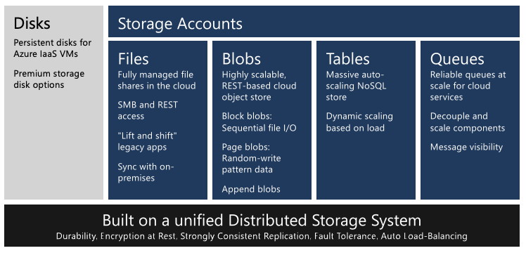
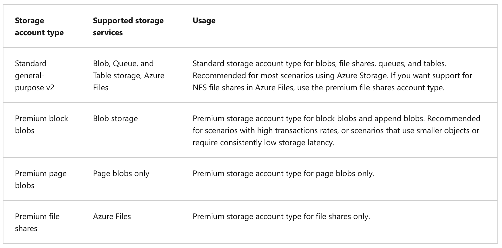
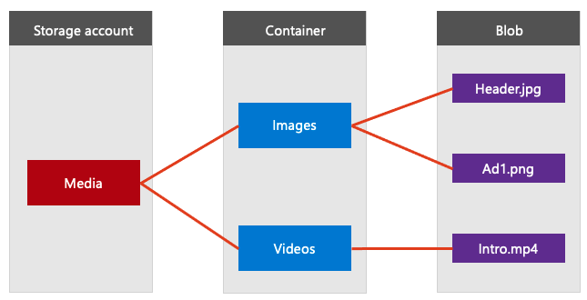
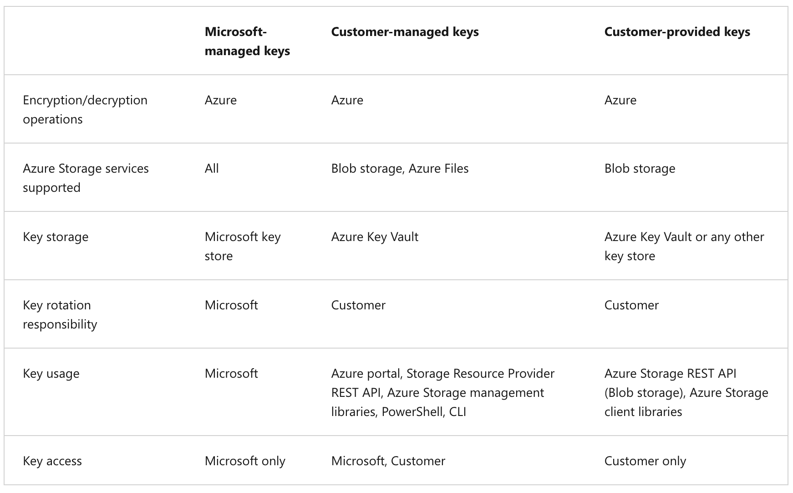
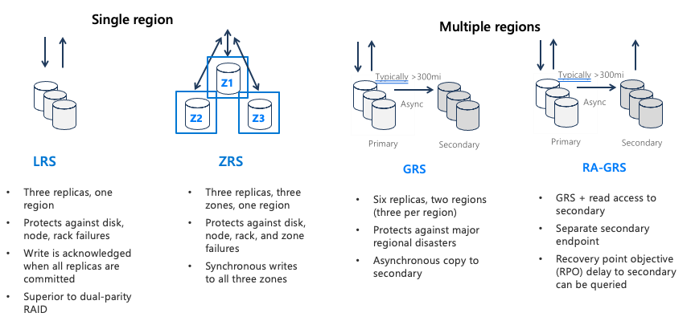
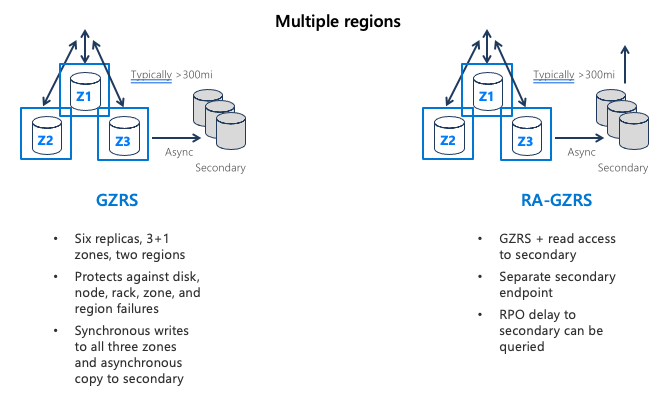
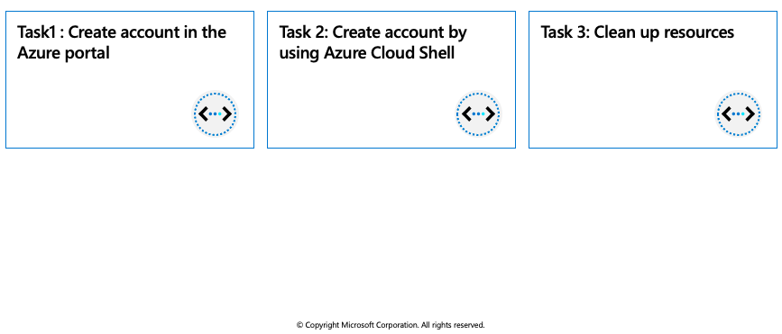

## Azure Blob storage

Azure Blob storage is Microsoft's object storage solution for the cloud. Blob storage is optimized for storing massive amounts of unstructured data. Unstructured data is data that does not adhere to a particular data model or definition, such as text or binary data.

Blob storage is designed for:

  * Serving images or documents directly to a browser.
  * Storing files for distributed access.
  * Streaming video and audio.
  * Writing to log files.
  * Storing data for backup and restore, disaster recovery, and archiving.
  * Storing data for analysis by an on-premises or Azure-hosted service.

An Azure storage account contains all of your Azure Storage data objects: blobs, files, queues, tables, and disks. The storage account provides a unique namespace for your Azure Storage data that is accessible from anywhere in the world over HTTP or HTTPS. Data in your Azure storage account is durable and highly available, secure, and massively scalable.



### Types of storage accounts

Azure Storage offers two performance levels of storage accounts, standard and premium. Each performance level supports different features and has its own pricing model.

  * Standard: This is the standard general-purpose v2 account and is recommended for most scenarios using Azure Storage.
  * Premium: Premium accounts offer higher performance by using solid-state drives. If you create a premium account you can choose between three account types, block blobs, page blobs, or file shares.

The following table describes the types of storage accounts recommended by Microsoft for most scenarios using Blob storage.



### Access tiers for block blob data

Azure Storage provides different options for accessing block blob data based on usage patterns. Each access tier in Azure Storage is optimized for a particular pattern of data usage. By selecting the right access tier for your needs, you can store your block blob data in the most cost-effective manner.

The available access tiers are:

  * The Hot access tier, which is optimized for frequent access of objects in the storage account. The Hot tier has the highest storage costs, but the lowest access costs. New storage accounts are created in the hot tier by default.
  * The Cool access tier, which is optimized for storing large amounts of data that is infrequently accessed and stored for at least 30 days. The Cool tier has lower storage costs and higher access costs compared to the Hot tier.
  * The Archive tier, which is available only for individual block blobs. The archive tier is optimized for data that can tolerate several hours of retrieval latency and will remain in the Archive tier for at least 180 days. The archive tier is the most cost-effective option for storing data, but accessing that data is more expensive than accessing data in the hot or cool tiers.

If there is a change in the usage pattern of your data, you can switch between these access tiers at any time.

## Discover Azure Blob storage resource types

Blob storage offers three types of resources:

  * The storage account.
  * A container in the storage account
  * A blob in a container



### Storage accounts

A storage account provides a unique namespace in Azure for your data. Every object that you store in Azure Storage has an address that includes your unique account name. The combination of the account name and the Azure Storage blob endpoint forms the base address for the objects in your storage account.

For example, if your storage account is named mystorageaccount, then the default endpoint for Blob storage is:

```azurecli-interactive
http://mystorageaccount.blob.core.windows.net
```

### Containers

A container organizes a set of blobs, similar to a directory in a file system. A storage account can include an unlimited number of containers, and a container can store an unlimited number of blobs. The container name must be lowercase.

### Blobs

Azure Storage supports three types of blobs:

  * **Block blobs** store text and binary data, up to about 190.7 TB. Block blobs are made up of blocks of data that can be managed individually.
  * **Append blobs** are made up of blocks like block blobs, but are optimized for append operations. Append blobs are ideal for scenarios such as logging data from virtual machines.
  * **Page blobs** store random access files up to 8 TB in size. Page blobs store virtual hard drive (VHD) files and serve as disks for Azure virtual machines.

## Azure Storage security features

Azure Storage provides a comprehensive set of security capabilities that together enable developers to build secure applications:

  * All data (including metadata) written to Azure Storage is automatically encrypted using Storage Service Encryption (SSE).
  * Azure Active Directory (Azure AD) and Role-Based Access Control (RBAC) are supported for Azure Storage for both resource management operations and data operations, as follows:
    * You can assign RBAC roles scoped to the storage account to security principals and use Azure AD to authorize resource management operations such as key management.
    * Azure AD integration is supported for blob and queue data operations. You can assign RBAC roles scoped to a subscription, resource group, storage account, or an individual container or queue to a security principal or a managed identity for Azure resources.
  * Data can be secured in transit between an application and Azure by using Client-Side Encryption, HTTPS, or SMB 3.0.
  * OS and data disks used by Azure virtual machines can be encrypted using Azure Disk Encryption.
  * Delegated access to the data objects in Azure Storage can be granted using a shared access signature.

### Azure Storage encryption for data at rest

Azure Storage automatically encrypts your data when persisting it to the cloud. Encryption protects your data and helps you meet your organizational security and compliance commitments. Data in Azure Storage is encrypted and decrypted transparently using 256-bit AES encryption, one of the strongest block ciphers available, and is FIPS 140-2 compliant. Azure Storage encryption is similar to BitLocker encryption on Windows.

Azure Storage encryption is enabled for all new and existing storage accounts and cannot be disabled. Because your data is secured by default, you don't need to modify your code or applications to take advantage of Azure Storage encryption.

Storage accounts are encrypted regardless of their performance tier (standard or premium) or deployment model (Azure Resource Manager or classic). All Azure Storage redundancy options support encryption, and all copies of a storage account are encrypted. All Azure Storage resources are encrypted, including blobs, disks, files, queues, and tables. All object metadata is also encrypted.

Encryption does not affect Azure Storage performance. There is no additional cost for Azure Storage encryption.

### Encryption key management

You can rely on Microsoft-managed keys for the encryption of your storage account, or you can manage encryption with your own keys. If you choose to manage encryption with your own keys, you have two options:

  * You can specify a customer-managed key to use for encrypting and decrypting all data in the storage account. A customer-managed key is used to encrypt all data in all services in your storage account.
  * You can specify a customer-provided key on Blob storage operations. A client making a read or write request against Blob storage can include an encryption key on the request for granular control over how blob data is encrypted and decrypted.

The following table compares key management options for Azure Storage encryption.



## Azure Storage redundancy options

Azure Storage always stores multiple copies of your data so that it is protected from planned and unplanned events, including transient hardware failures, network or power outages, and massive natural disasters. Redundancy ensures that your storage account meets its availability and durability targets even in the face of failures.

When deciding which redundancy option is best for your scenario, consider the tradeoffs between lower costs and higher availability. The factors that help determine which redundancy option you should choose include:

  * How your data is replicated in the primary region
  * Whether your data is replicated to a second region that is geographically distant to the primary region, to protect against regional disasters
  * Whether your application requires read access to the replicated data in the secondary region if the primary region becomes unavailable for any reason

An Azure Storage account always replicates your data to help ensure durability and high availability. Azure Storage copies data so that it’s protected from planned and unplanned events, including transient hardware failures, network or power outages, and natural disasters.

You can replicate data within the same datacenter, across zonal datacenters within the same region, or across geographically separated regions.

  * **Locally redundant storage (LRS)** replicates data three times within a single datacenter. LRS provides at least 99.999999999 (11 nines) percent durability of objects over a given year. LRS is the lowest-cost replication option, and it offers the least durability compared to other options.
  * **Zone-redundant storage (ZRS)** replicates data synchronously across three storage clusters in a single region. Each storage cluster is physically separated from the others and is in its own availability zone (AZ).
  * **Geo-redundant storage (GRS)** is designed to provide at least 99.99999999999999 (16 nines) percent durability of objects over a given year by replicating data to a secondary region that’s hundreds of miles away from the primary region.
  * **Read-access geo-redundant storage (RA-GRS)** is based on GRS. RA-GRS replicates data to another datacenter in a secondary region, and it also provides the option to read from the secondary region.
  


  * **Geographically zone-redundant storage (GZRS)** combines the high availability of ZRS with the protection from regional outages that GRS provides. A GZRS storage account replicates data across three Azure AZs in the primary region, and to a secondary geographic region for protection from regional disasters.
  * Optionally, you can enable read access to data in the secondary region with **Read-access geographically zone-redundant storage (RA-GZRS)** if your applications must read data in the event of a disaster in the primary region.


  
## Exercise: Create a block blob storage account
  


The block blob storage account type lets you create block blobs with premium performance characteristics. This type of storage account is optimized for workloads with high transactions rates or that require very fast access times.

In this exercise you will create a block blob storage account by using the Azure portal, and in the Cloud Shell using the Azure CLI.
  
### Prerequisites

 * **Azure Account** (https://docs.google.com/document/d/1XEkiGWUC4_AzngZQLQnVt8yWCb3dft1HzXglUnJcJzM/edit)

### Create account in the Azure portal

To create a block blob storage account in the Azure portal, follow these steps:

1. In the Azure portal, select **All services** > the **Storage** category > **Storage accounts**.

2. Under **Storage accounts**, select + **Create**.

3. In the **Subscription** field, select the subscription in which to create the storage account.

4. In the **Resource group** field, select **Create new** and enter az204-blob-rg as the name for the new resource group.

5. In the **Storage account name** field, enter a name for the account. Note the following guidelines:

  * The name must be unique across Azure.
  * The name must be between three and 24 characters long.
  * The name can include only numbers and lowercase letters.

6. In the Location field, select a location for the storage account, or use the default location.

7. For the rest of the settings, configure the following:
  
|**Field** | **Value** |
| -------- | --------- |
|**Value**	| Select **Premium**.|
|**Premium account type**	| Select **Block blobs**. |
|**Replication**	|Leave the default setting of **Locally-redundant storage (LRS)**. |

8. Select **Review + create** to review the storage account settings.

9. Select **Create**.

### Create account by using Azure Cloud Shell

1. Login to the [Azure Portal](https://portal.azure.com/) and open the Cloud Shell.


2. After the shell opens be sure to select the Bash environment.


3. Create a new resource group.

```azurecli-interactive
az group create --name az204-blob-rg --location eastus
```

4. Create the block blob storage account. See Step 5 in the Create account in the Azure portal instructions above for the storage account name requirements. 

```azurecli-interactive
az storage account create --resource-group az204-blob-rg --name \
<myStorageAcct> --location eastus \ 
--kind BlockBlobStorage --sku Premium_LRS
```

### Clean up resources

When you no longer need the resources in this walkthrough use the following command to delete the resource group and associated resources.


```azurecli-interactive
az group delete --name az204-blob-rg --no-wait
```
