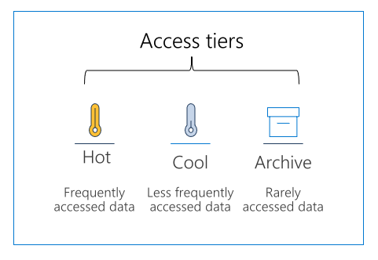

## Azure Blob storage lifecycle

Data sets have unique lifecycles. Early in the lifecycle, people access some data often. But the need for access drops drastically as the data ages. Some data stays idle in the cloud and is rarely accessed once stored. Some data expires days or months after creation, while other data sets are actively read and modified throughout their lifetimes.

### Access tiers



Azure storage offers different access tiers, allowing you to store blob object data in the most cost-effective manner. Available access tiers include:

  * **Hot** - Optimized for storing data that is accessed frequently.
  * **Cool** - Optimized for storing data that is infrequently accessed and stored for at least 30 days.
  * **Archive** - Optimized for storing data that is rarely accessed and stored for at least 180 days with flexible latency requirements, on the order of hours.

The following considerations apply to the different access tiers:

  * The access tier can be set on a blob during or after upload.
  * Only the hot and cool access tiers can be set at the account level. The archive access tier can only be set at the blob level.
  * Data in the cool access tier has slightly lower availability, but still has high durability, retrieval latency, and throughput characteristics similar to hot data.
  * Data in the archive access tier is stored offline. The archive tier offers the lowest storage costs but also the highest access costs and latency.
  * The hot and cool tiers support all redundancy options. The archive tier supports only LRS, GRS, and RA-GRS.
  * Data storage limits are set at the account level and not per access tier. You can choose to use all of your limit in one tier or across all three tiers.

### Manage the data lifecycle

Azure Blob storage lifecycle management offers a rich, rule-based policy for General Purpose v2 and Blob storage accounts. Use the policy to transition your data to the appropriate access tiers or expire at the end of the data's lifecycle. The lifecycle management policy lets you:

  * Transition blobs to a cooler storage tier (hot to cool, hot to archive, or cool to archive) to optimize for performance and cost
  * Delete blobs at the end of their lifecycles
  * Define rules to be run once per day at the storage account level
  * Apply rules to containers or a subset of blobs (using prefixes as filters)

Consider a scenario where data gets frequent access during the early stages of the lifecycle, but only occasionally after two weeks. Beyond the first month, the data set is rarely accessed. In this scenario, hot storage is best during the early stages. Cool storage is most appropriate for occasional access. Archive storage is the best tier option after the data ages over a month. By adjusting storage tiers in respect to the age of data, you can design the least expensive storage options for your needs. To achieve this transition, lifecycle management policy rules are available to move aging data to cooler tiers.

### Discover Blob storage lifecycle policies

A lifecycle management policy is a collection of rules in a JSON document. Each rule definition within a policy includes a filter set and an action set. The filter set limits rule actions to a certain set of objects within a container or objects names. The action set applies the tier or delete actions to the filtered set of objects.:

```azurecli-interactive
{
  "rules": [
    {
      "name": "rule1",
      "enabled": true,
      "type": "Lifecycle",
      "definition": {...}
    },
    {
      "name": "rule2",
      "type": "Lifecycle",
      "definition": {...}
    }
  ]
}
```

A policy is a collection of rules:

|**Parameter name** | **Parameter type** | **Notes** |
| --- | --- | --- |
|`rules`	| An array of rule objects | At least one rule is required in a policy. You can define up to 100 rules in a policy. |

Each rule within the policy has several parameters:

|**Parameter name** | **Parameter type** | **Notes** | **Required** |
| --- | --- | --- | --- |
|`name`	| An array of rule objects | A rule name can include up to 256 alphanumeric characters. Rule name is case-sensitive. It must be unique within a policy. | True |
|`enabled`	| An array of rule objects | An optional boolean to allow a rule to be temporary disabled. Default value is true if it's not set. | False |
|`type`	| An enum value	 | The current valid type is Lifecycle. | True |
|`definition`	| An object that defines the lifecycle rule | Each definition is made up of a filter set and an action set. | True |

### Rules

Each rule definition includes a filter set and an action set. The filter set limits rule actions to a certain set of objects within a container or objects names. The action set applies the tier or delete actions to the filtered set of objects.

The following sample rule filters the account to run the actions on objects that exist inside `container1` and start with `foo`.

  * Tier blob to cool tier 30 days after last modification
  * Tier blob to archive tier 90 days after last modification
  * Delete blob 2,555 days (seven years) after last modification
  * Delete blob snapshots 90 days after snapshot creation

```azurecli-interactive
{
  "rules": [
    {
      "name": "ruleFoo",
      "enabled": true,
      "type": "Lifecycle",
      "definition": {
        "filters": {
          "blobTypes": [ "blockBlob" ],
          "prefixMatch": [ "container1/foo" ]
        },
        "actions": {
          "baseBlob": {
            "tierToCool": { "daysAfterModificationGreaterThan": 30 },
            "tierToArchive": { "daysAfterModificationGreaterThan": 90 },
            "delete": { "daysAfterModificationGreaterThan": 2555 }
          },
          "snapshot": {
            "delete": { "daysAfterCreationGreaterThan": 90 }
          }
        }
      }
    }
  ]
}
```

## Implement Blob storage lifecycle policies

You can add, edit, or remove a policy by using any of the following methods:

  * Azure portal
  * Azure PowerShell
  * Azure CLI
  * REST APIs

Below are the steps and some examples for the Portal and Azure CLI.

## Azure portal

There are two ways to add a policy through the Azure portal: Azure portal List view, and Azure portal Code view.

### Azure portal List view

1. Sign in to the [Azure portal](https://portal.azure.com/).

2. Select **All resources** and then select your storage account.

3. Under **Data management**, select **Lifecycle management** to view or change your rules.

4. Select the **List view** tab.

5. Select **Add rule** and then fill out the **Action set** form fields. In the following example, blobs are moved to cool storage if they haven't been modified for 30 days.

6. Select **Filter set** to add an optional filter. Then, select Browse to specify a container and folder by which to filter.

7. Select **Review + add** to review the policy settings.

8. Select **Add** to add the new policy.

### Azure portal Code view

1. Follow the first three steps above in the List view section.

2. Select the Code view tab. The following JSON is an example of a policy that moves a block blob whose name begins with log to the cool tier if it has been more than 30 days since the blob was modified.

```azurecli-interactive
{
  "rules": [
    {
      "enabled": true,
      "name": "move-to-cool",
      "type": "Lifecycle",
      "definition": {
        "actions": {
          "baseBlob": {
            "tierToCool": {
              "daysAfterModificationGreaterThan": 30
            }
          }
        },
        "filters": {
          "blobTypes": [
            "blockBlob"
          ],
          "prefixMatch": [
            "sample-container/log"
          ]
        }
      }
    }
  ]
}
```

### Azure CLI

To add a lifecycle management policy with Azure CLI, write the policy to a JSON file, then call the `az storage account management-policy create` command to create the policy.

```azurecli-interactive
az storage account management-policy create \
    --account-name <storage-account> \
    --policy @policy.json \
    --resource-group <resource-group>
```

A lifecycle management policy must be read or written in full. Partial updates are not supported.
