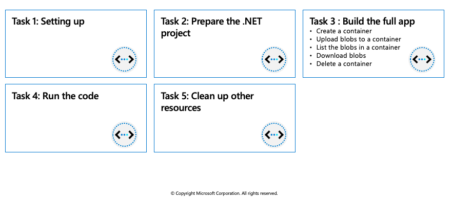

## Work with Azure Blob storage 

The Azure Storage client libraries for .NET offer a convenient interface for making calls to Azure Storage.

### Azure Blob storage client library

The Azure Storage client libraries for .NET offer a convenient interface for making calls to Azure Storage. The latest version of the Azure Storage client library is version 12.x. Microsoft recommends using version 12.x for new applications.

Below are the classes in the Azure.Storage.Blobs namespace and their purpose:

|**Class** | **Description** |
| -------- | --------- |
|`BlobClient`	| The `BlobClient` allows you to manipulate Azure Storage blobs.|
|`BlobClientOptions`	| Provides the client configuration options for connecting to Azure Blob Storage. |
|`BlobContainerClient`	|The `BlobContainerClient` allows you to manipulate Azure Storage containers and their blobs. |
|`BlobServiceClient`	| The `BlobServiceClient` allows you to manipulate Azure Storage service resources and blob containers. The storage account provides the top-level namespace for the Blob service. |
|`BlobUriBuilder`	| The `BlobUriBuilder` class provides a convenient way to modify the contents of a Uri instance to point to different Azure Storage resources like an account, container, or blob.. |

## Exercise: Create Blob storage resources by using the .NET client library



This exercise uses the Azure Blob storage client library to show you how to perform the following actions on Azure Blob storage in a console app:

  * Create a container
  * Upload blobs to a container
  * List the blobs in a container
  * Download blobs
  * Delete a container

### Prerequisites

 * **Azure Account** (https://docs.google.com/document/d/1XEkiGWUC4_AzngZQLQnVt8yWCb3dft1HzXglUnJcJzM/edit)
 * [Visual Studio Code](https://code.visualstudio.com/) on one of the supported platforms.
 * [.NET 6](https://dotnet.microsoft.com/download/dotnet/6.0) is the target framework for the steps below.
 * The [C# extension](https://marketplace.visualstudio.com/items?itemName=ms-dotnettools.csharp) for Visual Studio Code.

### Setting up

Perform the following actions to prepare Azure, and your local environment, for the exercise.

1. Start Visual Studio Code and open a terminal window by selecting **Terminal** from the top application bar, then selecting **New Terminal**.

2. Login to Azure by using the command below. A browser window should open letting you choose which account to login with.

```azurecli-interactive
az login
```

3. Create a resource group for the resources needed for this exercise. 

```azurecli-interactive
az group create --location eastus --name az204-blob-rg
```

4. Create a storage account. We need a storage account created to use in the application. Replace <myStorageAcct> with a unique name.
 
```azurecli-interactive
az storage account create --resource-group az204-blob-rg --name <myStorageAcct> --location eastus --sku Standard_LRS
```
  
> **Note**: 
> Storage account names must be between 3 and 24 characters in length and may contain numbers and lowercase letters only. Your storage account name must be unique within Azure. No two storage accounts can have the same name.
 
5. Get credentials for the storage account.
  
  * Navigate to the [Azure portal](https://portal.azure.com/).
  * Locate the storage account created.
  * Select **Access keys** in the **Security + networking** section of the navigation pane. Here, you can view your account access keys and the complete connection string for each key.
  * Find the **Connection string** value under **key1**, and select the **Copy** button to copy the connection string. You will add the connection string value to the code in the next section.
  * In the **Blob** section of the storage account overview, select **Containers**. Leave the windows open so you can view changes made to the storage as you progress through the exercise.

### Prepare the .NET project

In this section we'll create project named az204-blob and install the Azure Blob Storage client library.

1. In the VS Code terminal navigate to a directory where you want to store your project.

2. In the terminal, use the `dotnet new` command to create a new console app. This command creates a simple "Hello World" C# project with a single source file: Program.cs.

```azurecli-interactive
dotnet new console -n az204-blob
```

3. Use the following commands to switch to the newly created az204-blob folder and build the app to verify that all is well.
  
```azurecli-interactive
cd az204-blob
dotnet build
```  

4. Inside the az204-blob folder, create another folder named data. This is where the blob data files will be created and stored.

```azurecli-interactive
mkdir data
```  

5. While still in the application directory, install the Azure Blob Storage client library for .NET package by using the `dotnet add package` command.

```azurecli-interactive
dotnet add package Azure.Storage.Blobs
```  

> **Tip**: 
> Leave the console window open so you can use it to build and run the app later in the exercise.


6. Open the Program.cs file in your editor, and replace the contents with the following code.

```azurecli-interactive
using Azure.Storage.Blobs;
using Azure.Storage.Blobs.Models;

Console.WriteLine("Azure Blob Storage exercise\n");

// Run the examples asynchronously, wait for the results before proceeding
ProcessAsync().GetAwaiter().GetResult();

Console.WriteLine("Press enter to exit the sample application.");
Console.ReadLine();

static async Task ProcessAsync()
{
    // Copy the connection string from the portal in the variable below.
    string storageConnectionString = "CONNECTION STRING";

    // Create a client that can authenticate with a connection string
    BlobServiceClient blobServiceClient = new BlobServiceClient(storageConnectionString);

    // COPY EXAMPLE CODE BELOW HERE

}
```  
  
7. Set the `storageConnectionString` variable to the value you copied from the portal.

## Build the full app

For each of the following sections below you'll find a brief description of the action being taken as well as the code snippet you'll add to the project. Each new snippet is appended to the one before it, and we'll build and run the console app at the end.

For each example below copy the code and append it to the previous snippet in the example code section of the Program.cs file.

### Create a container

To create the container first create an instance of the `BlobServiceClient` class, then call the `CreateBlobContainerAsync` method to create the container in your storage account. A GUID value is appended to the container name to ensure that it is unique. The `CreateBlobContainerAsync` method will fail if the container already exists.
  
```azurecli-interactive
//Create a unique name for the container
string containerName = "wtblob" + Guid.NewGuid().ToString();

// Create the container and return a container client object
BlobContainerClient containerClient = await blobServiceClient.CreateBlobContainerAsync(containerName);
Console.WriteLine("A container named '" + containerName + "' has been created. " +
    "\nTake a minute and verify in the portal." + 
    "\nNext a file will be created and uploaded to the container.");
Console.WriteLine("Press 'Enter' to continue.");
Console.ReadLine();
```  

### Upload blobs to a container

The following code snippet gets a reference to a `BlobClient` object by calling the `GetBlobClient` method on the container created in the previous section. It then uploads the selected local file to the blob by calling the `UploadAsync` method. This method creates the blob if it doesn't already exist, and overwrites it if it does.

```azurecli-interactive
// Create a local file in the ./data/ directory for uploading and downloading
string localPath = "./data/";
string fileName = "wtfile" + Guid.NewGuid().ToString() + ".txt";
string localFilePath = Path.Combine(localPath, fileName);

// Write text to the file
await File.WriteAllTextAsync(localFilePath, "Hello, World!");

// Get a reference to the blob
BlobClient blobClient = containerClient.GetBlobClient(fileName);

Console.WriteLine("Uploading to Blob storage as blob:\n\t {0}\n", blobClient.Uri);

// Open the file and upload its data
using (FileStream downloadFileStream = File.OpenWrite(downloadFilePath))
    {
        await download.Content.CopyToAsync(downloadFileStream);
        downloadFileStream.Close();
    }

Console.WriteLine("\nThe file was uploaded. We'll verify by listing" + 
        " the blobs next.");
Console.WriteLine("Press 'Enter' to continue.");
Console.ReadLine();
```  

### List the blobs in a container

List the blobs in the container by using the GetBlobsAsync method. In this case, only one blob has been added to the container, so the listing operation returns just that one blob.
  
```azurecli-interactive
// List blobs in the container
Console.WriteLine("Listing blobs...");
await foreach (BlobItem blobItem in containerClient.GetBlobsAsync())
{
    Console.WriteLine("\t" + blobItem.Name);
}

Console.WriteLine("\nYou can also verify by looking inside the " + 
        "container in the portal." +
        "\nNext the blob will be downloaded with an altered file name.");
Console.WriteLine("Press 'Enter' to continue.");
Console.ReadLine();
```  
  
### Download blobs
  
Download the blob created previously to your local file system by using the `DownloadAsync` method. The example code adds a suffix of "DOWNLOADED" to the blob name so that you can see both files in local file system.

```azurecli-interactive
// Download the blob to a local file
// Append the string "DOWNLOADED" before the .txt extension 
string downloadFilePath = localFilePath.Replace(".txt", "DOWNLOADED.txt");

Console.WriteLine("\nDownloading blob to\n\t{0}\n", downloadFilePath);

// Download the blob's contents and save it to a file
BlobDownloadInfo download = await blobClient.DownloadAsync();

using (FileStream downloadFileStream = File.OpenWrite(downloadFilePath))
{
    await download.Content.CopyToAsync(downloadFileStream);
}
Console.WriteLine("\nLocate the local file in the data directory created earlier to verify it was downloaded.");
Console.WriteLine("The next step is to delete the container and local files.");
Console.WriteLine("Press 'Enter' to continue.");
Console.ReadLine();
``` 
  
### Delete a container

The following code cleans up the resources the app created by deleting the entire container using `DeleteAsync`. It also deletes the local files created by the app.
  
```azurecli-interactive
// Delete the container and clean up local files created
Console.WriteLine("\n\nDeleting blob container...");
await containerClient.DeleteAsync();

Console.WriteLine("Deleting the local source and downloaded files...");
File.Delete(localFilePath);
File.Delete(downloadFilePath);

Console.WriteLine("Finished cleaning up.");
```
  
### Run the code

Now that the app is complete it's time to build and run it. Ensure you are in your application directory and run the following commands:
  
```azurecli-interactive
dotnet build
dotnet run
```
  
There are many prompts in the app to allow you to take the time to see what's happening in the portal after each step.

### Clean up other resources

The app deleted the resources it created. You can delete all of the resources created for this exercise by using the command below. You will need to confirm that you want to delete the resources.
  
```azurecli-interactive
az group delete --name az204-blob-rg --no-wait
```
  
## Manage container properties and metadata by using .NET
  
Blob containers support system properties and user-defined metadata, in addition to the data they contain.

  * **System properties**: System properties exist on each Blob storage resource. Some of them can be read or set, while others are read-only. Under the covers, some system properties correspond to certain standard HTTP headers. The Azure Storage client library for .NET maintains these properties for you.

  * **User-defined metadata**: User-defined metadata consists of one or more name-value pairs that you specify for a Blob storage resource. You can use metadata to store additional values with the resource. Metadata values are for your own purposes only, and do not affect how the resource behaves.

Metadata name/value pairs are valid HTTP headers, and so should adhere to all restrictions governing HTTP headers. Metadata names must be valid HTTP header names and valid C# identifiers, may contain only ASCII characters, and should be treated as case-insensitive. Metadata values containing non-ASCII characters should be Base64-encoded or URL-encoded.

### Retrieve container properties

To retrieve container properties, call one of the following methods of the BlobContainerClient class:

  * `GetProperties`
  * `GetPropertiesAsync`

### Set and retrieve metadata

You can specify metadata as one or more name-value pairs on a blob or container resource. To set metadata, add name-value pairs to an IDictionary object, and then call one of the following methods of the BlobContainerClient class to write the values:

  * `SetMetadata`
  * `SetMetadataAsync`

## Set and retrieve properties and metadata for blob resources by using REST
  
Containers and blobs support custom metadata, represented as HTTP headers. Metadata headers can be set on a request that creates a new container or blob resource, or on a request that explicitly creates a property on an existing resource.

### Metadata header format
  
Metadata headers are name/value pairs. The format for the header is:

```azurecli-interactive
x-ms-meta-name:string-value
```

### Operations on metadata

Metadata on a blob or container resource can be retrieved or set directly, without returning or altering the content of the resource.

Note that metadata values can only be read or written in full; partial updates are not supported. Setting metadata on a resource overwrites any existing metadata values for that resource.

### Retrieving properties and metadata
  
The GET and HEAD operations both retrieve metadata headers for the specified container or blob. These operations return headers only; they do not return a response body. The URI syntax for retrieving metadata headers on a container is as follows:
  
```azurecli-interactive
GET/HEAD https://myaccount.blob.core.windows.net/mycontainer?restype=container
```
  
The URI syntax for retrieving metadata headers on a blob is as follows:  
  
```azurecli-interactive
GET/HEAD https://myaccount.blob.core.windows.net/mycontainer/myblob?comp=metadata
```

### Setting Metadata Headers
  
The PUT operation sets metadata headers on the specified container or blob, overwriting any existing metadata on the resource. Calling PUT without any headers on the request clears all existing metadata on the resource.

The URI syntax for setting metadata headers on a container is as follows:
    
```azurecli-interactive
PUT https://myaccount.blob.core.windows.net/mycontainer?comp=metadata&restype=container
```
  
The URI syntax for setting metadata headers on a blob is as follows:  
  
```azurecli-interactive
PUT https://myaccount.blob.core.windows.net/mycontainer/myblob?comp=metadata
```
  
### Standard HTTP properties for containers and blobs
  
Containers and blobs also support certain standard HTTP properties. Properties and metadata are both represented as standard HTTP headers; the difference between them is in the naming of the headers. Metadata headers are named with the header prefix x-ms-meta- and a custom name. Property headers use standard HTTP header names, as specified in the Header Field Definitions section 14 of the HTTP/1.1 protocol specification.

The standard HTTP headers supported on containers include:

  * `ETag`
  * `Last-Modified`
  
The standard HTTP headers supported on blobs include:

  * `ETag`
  * `Last-Modified`
  * `Content-Length`
  * `Content-Type`
  * `Content-MD5`
  * `Content-Encoding`
  * `Content-Language`
  * `Cache-Control`
  * `Origin`
  * `Range`
