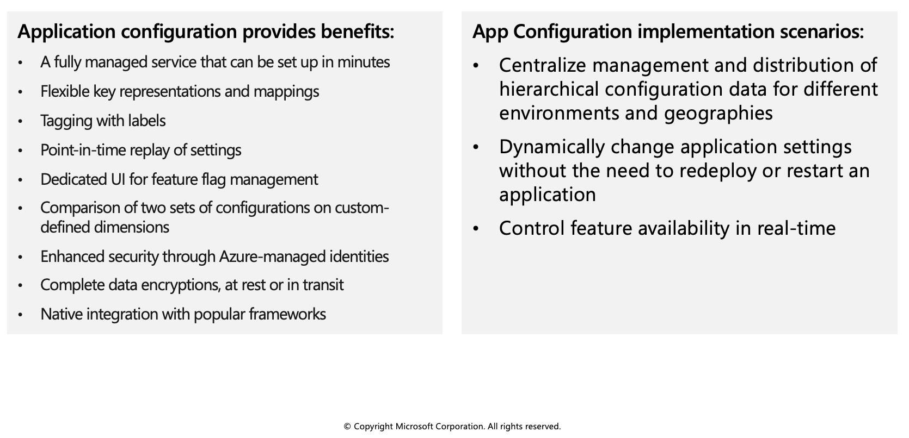
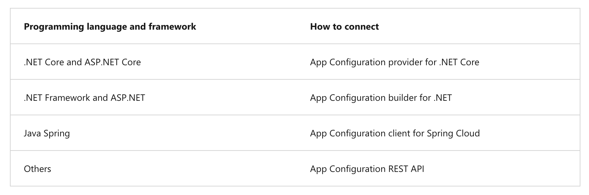
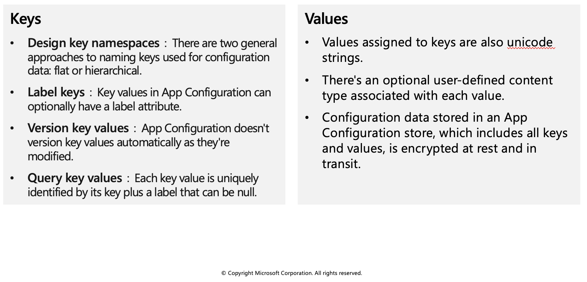
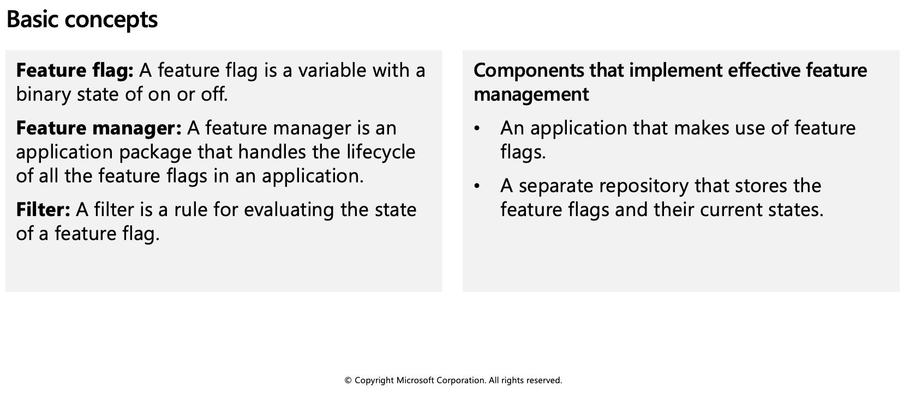
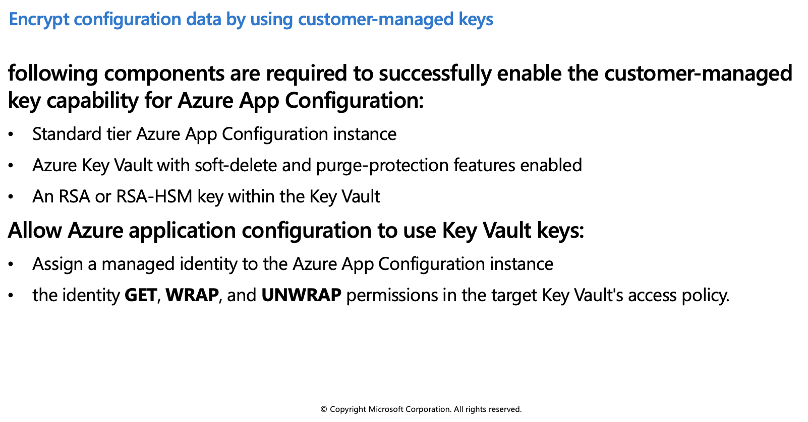
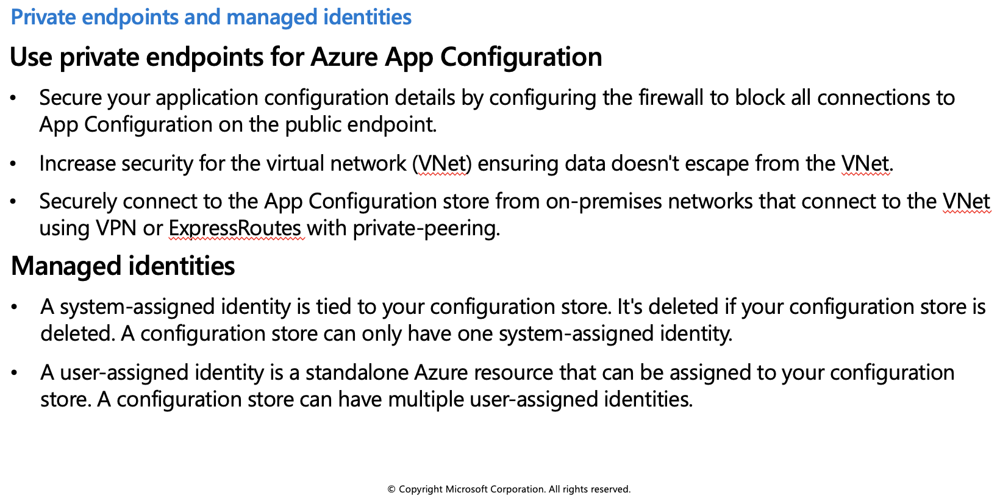

## Azure App Configuration service

Modern programs, especially programs running in a cloud, generally have many components that are distributed in nature. Spreading configuration settings across these components can lead to hard-to-troubleshoot errors during an application deployment. Use App Configuration to store all the settings for your application and secure their access in one place.



### Use App Configuration

The easiest way to add an App Configuration store to your application is through a client library that Microsoft provides. Based on the programming language and framework, the following best methods are available to you.



## Create paired keys and values



### Keys

Keys serve as the name for key-value pairs and are used to store and retrieve corresponding values. It's a common practice to organize keys into a hierarchical namespace by using a character delimiter, such as `/` or `:`. Use a convention that's best suited for your application. App Configuration treats keys as a whole. It doesn't parse keys to figure out how their names are structured or enforce any rule on them.

Keys stored in App Configuration are case-sensitive, unicode-based strings. The keys app1 and App1 are distinct in an App Configuration store. Keep this in mind when you use configuration settings within an application because some frameworks handle configuration keys case-insensitively.

You can use any unicode character in key names entered into App Configuration except for `*`, `,`, and `\`. These characters are reserved. If you need to include a reserved character, you must escape it by using \`{Reserved Character}`. There's a combined size limit of 10,000 characters on a key-value pair. This limit includes all characters in the key, its value, and all associated optional attributes. Within this limit, you can have many hierarchical levels for keys.

### Values

Values assigned to keys are also unicode strings. You can use all unicode characters for values. There's an optional user-defined content type associated with each value. Use this attribute to store information, for example an encoding scheme, about a value that helps your application to process it properly.

Configuration data stored in an App Configuration store, which includes all keys and values, is encrypted at rest and in transit. App Configuration isn't a replacement solution for Azure Key Vault. Don't store application secrets in it.

## Manage application features

Feature management is a modern software-development practice that decouples feature release from code deployment and enables quick changes to feature availability on demand. It uses a technique called feature flags (also known as feature toggles, feature switches, and so on) to dynamically administer a feature's lifecycle.



### Feature flag usage in code

The basic pattern for implementing feature flags in an application is simple. You can think of a feature flag as a Boolean state variable used with an `if` conditional statement in your code:

```azurecli-interactive
if (featureFlag) {
    // Run the following code
}
```

In this case, if `featureFlag` is set to `True`, the enclosed code block is executed; otherwise, it's skipped. You can set the value of `featureFlag` statically, as in the following code example:

```azurecli-interactive
bool featureFlag = true;
```

You can also evaluate the flag's state based on certain rules:

```azurecli-interactive
bool featureFlag = isBetaUser();
```

A slightly more complicated feature flag pattern includes an `else` statement as well:

```azurecli-interactive
if (featureFlag) {
    // This following code will run if the featureFlag value is true
} else {
    // This following code will run if the featureFlag value is false
}
```

### Feature flag declaration

Each feature flag has two parts: a name and a list of one or more filters that are used to evaluate if a feature's state is on (that is, when its value is `True`). A filter defines a use case for when a feature should be turned on.

When a feature flag has multiple filters, the filter list is traversed in order until one of the filters determines the feature should be enabled. At that point, the feature flag is on, and any remaining filter results are skipped. If no filter indicates the feature should be enabled, the feature flag is off.

The feature manager supports appsettings.json as a configuration source for feature flags. The following example shows how to set up feature flags in a JSON file:

```azurecli-interactive
"FeatureManagement": {
    "FeatureA": true, // Feature flag set to on
    "FeatureB": false, // Feature flag set to off
    "FeatureC": {
        "EnabledFor": [
            {
                "Name": "Percentage",
                "Parameters": {
                    "Value": 50
                }
            }
        ]
    }
}
```

### Feature flag repository

To use feature flags effectively, you need to externalize all the feature flags used in an application. This approach allows you to change feature flag states without modifying and redeploying the application itself.

Azure App Configuration is designed to be a centralized repository for feature flags. You can use it to define different kinds of feature flags and manipulate their states quickly and confidently. You can then use the App Configuration libraries for various programming language frameworks to easily access these feature flags from your application.

## Secure app configuration data

In this unit you will learn how to secure your apps configuration data by using:

* Customer-managed keys
* Private endpoints
* Managed identities

### Encrypt configuration data by using customer-managed keys

Azure App Configuration encrypts sensitive information at rest using a 256-bit AES encryption key provided by Microsoft. Every App Configuration instance has its own encryption key managed by the service and used to encrypt sensitive information. Sensitive information includes the values found in key-value pairs. When customer-managed key capability is enabled, App Configuration uses a managed identity assigned to the App Configuration instance to authenticate with Azure Active Directory. The managed identity then calls Azure Key Vault and wraps the App Configuration instance's encryption key. The wrapped encryption key is then stored and the unwrapped encryption key is cached within App Configuration for one hour. App Configuration refreshes the unwrapped version of the App Configuration instance's encryption key hourly. This ensures availability under normal operating conditions.



### Use private endpoints for Azure App Configuration

You can use private endpoints for Azure App Configuration to allow clients on a virtual network (VNet) to securely access data over a private link. The private endpoint uses an IP address from the VNet address space for your App Configuration store. Network traffic between the clients on the VNet and the App Configuration store traverses over the VNet using a private link on the Microsoft backbone network, eliminating exposure to the public internet.

### Managed identities

A managed identity from Azure Active Directory (AAD) allows Azure App Configuration to easily access other AAD-protected resources, such as Azure Key Vault. The identity is managed by the Azure platform. It does not require you to provision or rotate any secrets.



### Add a system-assigned identity

To set up a managed identity using the Azure CLI, use the `az appconfig identity assign` command against an existing configuration store. The following Azure CLI example creates a system-assigned identity for an Azure App Configuration store named `myTestAppConfigStore`.

```azurecli-interactive
az appconfig identity assign \ 
    --name myTestAppConfigStore \ 
    --resource-group myResourceGroup
```

### Add a user-assigned identity

Creating an App Configuration store with a user-assigned identity requires that you create the identity and then assign its resource identifier to your store. The following Azure CLI examples create a user-assigned identity called `myUserAssignedIdentity` and assigns it to an Azure App Configuration store named `myTestAppConfigStore`.

Create an identity using the `az identity create` command:

```azurecli-interactive
az identity create --resource-group myResourceGroup --name myUserAssignedIdentity
```

Assign the new user-assigned identity to the `myTestAppConfigStore` configuration store:

```azurecli-interactive
az appconfig identity assign --name myTestAppConfigStore \ 
    --resource-group myResourceGroup \ 
    --identities /subscriptions/[subscription id]/resourcegroups/myResourceGroup/providers/Microsoft.ManagedIdentity/userAssignedIdentities/myUserAssignedIdentity
```
