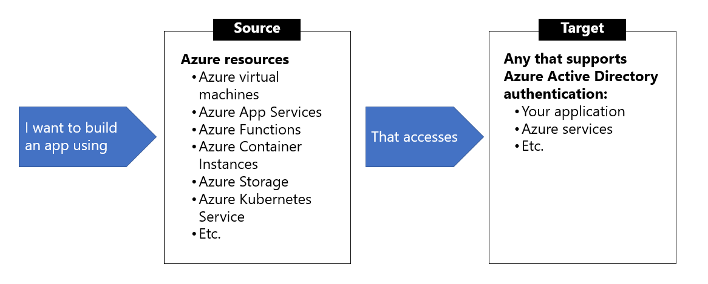

## Managed identities

Managed identities provide an identity for applications to use when connecting to resources that support Azure Active Directory (Azure AD) authentication. Applications may use the managed identity to obtain Azure AD tokens. For example, an application may use a managed identity to access resources like Azure Key Vault where developers can store credentials in a secure manner or to access storage accounts.


Internally, managed identities are service principals of a special type, which are locked to only be used with Azure resources. When the managed identity is deleted, the corresponding service principal is automatically removed.

## When to use managed identities

The image below gives an overview of the scenarios that support using managed identities. For example, you can use managed identities if you want to build an app using Azure App Services that accesses Azure Storage without having to manage any credentials.



### What Azure services support managed identities?

Managed identities for Azure resources can be used to authenticate to services that support Azure Active Directory authentication. For a list of Azure services that support the managed identities for Azure resources feature, visit Services that support managed identities for Azure resources.

The rest of this module will use Azure virtual machines in the examples, but the same concepts and similar actions can be applied to any resource in Azure that supports Azure Active Directory authentication.

## Managed identities authentication flow

In this unit, you learn how managed identities work with Azure virtual machines. Below are the flows detailing how the two types of managed identities work with an Azure virtual machine.

### How a system-assigned managed identity works with an Azure virtual machine

1. Azure Resource Manager receives a request to enable the system-assigned managed identity on a virtual machine.

2. Azure Resource Manager creates a service principal in Azure Active Directory for the identity of the virtual machine. The service principal is created in the Azure Active Directory tenant that's trusted by the subscription.

3. Azure Resource Manager configures the identity on the virtual machine by updating the Azure Instance Metadata Service identity endpoint with the service principal client ID and certificate.

4. After the virtual machine has an identity, use the service principal information to grant the virtual machine access to Azure resources. To call Azure Resource Manager, use role-based access control in Azure Active Directory to assign the appropriate role to the virtual machine service principal. To call Key Vault, grant your code access to the specific secret or key in Key Vault.

5, Your code that's running on the virtual machine can request a token from the Azure Instance Metadata service endpoint, accessible only from within the virtual machine: `http://169.254.169.254/metadata/identity/oauth2/token`

6. A call is made to Azure Active Directory to request an access token (as specified in step 5) by using the client ID and certificate configured in step 3. Azure Active Directory returns a JSON Web Token (JWT) access token.

7. Your code sends the access token on a call to a service that supports Azure Active Directory authentication.

### How a user-assigned managed identity works with an Azure virtual machine

1. Azure Resource Manager receives a request to create a user-assigned managed identity.

2. Azure Resource Manager creates a service principal in Azure Active Directory for the user-assigned managed identity. The service principal is created in the Azure Active Directory tenant that's trusted by the subscription.

3. Azure Resource Manager receives a request to configure the user-assigned managed identity on a virtual machine and updates the Azure Instance Metadata Service identity endpoint with the user-assigned managed identity service principal client ID and certificate.

4. After the user-assigned managed identity is created, use the service principal information to grant the identity access to Azure resources. To call Azure Resource Manager, use role-based access control in Azure Active Directory to assign the appropriate role to the service principal of the user-assigned identity. To call Key Vault, grant your code access to the specific secret or key in Key Vault.

> **Note**: You can also do this step before step 3.

5. Your code that's running on the virtual machine can request a token from the Azure Instance Metadata Service identity endpoint, accessible only from within the virtual machine: `http://169.254.169.254/metadata/identity/oauth2/token`

6. A call is made to Azure Active Directory to request an access token (as specified in step 5) by using the client ID and certificate configured in step 3. Azure Active Directory returns a JSON Web Token (JWT) access token.

7. Your code sends the access token on a call to a service that supports Azure Active Directory authentication.

## Configure managed identities

You can configure an Azure virtual machine with a managed identity during, or after, the creation of the virtual machine. Below are some CLI examples showing the commands for both system- and user-assigned identities.

### System-assigned managed identity


### Enable system-assigned managed identity during creation of an Azure virtual machine

The following example creates a virtual machine named myVM with a system-assigned managed identity, as requested by the `--assign-identity` parameter, with the specified `--role` and `--scope`. The `--admin-username` and `--admin-password` parameters specify the administrative user name and password account for virtual machine sign-in. Update these values as appropriate for your environment:

```azurecli-interactive
az vm create --resource-group myResourceGroup \ 
    --name myVM --image win2016datacenter \ 
    --generate-ssh-keys \ 
    --assign-identity \ 
    --role contributor \
    --scope mySubscription \
    --admin-username azureuser \ 
    --admin-password myPassword12
```

### Enable system-assigned managed identity on an existing Azure virtual machine

Use the `az vm identity assign` command to assign the system-assigned identity to an existing virtual machine:

```azurecli-interactive
az vm identity assign -g myResourceGroup -n myVm
```

### User-assigned managed identity

To assign a user-assigned identity to a virtual machine during its creation, your account needs the **Virtual Machine Contributor** and **Managed Identity Operator role assignments. No additional Azure AD directory role assignments are required.

Enabling user-assigned managed identities is a two-step process:

1. Create the user-assigned identity

2. Assign the identity to a virtual machine

### Create a user-assigned identity

Create a user-assigned managed identity using `az identity create`. The `-g` parameter specifies the resource group where the user-assigned managed identity is created, and the `-n` parameter specifies its name.

```azurecli-interactive
az identity create -g myResourceGroup -n myUserAssignedIdentity
```

### Assign a user-assigned managed identity during the creation of an Azure virtual machine

The following example creates a virtual machine associated with the new user-assigned identity, as specified by the `--assign-identity` parameter, with the given `--role` and `--scope`.

```azurecli-interactive
az vm create \
--resource-group <RESOURCE GROUP> \
--name <VM NAME> \
--image UbuntuLTS \
--admin-username <USER NAME> \
--admin-password <PASSWORD> \
--assign-identity <USER ASSIGNED IDENTITY NAME> \
--role <ROLE> \
--scope <SUBSCRIPTION>
```

### Assign a user-assigned managed identity to an existing Azure virtual machine

Assign the user-assigned identity to your virtual machine using `az vm identity assign`.

```azurecli-interactive
az vm identity assign \
    -g <RESOURCE GROUP> \
    -n <VM NAME> \
    --identities <USER ASSIGNED IDENTITY>
```

### Azure SDKs with managed identities for Azure resources support


## Acquire an access token

A client application can request managed identities for Azure resources app-only access token for accessing a given resource. The token is based on the managed identities for Azure resources service principal. As such, there is no need for the client to register itself to obtain an access token under its own service principal. The token is suitable for use as a bearer token in service-to-service calls requiring client credentials.

This unit provides various code and script examples for token acquisition, as well as guidance on important topics such as handling token expiration and HTTP errors.

### Acquire a token

The fundamental interface for acquiring an access token is based on REST, making it accessible to any client application running on the VM that can make HTTP REST calls. This is similar to the Azure AD programming model, except the client uses an endpoint on the virtual machine versus an Azure AD endpoint.

Sample request using the Azure Instance Metadata Service (IMDS) endpoint:


Sample response:

```azurecli-interactive
HTTP/1.1 200 OK
Content-Type: application/json
{
  "access_token": "eyJ0eXAi...",
  "refresh_token": "",
  "expires_in": "3599",
  "expires_on": "1506484173",
  "not_before": "1506480273",
  "resource": "https://management.azure.com/",
  "token_type": "Bearer"
}
```

### Get a token by using C#

The code sample below builds the request to acquire a token, calls the endpoint, and then extracts the token from the response.

```azurecli-interactive
using System;
using System.Collections.Generic;
using System.IO;
using System.Net;
using System.Web.Script.Serialization; 

// Build request to acquire managed identities for Azure resources token
HttpWebRequest request = (HttpWebRequest)WebRequest.Create("http://169.254.169.254/metadata/identity/oauth2/token?api-version=2018-02-01&resource=https://management.azure.com/");
request.Headers["Metadata"] = "true";
request.Method = "GET";

try
{
    // Call /token endpoint
    HttpWebResponse response = (HttpWebResponse)request.GetResponse();

    // Pipe response Stream to a StreamReader, and extract access token
    StreamReader streamResponse = new StreamReader(response.GetResponseStream()); 
    string stringResponse = streamResponse.ReadToEnd();
    JavaScriptSerializer j = new JavaScriptSerializer();
    Dictionary<string, string> list = (Dictionary<string, string>) j.Deserialize(stringResponse, typeof(Dictionary<string, string>));
    string accessToken = list["access_token"];
}
catch (Exception e)
{
    string errorText = String.Format("{0} \n\n{1}", e.Message, e.InnerException != null ? e.InnerException.Message : "Acquire token failed");
}
```

### Token caching

While the managed identities for Azure resources subsystem does cache tokens, we also recommend to implement token caching in your code. As a result, you should prepare for scenarios where the resource indicates that the token is expired.

On-the-wire calls to Azure Active Directory result only when:

 * Cache miss occurs due to no token in the managed identities for Azure resources subsystem cache.
 * The cached token is expired.

### Retry guidance
It is recommended to retry if you receive a 404, 429, or 5xx error code. Throttling limits apply to the number of calls made to the IMDS endpoint. When the throttling threshold is exceeded, IMDS endpoint limits any further requests while the throttle is in effect. During this period, the IMDS endpoint will return the HTTP status code 429 ("Too many requests"), and the requests fail.
