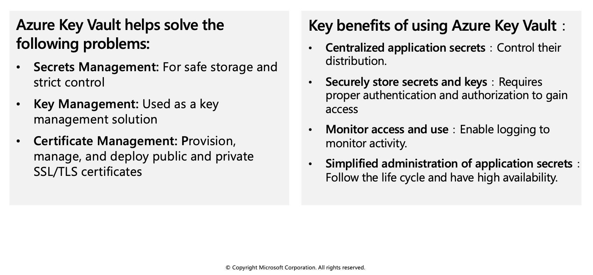
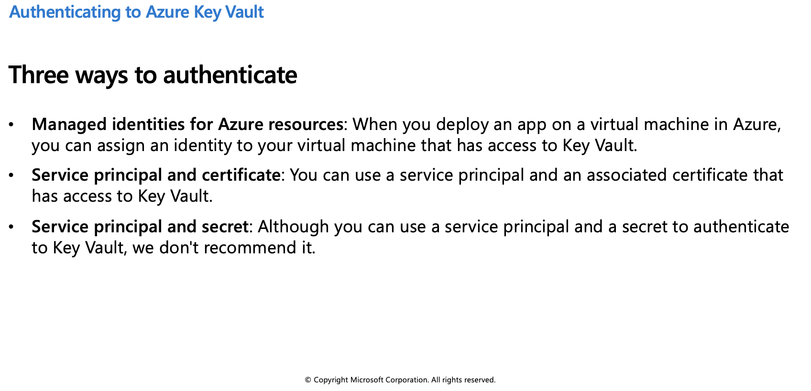
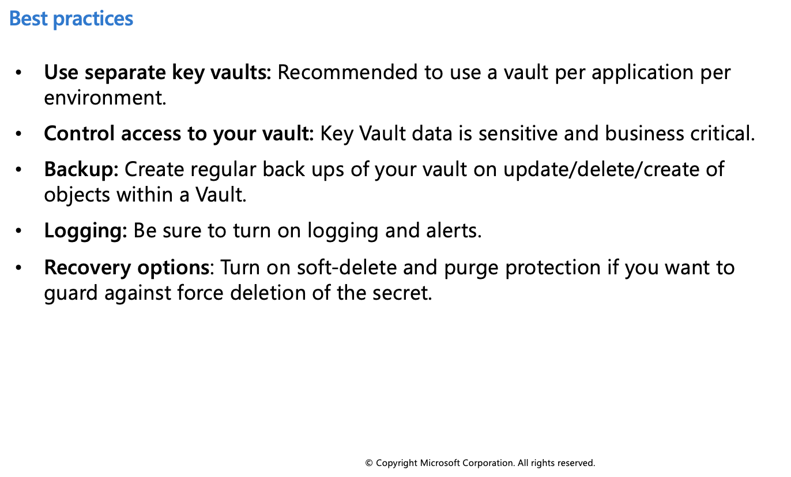
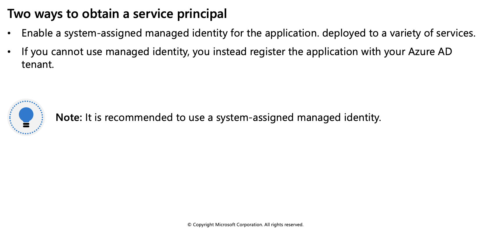
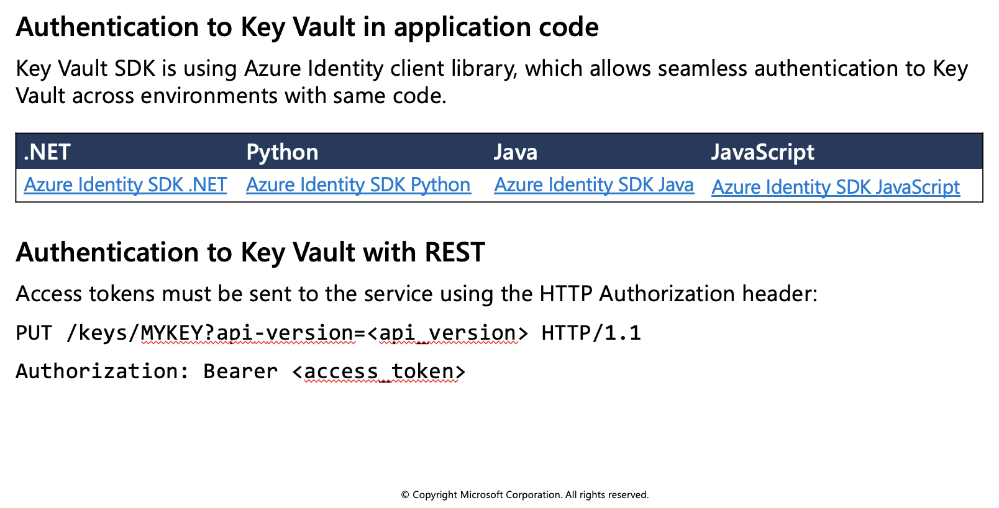
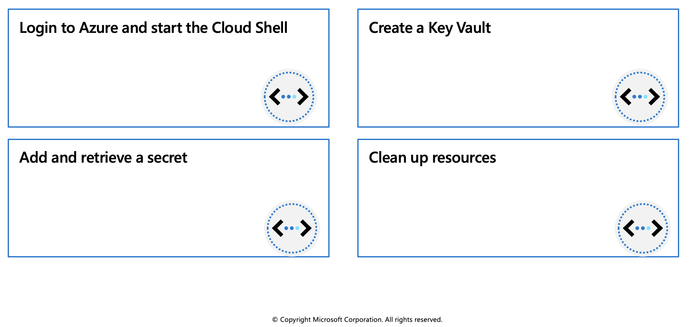

## Azure Key Vault

The Azure Key Vault service supports two types of containers: vaults and managed hardware security module(HSM) pools. Vaults support storing software and HSM-backed keys, secrets, and certificates. Managed HSM pools only support HSM-backed keys.



## Azure Key Vault best practices

Azure Key Vault is a tool for securely storing and accessing secrets. A secret is anything that you want to tightly control access to, such as API keys, passwords, or certificates. A vault is logical group of secrets.

### Authentication

To do any operations with Key Vault, you first need to authenticate to it. There are three ways to authenticate to Key Vault:



### Encryption of data in transit

Azure Key Vault enforces Transport Layer Security (TLS) protocol to protect data when it’s traveling between Azure Key Vault and clients. Clients negotiate a TLS connection with Azure Key Vault. TLS provides strong authentication, message privacy, and integrity (enabling detection of message tampering, interception, and forgery), interoperability, algorithm flexibility, and ease of deployment and use.

Perfect Forward Secrecy (PFS) protects connections between customers’ client systems and Microsoft cloud services by unique keys. Connections also use RSA-based 2,048-bit encryption key lengths. This combination makes it difficult for someone to intercept and access data that is in transit.

### Azure Key Vault best practices



## Authenticate to Azure Key Vault

Authentication with Key Vault works in conjunction with Azure Active Directory, which is responsible for authenticating the identity of any given security principal.




Below is information on authenticating to Key Vault without using a managed identity.



### Additional resources

 * [Azure Key Vault developer's guide](https://learn.microsoft.com/en-us/azure/key-vault/general/developers-guide)
 * [Azure Key Vault availability and redundancy](https://learn.microsoft.com/en-us/azure/key-vault/general/disaster-recovery-guidance)

## Exercise: Set and retrieve a secret from Azure Key Vault by using Azure CLI



In this exercise you'll learn how to perform the following actions by using the Azure CLI:

 * Create a Key Vault
 * Add and retrieve a secret

### Prerequisites

  * An Azure account with an active subscription. If you don't already have one, [follow this instructions](https://docs.google.com/document/d/1XEkiGWUC4_AzngZQLQnVt8yWCb3dft1HzXglUnJcJzM/edit#heading=h.c96x7dxoz6ej).
   

### Login to Azure and start the Cloud Shell
1. Login to the [Azure Portal](https://portal.azure.com/) and open the Cloud Shell.


2. After the shell opens be sure to select the Bash environment.


### Create a Key Vault

1. Create a secret. Let's add a password that could be used by an app. The password will be called **ExamplePassword** and will store the value of **hVFkk965BuUv** in it.

```azurecli-interactive
az keyvault secret set --vault-name $myKeyVault --name "ExamplePassword" --value "hVFkk965BuUv"
```

2. Use the `az keyvault secret show` command to retrieve the secret.

```azurecli-interactive
az keyvault secret show --name "ExamplePassword" --vault-name $myKeyVault
```

This command will return some JSON. The last line will contain the password in plain text.

```azurecli-interactive
"value": "hVFkk965BuUv"
```

You have created a Key Vault, stored a secret, and retrieved it.

### Clean up resources

When you no longer need the resources in this exercise use the following command to delete the resource group and associated Key Vault.

```azurecli-interactive
az group delete --name az204-vault-rg --no-wait
```

> **Note**: This operation takes on average 5 - 10 minutes
