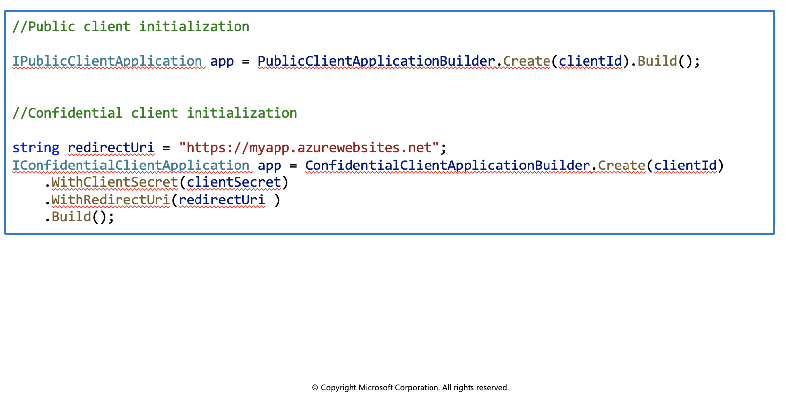

## Microsoft Authentication Library

The Microsoft Authentication Library (MSAL) can be used to provide secure access to Microsoft Graph, other Microsoft APIs, third-party web APIs, or your own web API. MSAL supports many different application architectures and platforms including .NET, JavaScript, Java, Python, Android, and iOS.

MSAL gives you many ways to get tokens, with a consistent API for a number of platforms. Using MSAL provides the following benefits:

  * No need to directly use the OAuth libraries or code against the protocol in your application.
  * Acquires tokens on behalf of a user or on behalf of an application (when applicable to the platform).
  * Maintains a token cache and refreshes tokens for you when they are close to expire. You don't need to handle token expiration on your own.
  * Helps you specify which audience you want your application to sign in.
  * Helps you set up your application from configuration files.
  * Helps you troubleshoot your app by exposing actionable exceptions, logging, and telemetry.

### Application types and scenarios

Using MSAL, a token can be acquired from a number of application types: web applications, web APIs, single-page apps (JavaScript), mobile and native applications, and daemons and server-side applications. MSAL currently supports the platforms and frameworks listed in the table below.


### Authentication flows

Below are some of the different authentication flows provided by Microsoft Authentication Library (MSAL). These flows can be used in a variety of different application scenarios.

There are several components that make up the Microsoft identity platform:


### Public client, and confidential client applications

Security tokens can be acquired by multiple types of applications. These applications tend to be separated into the following two categories. Each is used with different libraries and objects.

  * **Public client applications:** Are apps that run on devices or desktop computers or in a web browser. They're not trusted to safely keep application secrets, so they only access web APIs on behalf of the user. (They support only public client flows.) Public clients can't hold configuration-time secrets, so they don't have client secrets.

  * **Confidential client applications:** Are apps that run on servers (web apps, web API apps, or even service/daemon apps). They're considered difficult to access, and for that reason capable of keeping an application secret. Confidential clients can hold configuration-time secrets. Each instance of the client has a distinct configuration (including client ID and client secret).

## Initialize client applications

With MSAL.NET 3.x, the recommended way to instantiate an application is by using the application builders: `PublicClientApplicationBuilder` and `ConfidentialClientApplicationBuilder`. They offer a powerful mechanism to configure the application either from the code, or from a configuration file, or even by mixing both approaches.

Before initializing an application, you first need to register it so that your app can be integrated with the Microsoft identity platform. After registration, you may need the following information (which can be found in the Azure portal):

  * The client ID (a string representing a GUID)
  * The identity provider URL (named the instance) and the sign-in audience for your application. These two parameters are collectively known as the authority.
  * The tenant ID if you are writing a line of business application solely for your organization (also named single-tenant application).
  * The application secret (client secret string) or certificate (of type X509Certificate2) if it's a confidential client app.
  * For web apps, and sometimes for public client apps (in particular when your app needs to use a broker), you'll have also set the redirectUri where the identity provider will contact back your application with the security tokens.



### Modifiers common to public and confidential client applications

The table below lists some of the modifiers you can set on a public, or client confidential client.


### Modifiers specific to confidential client applications

The modifiers you can set on a confidential client application builder are:


## Exercise: Implement interactive authentication by using MSAL.NET

In this exercise you'll learn how to perform the following actions:

  * Register an application with the Microsoft identity platform
  * Use the PublicClientApplicationBuilder class in MSAL.NET
  * Acquire a token interactively in a console application

### Register a new application

1. Sign in to the portal: https://portal.azure.com

2. Search for and select Azure Active Directory.

3. Under Manage, select App registrations > New registration.

4. When the Register an application page appears, enter your application's registration information:

|**Field** | **Value** |
| -------- | --------- |
|Name	| `az204appreg`|
|Supported account types	| Select **Accounts in this organizational directory only**|
|Redirect URI (optional)	|Select **Public client/native (mobile & desktop)** and enter `http://localhost` in the box to the right.|

Below are more details on the Supported account types.

5. Select **Register**.

Azure Active Directory assigns a unique application (client) ID to your app, and you're taken to your application's **Overview** page.

### Set up the console application

1. Launch Visual Studio Code and open a terminal by selecting Terminal and then New Terminal.

2. Create a folder for the project and change in to the folder.

```azurecli-interactive
md az204-auth
cd az204-auth
```

3. Create the .NET console app.

```azurecli-interactive
dotnet new console
```

4. Open the az204-auth folder in VS Code.

```azurecli-interactive
code . -r
```

### Build the console app

In this section you will add the necessary packages and code to the project.

### Add packages and using statements

1. Add the `Microsoft.Identity.Client` package to the project in a terminal in VS Code.

```azurecli-interactive
dotnet add package Microsoft.Identity.Client
```

2. Open the Program.cs file and add `using` statements to include `Microsoft.Identity.Client` and to enable async operations.

```azurecli-interactive
using System.Threading.Tasks;
using Microsoft.Identity.Client;
```

3. Change the Main method to enable async.

```azurecli-interactive
public static async Task Main(string[] args)
```

### Add code for the interactive authentication

1. We'll need two variables to hold the Application (client) and Directory (tenant) IDs. You can copy those values from the portal. Add the code below and replace the string values with the appropriate values from the portal.

```azurecli-interactive
private const string _clientId = "APPLICATION_CLIENT_ID";
private const string _tenantId = "DIRECTORY_TENANT_ID";
```

2. Use the `PublicClientApplicationBuilder` class to build out the authorization context.

```azurecli-interactive
var app = PublicClientApplicationBuilder
    .Create(_clientId)
    .WithAuthority(AzureCloudInstance.AzurePublic, _tenantId)
    .WithRedirectUri("http://localhost")
    .Build();
```

|**Code** | **Description** |
| --- | --- |
| `.Create` | Creates a `PublicClientApplicationBuilder` from a clientID.|
|`.WithAuthority`		| Adds a known Authority corresponding to an ADFS server. In the code we're specifying the Public cloud, and using the tenant for the app we registered.|
