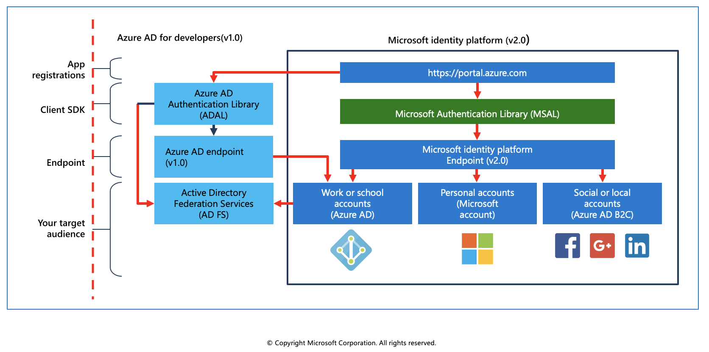
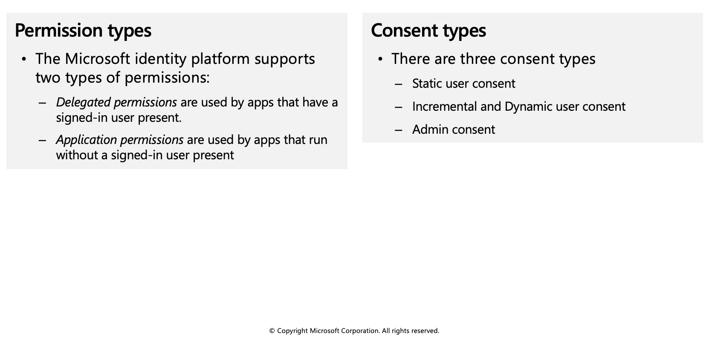
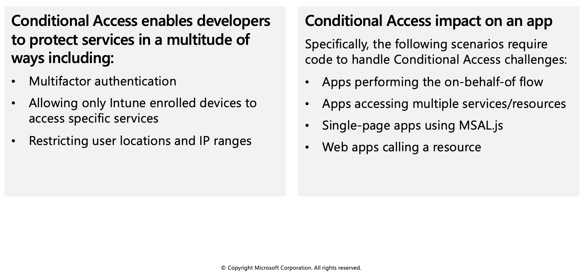

## Microsoft identity platform

The Microsoft identity platform helps you build applications your users and customers can sign in to using their Microsoft identities or social accounts, and provide authorized access to your own APIs or Microsoft APIs like Microsoft Graph.



There are several components that make up the Microsoft identity platform:

  * **OAuth 2.0 and OpenID Connect standard-compliant authentication service** enabling developers to authenticate several identity types, including:

    * Work or school accounts, provisioned through Azure Active Directory
    * Personal Microsoft account, like Skype, Xbox, and Outlook.com
    * Social or local accounts, by using Azure Active Directory B2C

  * **Open-source libraries:** Microsoft Authentication Libraries (MSAL) and support for other standards-compliant libraries

  * **Application management portal:** A registration and configuration experience in the Azure portal, along with the other Azure management capabilities.

  * **Application configuration API and PowerShell:** Programmatic configuration of your applications through the Microsoft Graph API and PowerShell so you can automate your DevOps tasks.

For developers, the Microsoft identity platform offers integration of modern innovations in the identity and security space like passwordless authentication, step-up authentication, and Conditional Access. You don’t need to implement such functionality yourself: applications integrated with the Microsoft identity platform natively take advantage of such innovations.

## Service Principals

To delegate Identity and Access Management functions to Azure Active Directory, an application must be registered with an Azure Active Directory tenant. When you register your application with Azure Active Directory, you're creating an identity configuration for your application that allows it to integrate with Azure Active Directory. 

When you register an app in the Azure portal, you choose whether it is:

  * **Single tenant:** only accessible in your tenant
  * **Multi-tenant:** accessible in other tenants

If you register an application in the portal, an application object (the globally unique instance of the app) as well as a service principal object are automatically created in your home tenant. You also have a globally unique ID for your app (the app or client ID). In the portal, you can then add secrets or certificates and scopes to make your app work, customize the branding of your app in the sign-in dialog, and more.

### Application object

An Azure Active Directory application is defined by its one and only application object, which resides in the Azure Active Directory tenant where the application was registered (known as the application's "home" tenant). An application object is used as a template or blueprint to create one or more service principal objects. A service principal is created in every tenant where the application is used. Similar to a class in object-oriented programming, the application object has some static properties that are applied to all the created service principals (or application instances).

The application object describes three aspects of an application: how the service can issue tokens in order to access the application, resources that the application might need to access, and the actions that the application can take.

The Microsoft Graph Application entity defines the schema for an application object's properties.

### Service principal object

To access resources that are secured by an Azure Active Directory tenant, the entity that requires access must be represented by a security principal. This is true for both users (user principal) and applications (service principal).

The security principal defines the access policy and permissions for the user/application in the Azure Active Directory tenant. This enables core features such as authentication of the user/application during sign-in, and authorization during resource access.

There are three types of service principal:

  * **Application** - This type of service principal is the local representation, or application instance, of a global application object in a single tenant or directory. A service principal is created in each tenant where the application is used and references the globally unique app object. The service principal object defines what the app can actually do in the specific tenant, who can access the app, and what resources the app can access.

  * **Managed identity** - This type of service principal is used to represent a managed identity. Managed identities provide an identity for applications to use when connecting to resources that support Azure Active Directory authentication. When a managed identity is enabled, a service principal representing that managed identity is created in your tenant. Service principals representing managed identities can be granted access and permissions, but cannot be updated or modified directly.

  * **Legacy** - This type of service principal represents a legacy app, which is an app created before app registrations were introduced or an app created through legacy experiences. A legacy service principal can have credentials, service principal names, reply URLs, and other properties that an authorized user can edit, but does not have an associated app registration. The service principal can only be used in the tenant where it was created.

### Relationship between application objects and service principals

The application object is the global representation of your application for use across all tenants, and the service principal is the local representation for use in a specific tenant. The application object serves as the template from which common and default properties are derived for use in creating corresponding service principal objects.

An application object has:

  * A 1:1 relationship with the software application, and
  * A 1:many relationship with its corresponding service principal object(s).

A service principal must be created in each tenant where the application is used, enabling it to establish an identity for sign-in and/or access to resources being secured by the tenant. A single-tenant application has only one service principal (in its home tenant), created and consented for use during application registration. A multi-tenant application also has a service principal created in each tenant where a user from that tenant has consented to its use.

## Permissions and consent

Applications that integrate with the Microsoft identity platform follow an authorization model that gives users and administrators control over how data can be accessed.

The Microsoft identity platform implements the OAuth 2.0 authorization protocol. OAuth 2.0 is a method through which a third-party app can access web-hosted resources on behalf of a user. Any web-hosted resource that integrates with the Microsoft identity platform has a resource identifier, or application ID URI.

Here are some examples of Microsoft web-hosted resources:

  * Microsoft Graph: `https://graph.microsoft.com`
  * Microsoft 365 Mail API: `https://outlook.office.com
  * Azure Key Vault: `https://vault.azure.net`



### Requesting individual user consent

In an OpenID Connect or OAuth 2.0 authorization request, an app can request the permissions it needs by using the scope query parameter. For example, when a user signs in to an app, the app sends a request like the following example. Line breaks are added for legibility.

```azurecli-interactive
GET https://login.microsoftonline.com/common/oauth2/v2.0/authorize?
client_id=6731de76-14a6-49ae-97bc-6eba6914391e
&response_type=code
&redirect_uri=http%3A%2F%2Flocalhost%2Fmyapp%2F
&response_mode=query
&scope=
https%3A%2F%2Fgraph.microsoft.com%2Fcalendars.read%20
https%3A%2F%2Fgraph.microsoft.com%2Fmail.send
&state=12345
```

## Conditional access

The Conditional Access feature in Azure Active Directory offers one of several ways that you can use to secure your app and protect a service. Conditional Access enables developers and enterprise customers to protect services in a multitude of ways including:

  * Multifactor authentication
  * Allowing only Intune enrolled devices to access specific services
  * Restricting user locations and IP ranges



### Conditional Access examples

Some scenarios require code changes to handle Conditional Access whereas others work as is. Here are a few scenarios using Conditional Access to do multifactor authentication that gives some insight into the difference.

  * You are building a single-tenant iOS app and apply a Conditional Access policy. The app signs in a user and doesn't request access to an API. When the user signs in, the policy is automatically invoked and the user needs to perform multifactor authentication.

  * You are building an app that uses a middle tier service to access a downstream API. An enterprise customer at the company using this app applies a policy to the downstream API. When an end user signs in, the app requests access to the middle tier and sends the token. The middle tier performs on-behalf-of flow to request access to the downstream API. At this point, a claims "challenge" is presented to the middle tier. The middle tier sends the challenge back to the app, which needs to comply with the Conditional Access policy.
