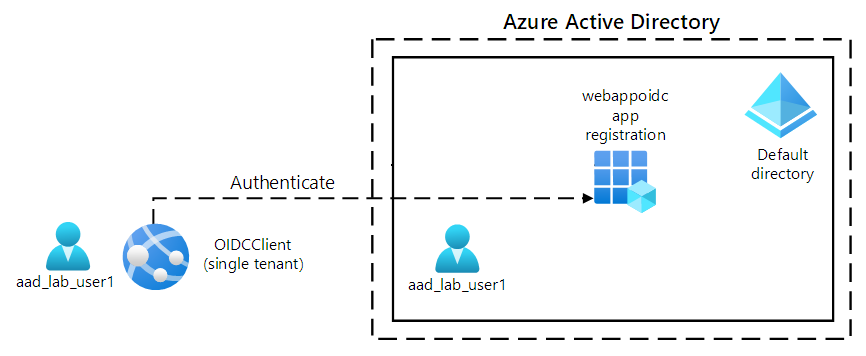

# Implement use authentication and authorization

## About the module

Learn how to implement authentication and authorization to resources by using the Microsoft identity platform, Microsoft Authentication Library, shared access signatures, and use Microsoft Graph.

## Modules in this learning path:

* [Explore the Microsoft identity platform](https://github.com/airan-tw/azure_training/blob/main/M3/Implement%20use%20authentication%20and%20authorization/Implement_auth.md)
* [Implement authentication by using the Microsoft Authentication Library](https://github.com/airan-tw/azure_training/blob/main/M3/Implement%20use%20authentication%20and%20authorization/Microsoft_id_platform.md)
* [Implement shared access signatures](https://github.com/airan-tw/azure_training/blob/main/M3/Implement%20use%20authentication%20and%20authorization/Implement_shared_access.md)
* [Explore Microsoft Graph](https://github.com/airan-tw/azure_training/blob/main/M3/Implement%20use%20authentication%20and%20authorization/Microsoft_graph.md)

 

## Hands-on Labs 

### Labs Diagram

 

* [Lab 01: Configure a single-tenant Azure AD environment](https://github.com/airan-tw/azure_training/blob/main/M3/Implement%20use%20authentication%20and%20authorization/lab01.md)
* [Lab 02: Create a single-tenant ASP.NET web app](https://github.com/airan-tw/azure_training/blob/main/M3/Implement%20use%20authentication%20and%20authorization/lab02.md)
* [Lab 03: Clean up your lab environment](https://github.com/airan-tw/azure_training/blob/main/M3/Implement%20use%20authentication%20and%20authorization/lab03.md)
