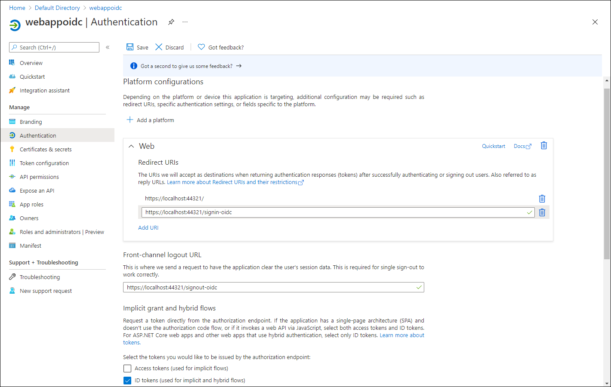

## Lab 1: Configure a single-tenant Azure AD environment

### Task 1: Open the Azure portal

1.  On the taskbar, select the **Microsoft Edge** icon.

1.  In the open browser window, browse to the Azure portal ([portal.azure.com](https://portal.azure.com)), and then sign in with the account you'll use for this lab.

    > **Note**: If this is your first time signing in to the Azure portal, you'll be offered a tour of the portal. Select **Get Started** to skip the tour and begin using the portal.

### Task 2: Register an application in Azure AD

1.  In the Azure portal, use the **Search resources, services, and docs** text box to search for **Azure Active Directory** and, in the list of results, select **Azure Active Directory**.

    > **Note**: This redirects your browser session to the blade of the Azure Active Directory (Azure AD) tenant associated with your Azure subscription.

1.  On the **Azure Active Directory** blade, select **App registrations** in the **Manage** section.

1.  In the **App registrations** section, select **+ New registration**.

1.  In the **Register an application** section, perform the following actions, and then select **Register**:
    
    | Setting | Action |
    | -- | -- |
    | **Name** text box | Enter **webappoidc** |
    | **Supported account types** list | Select **Accounts in this organizational directory only (Default Directory only - Single tenant)** |

    > **Note**: The name of the tenant might differ depending on your Azure subscription.
   
    The following screenshot displays the configured settings in the **Register an application** section.
          
     
      
    
### Task 3: Record unique identifiers

1.  On the **webappoidc** application registration blade, select **Overview**.

1.  In the **Overview** section, find and record the value of the **Application (client) ID** text box. You'll use this value later in the lab.

1.  In the **Overview** section, find and record the value of the **Directory (tenant) ID** text box. You'll use this value later in the lab.

### Task 4: Configure the application authentication settings

1.  On the **webappoidc** application registration blade, select **Authentication** in the **Manage** section.

1.  In the **Authentication** section, perform the following actions, and select **Configure**:

    | Setting | Action |
    | -- | -- |
    | **Platform configurations** section | Select **+ Add a platform** |
    | **Configure platforms** blade | Select **Web** |
    | **Redirect URIs** text box | Enter `https://localhost:5001/` |
    | **Front-channel logout URL** text box | Enter `https://localhost:5001/signout-oidc` |
        
1. Back in the **Platform configurations** section, select **Add URI**, and then enter `https://localhost:5001/signin-oidc`.

1. In the **Implicit grant and hybrid flows** section, select **ID tokens (used for implicit and hybrid  flows)**. 

1. Select **Save**.

    The following screenshot displays the configured settings on the **Authentication** blade.
          
     
       

### Task 5: Create an Azure AD user

1.  In the Azure portal, select the **Cloud Shell** icon  to open a new PowerShell session. If Cloud Shell defaults to a Bash session, select **Bash** and then, in the drop down menu, select **PowerShell**.

     > **Note**: If this is the first time you're starting **Cloud Shell**, when prompted to select either **Bash** or **PowerShell**, select **PowerShell**. When the **You have no storage mounted** message appears, select the subscription you're using in this lab, and then select **Create storage**.

1.  In the **Cloud Shell** pane, run the following command to sign in to the Azure AD tenant associated with your Azure subscription:

      ```powershell
       Connect-AzureAD
      ```

1.  Run the following command to retrieve and display the primary Domain Name System (DNS) domain name of the Azure AD tenant:

       ```powershell
       $aadDomainName = ((Get-AzureAdTenantDetail).VerifiedDomains)[0].Name
       $aadDomainName
       ```

    > **Note**: Record the value of the DNS domain name. You'll use this value later in the lab.

1.  Run the following commands to create Azure AD users that you'll use to test Azure AD authentication:

       ```powershell
       $passwordProfile = New-Object -TypeName Microsoft.Open.AzureAD.Model.PasswordProfile
       $passwordProfile.Password = 'Pa55w.rd1234'
       $passwordProfile.ForceChangePasswordNextLogin = $false
       New-AzureADUser -AccountEnabled $true -DisplayName 'aad_lab_user1' -PasswordProfile $passwordProfile -MailNickName 'aad_lab_user1' -UserPrincipalName "aad_lab_user1@$aadDomainName" 
       ```

1.  Run the following command to identify the user principal name (UPN) of the newly created Azure AD user:

       ```powershell
       (Get-AzureADUser -Filter "MailNickName eq 'aad_lab_user1'").UserPrincipalName
       ```

    > **Note**: Record the UPN. You'll use this value later in the lab.

1.  Close the Cloud Shell pane.

## Review

In this exercise, you registered a single-tenant Azure AD application and created an Azure AD user account.
