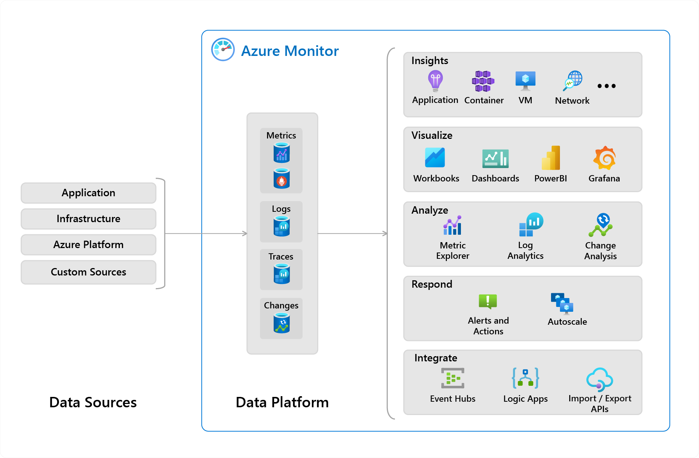

## Azure Monitor

Azure Monitor delivers a comprehensive solution for collecting, analyzing, and acting on telemetry from your cloud and on-premises environments.

The following diagram is a high-level view of Azure Monitor.

  * At the center of the diagram, you'll find the data stores for metrics and logs and changes. These data stores are the fundamental types of data used by Azure Monitor.
  * On the left are the sources of monitoring data that populate the data stores.
  * On the right are the different functions that Azure Monitor performs with this collected data. This diagram includes such actions as analysis, alerting, and integration such as streaming to external systems.

### What data does Azure Monitor collect?

Metrics, logs, and distributed traces are commonly referred to as the three pillars of observability.

|**Pillar** | **Description** |
| --- | --- |
|Metrics | Metrics are numerical values that describe some aspect of a system at a particular point in time. They're collected at regular intervals and are identified with a timestamp, a name, a value, and one or more defining labels.|
|Logs	| Logs are events that occurred within the system. They can contain different kinds of data and may be structured or free-form text with a timestamp.|
|Distributed traces	|Traces are series of related events that follow a user request through a distributed system.|
|Changes	| Changes are a series of events that occur in your Azure application and resources. Change Analysis tracks changes and is a subscription-level observability tool that's built on the power of Azure Resource Graph.|

### Insights and curated visualizations

Monitoring data is only useful if it can increase your visibility into the operation of your computing environment. Some Azure resource providers have a "curated visualization" which gives you a customized monitoring experience for that particular service or set of services. They generally require minimal configuration. Larger scalable curated visualizations are known as "insights" and marked with that name in the documentation and Azure portal. Some examples are:

  * **Application Insights**: Application Insights monitors the availability, performance, and usage of your web applications whether they're hosted in the cloud or on-premises. It leverages the powerful data analysis platform in Azure Monitor to provide you with deep insights into your application's operations. It enables you to diagnose errors without waiting for a user to report them.

  * **Container Insights**: Container Insights monitors the performance of container workloads that are deployed to managed Kubernetes clusters hosted on Azure Kubernetes Service (AKS) and Azure Container Instances. It gives you performance visibility by collecting metrics from controllers, nodes, and containers that are available in Kubernetes through the Metrics API. Container logs are also collected.

  * **VM Insights**: VM Insights monitors your Azure virtual machines (VM) at scale. It analyzes the performance and health of your Windows and Linux VMs and identifies their different processes and interconnected dependencies on external processes.

## Application Insights

Application Insights is an extension of Azure Monitor and provides Application Performance Monitoring (also known as “APM”) features.

### Application Insights feature overview

Features include, but not limited to:

|**Feature** | **Description** |
| --- | --- |
|Live Metrics	 | Observe activity from your deployed application in real time with no effect on the host environment.|
|Availability	| Probe your applications external endpoint(s) to test the overall availability and responsiveness over time.|
|GitHub or Azure DevOps integration	|	Create GitHub or Azure DevOps work items in context of Application Insights data.|
|Usage	| Reveals which features are popular with users and how users interact and use your application.|
|Smart Detection	| Provides automatic failure and anomaly detection through proactive telemetry analysis.|
|Application Map		|	Allows a high level top-down view of the application architecture and at-a-glance visual references to component health and responsiveness.|
|Distributed Tracing		| Search and visualize an end-to-end flow of a given execution or transaction.|

More details on availability and Application Map are discussed later in this module.

### What Application Insights monitors

Application Insights collects Metrics and application Telemetry data, which describe application activities and health, as well as trace logging data.

  * **Request rates, response times, and failure rates** - Find out which pages are most popular, at what times of day, and where your users are. See which pages perform best. If your response times and failure rates go high when there are more requests, then perhaps you have a resourcing problem.
  * **Dependency rates, response times, and failure rates** - Find out whether external services are slowing you down.
  * **Exceptions** - Analyze the aggregated statistics, or pick specific instances and drill into the stack trace and related requests. Both server and browser exceptions are reported.
  * **Page views and load performance** - reported by your users' browsers.
  * **AJAX calls from web pages** - rates, response times, and failure rates.
  * **User and session counts.**
  * **Performance counters** from your Windows or Linux server machines, such as CPU, memory, and network usage.
  * **Host diagnostics** from Docker or Azure.
  * **Diagnostic trace logs from your app** - so that you can correlate trace events with requests.
  * **Custom events and metrics** that you write yourself in the client or server code, to track business events such as items sold or games won.

### Getting started with Application Insights

Application Insights is one of the many services hosted within Microsoft Azure, and telemetry is sent there for analysis and presentation. It's free to sign up, and if you choose the basic pricing plan of Application Insights, there's no charge until your application has grown to have substantial usage.

There are several ways to get started monitoring and analyzing app performance:

  * **At run time**: instrument your web app on the server. Ideal for applications already deployed. Avoids any update to the code.
  * **At development time**: add Application Insights to your code. Allows you to customize telemetry collection and send more telemetry.
  * **Instrument your web pages** for page view, AJAX, and other client-side telemetry.
  * **Analyze mobile app usage** by integrating with Visual Studio App Center.
  * **Availability tests** - ping your website regularly from our servers.

## Log-based metrics

Application Insights log-based metrics let you analyze the health of your monitored apps, create powerful dashboards, and configure alerts. There are two kinds of metrics:

  * **Log-based metrics** behind the scene are translated into Kusto queries from stored events.
  * **Standard metrics** are stored as pre-aggregated time series.

Since standard metrics are pre-aggregated during collection, they have better performance at query time. This makes them a better choice for dashboarding and in real-time alerting. The log-based metrics have more dimensions, which makes them the superior option for data analysis and ad-hoc diagnostics. Use the namespace selector to switch between log-based and standard metrics in metrics explorer.

## Instrument an app for monitoring

Application Insights is enabled through either Auto-Instrumentation (agent) or by adding the Application Insights SDK to your application code.

### Auto-instrumentation

Auto-instrumentation is the preferred instrumentation method. It requires no developer investment and eliminates future overhead related to updating the SDK. It's also the only way to instrument an application in which you don't have access to the source code.

In essence, all you have to do is enable and - in some cases - configure the agent, which will collect the telemetry automatically.

The list of services that are supported by auto-instrumentation changes rapidly, visit this page for a list of what is currently supported.

### Enabling via Application Insights SDKs

You only need to install the Application Insights SDK in the following circumstances:

  * You require custom events and metrics
  * You require control over the flow of telemetry
  * Auto-Instrumentation isn't available (typically due to language or platform limitations)

To use the SDK, you install a small instrumentation package in your app and then instrument the web app, any background components, and JavaScript within the web pages. The app and its components don't have to be hosted in Azure. The instrumentation monitors your app and directs the telemetry data to an Application Insights resource by using a unique token.

The Application Insights SDKs for .NET, .NET Core, Java, Node.js, and JavaScript all support distributed tracing natively.

Additionally, any technology can be tracked manually with a call to `TrackDependency` on the `TelemetryClient`.

### Enable via OpenCensus

In addition to the Application Insights SDKs, Application Insights also supports distributed tracing through OpenCensus. OpenCensus is an open source, vendor-agnostic, single distribution of libraries to provide metrics collection and distributed tracing for services. It also enables the open source community to enable distributed tracing with popular technologies like Redis, Memcached, or MongoDB.

## Select an availability test

After you've deployed your web app or website, you can set up recurring tests to monitor availability and responsiveness. Application Insights sends web requests to your application at regular intervals from points around the world. It can alert you if your application isn't responding or responds too slowly.

You can set up availability tests for any HTTP or HTTPS endpoint that's accessible from the public internet. You don't have to make any changes to the website you're testing. In fact, it doesn't even have to be a site that you own. You can test the availability of a REST API that your service depends on.

You can create up to 100 availability tests per Application Insights resource, and there are three types of availability tests:

  * **URL ping test (classic)**: You can create this simple test through the portal to validate whether an endpoint is responding and measure performance associated with that response. You can also set custom success criteria coupled with more advanced features, like parsing dependent requests and allowing for retries.
  * **Standard test (Preview)**: This single request test is similar to the URL ping test. It includes SSL certificate validity, proactive lifetime check, HTTP request verb (for example GET, HEAD, or POST), custom headers, and custom data associated with your HTTP request.
  * **Custom TrackAvailability test**: If you decide to create a custom application to run availability tests, you can use the TrackAvailability() method to send the results to Application Insights.

## Troubleshoot app performance by using Application Map

Application Map helps you spot performance bottlenecks or failure hotspots across all components of your distributed application. Each node on the map represents an application component or its dependencies; and has health KPI and alerts status. You can click through from any component to more detailed diagnostics, such as Application Insights events. If your app uses Azure services, you can also click through to Azure diagnostics, such as SQL Database Advisor recommendations.

Components are independently deployable parts of your distributed/microservices application. Developers and operations teams have code-level visibility or access to telemetry generated by these application components.

  * Components are different from "observed" external dependencies such as SQL, Event Hubs, etc. which your team/organization may not have access to (code or telemetry).
  * Components run on any number of server/role/container instances.
  * Components can be separate Application Insights instrumentation keys (even if subscriptions are different) or different roles reporting to a single Application Insights instrumentation key. The preview map experience shows the components regardless of how they are set up.

You can see the full application topology across multiple levels of related application components. Components could be different Application Insights resources, or different roles in a single resource. The app map finds components by following HTTP dependency calls made between servers with the Application Insights SDK installed.

This experience starts with progressive discovery of the components. When you first load the application map, a set of queries is triggered to discover the components related to this component. A button at the top-left corner will update with the number of components in your application as they are discovered.

On clicking "Update map components", the map is refreshed with all components discovered until that point. Depending on the complexity of your application, this may take a minute to load.

If all of the components are roles within a single Application Insights resource, then this discovery step is not required. The initial load for such an application will have all its components.

One of the key objectives with this experience is to be able to visualize complex topologies with hundreds of components. Click on any component to see related insights and go to the performance and failure triage experience for that component.

Application Map uses the cloud role name property to identify the components on the map. You can manually set or override the cloud role name and change what gets displayed on the Application Map.
