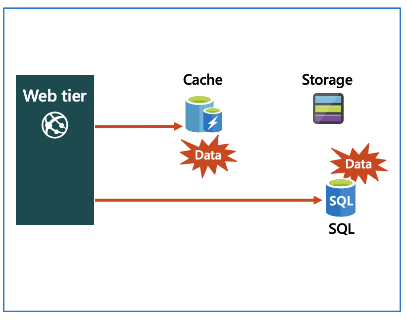
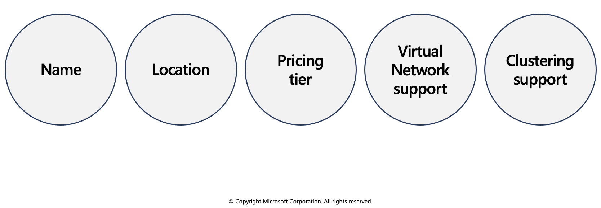
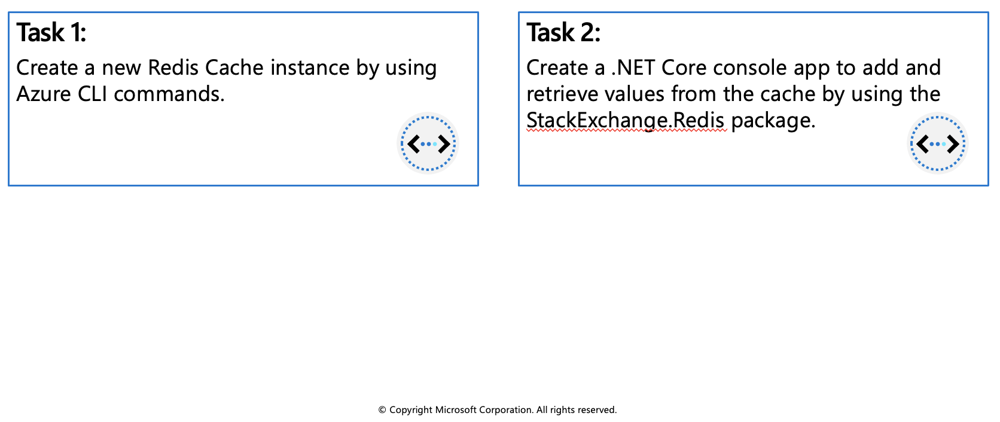

## Azure Cache for Redis

Azure Cache for Redis provides an in-memory data store based on the Redis software. Redis improves the performance and scalability of an application that uses backend data stores heavily. It's able to process large volumes of application requests by keeping frequently accessed data in the server memory, which can be written to and read from quickly. Redis brings a critical low-latency and high-throughput data storage solution to modern applications.

Azure Cache for Redis offers both the Redis open-source (OSS Redis) and a commercial product from Redis Labs (Redis Enterprise) as a managed service. It provides secure and dedicated Redis server instances and full Redis API compatibility. The service is operated by Microsoft, hosted on Azure, and usable by any application within or outside of Azure.



### Key scenarios

Azure Cache for Redis improves application performance by supporting common application architecture patterns. Some of the most common include the following patterns:

  * **Data cache** - Databases are often too large to load directly into a cache. It's common to use the cache-aside pattern to load data into the cache only as needed. When the system makes changes to the data, the system can also update the cache, which is then distributed to other clients.
  * **Content cache** - Many web pages are generated from templates that use static content such as headers, footers, banners. These static items shouldn't change often. Using an in-memory cache provides quick access to static content compared to backend datastores.
  * **Session store** - This pattern is commonly used with shopping carts and other user history data that a web application might associate with user cookies. Storing too much in a cookie can have a negative effect on performance as the cookie size grows and is passed and validated with every request. A typical solution uses the cookie as a key to query the data in a database. Using an in-memory cache, like Azure Cache for Redis, to associate information with a user is much faster than interacting with a full relational database.
  * **Job and message queuing** - Applications often add tasks to a queue when the operations associated with the request take time to execute. Longer running operations are queued to be processed in sequence, often by another server. This method of deferring work is called task queuing.
  * **Distributed transactions** - Applications sometimes require a series of commands against a backend data-store to execute as a single atomic operation. All commands must succeed, or all must be rolled back to the initial state. Azure Cache for Redis supports executing a batch of commands as a single transaction.

### Service tiers

Azure Cache for Redis is available in these tiers:

  * **Basic** - An OSS Redis cache running on a single VM. This tier has no service-level agreement (SLA) and is ideal for development/test and non-critical workloads.
  * **Standard** - An OSS Redis cache running on two VMs in a replicated configuration.
  * **Premium** - High-performance OSS Redis caches. This tier offers higher throughput, lower latency, better availability, and more features. Premium caches are deployed on more powerful VMs compared to the VMs for Basic or Standard caches.
  * **Enterprise** - High-performance caches powered by Redis Labs' Redis Enterprise software. This tier supports Redis modules including RediSearch, RedisBloom, and RedisTimeSeries. Also, it offers even higher availability than the Premium tier.
  * **Enterprise Flash** - Cost-effective large caches powered by Redis Labs' Redis Enterprise software. This tier extends Redis data storage to non-volatile memory, which is cheaper than DRAM, on a VM. It reduces the overall per-GB memory cost.

## Configure Azure Cache for Redis

You can create a Redis cache using the Azure portal, the Azure CLI, or Azure PowerShell.

### Create and configure an Azure Cache for Redis instance

There are several parameters you will need to decide in order to configure the cache properly for your purposes.



### Name

The Redis cache will need a globally unique name. The name has to be unique within Azure because it is used to generate a public-facing URL to connect and communicate with the service.

The name must be between 1 and 63 characters, composed of numbers, letters, and the '-' character. The cache name can't start or end with the '-' character, and consecutive '-' characters aren't valid.

### Location

You will need to decide where the Redis cache will be physically located by selecting an Azure region. You should always place your cache instance and your application in the same region. Connecting to a cache in a different region can significantly increase latency and reduce reliability. If you are connecting to the cache outside of Azure, then select a location close to where the application consuming the data is running.

### Pricing tier

As mentioned in the last unit, there are three pricing tiers available for an Azure Cache for Redis.

  * **Basic**: Basic cache ideal for development/testing. Is limited to a single server, 53 GB of memory, and 20,000 connections. There is no SLA for this service tier.
  * **Standard**: Production cache which supports replication and includes an SLA. It supports two servers, and has the same memory/connection limits as the Basic tier.
  * **Premium**: Enterprise tier which builds on the Standard tier and includes persistence, clustering, and scale-out cache support. This is the highest performing tier with up to 530 GB of memory and 40,000 simultaneous connections.

You can control the amount of cache memory available on each tier - this is selected by choosing a cache level from C0-C6 for Basic/Standard and P0-P4 for Premium. 

### Virtual Network support

If you create a premium tier Redis cache, you can deploy it to a virtual network in the cloud. Your cache will be available to only other virtual machines and applications in the same virtual network. This provides a higher level of security when your service and cache are both hosted in Azure, or are connected through an Azure virtual network VPN.

### Clustering support

With a premium tier Redis cache, you can implement clustering to automatically split your dataset among multiple nodes. To implement clustering, you specify the number of shards to a maximum of 10. The cost incurred is the cost of the original node, multiplied by the number of shards.

### Accessing the Redis instance

Redis has a command-line tool for interacting with an Azure Cache for Redis as a client. The tool is available for Windows platforms by downloading the [Redis command-line tools for Windows](https://github.com/MSOpenTech/redis/releases/). If you want to run the command-line tool on another platform, download Azure Cache for Redis from `https://redis.io/download`.

Redis supports a set of known commands. A command is typically issued as `COMMAND parameter1 parameter2 parameter3`.


|**Command** | **Description** |
| -------- | --------- |
|`ping`	| Ping the server. Returns "PONG".|
|`set [key] [value]`	| Sets a key/value in the cache. Returns "OK" on success. |
|`get [key]`	|Gets a value from the cache. |
|`exists [key]` | Returns '1' if the **key** exists in the cache, '0' if it doesn't.|
|`type [key]` | Returns the type associated to the value for the given **key**. |
|`incr [key]`	| Increment the given value associated with **key** by '1'. The value must be an integer or double value. This returns the new value. |
|`incrby [key] [amount]`	| Increment the given value associated with **key** by the specified amount. The value must be an integer or double value. This returns the new value.|
|`del [key]`	| Deletes the value associated with the **key**. |
|`flushdb`	|Delete all keys and values in the database.|

Below is an example of a command:

```azurecli-interactive
> set somekey somevalue
OK
> get somekey
"somevalue"
> exists somekey
(string) 1
> del somekey
(string) 1
> exists somekey
(string) 0
```

### Adding an expiration time to values

Caching is important because it allows us to store commonly used values in memory. However, we also need a way to expire values when they are stale. In Redis this is done by applying a time to live (TTL) to a key.

When the TTL elapses, the key is automatically deleted, exactly as if the DEL command were issued. Here are some notes on TTL expirations.

 * Expirations can be set using seconds or milliseconds precision.
 * The expire time resolution is always 1 millisecond.
 * Information about expires are replicated and persisted on disk, the time virtually passes when your Redis server remains stopped (this means that Redis saves the date at which a key will expire).

Here is an example of an expiration:

```azurecli-interactive
> set counter 100
OK
> expire counter 5
(integer) 1
> get counter
100
... wait ...
> get counter
(nil)
```

### Accessing a Redis cache from a client

To connect to an Azure Cache for Redis instance, you'll need several pieces of information. Clients need the host name, port, and an access key for the cache. You can retrieve this information in the Azure portal through the **Settings > Access Keys** page.

 * The host name is the public Internet address of your cache, which was created using the name of the cache. For example `sportsresults.redis.cache.windows.net`.

 * The access key acts as a password for your cache. There are two keys created: primary and secondary. You can use either key, two are provided in case you need to change the primary key. You can switch all of your clients to the secondary key, and regenerate the primary key. This would block any applications using the original primary key. Microsoft recommends periodically regenerating the keys - much like you would your personal passwords.

## Interact with Azure Cache for Redis by using .NET

Typically, a client application will use a client library to form requests and execute commands on a Redis cache. You can get a list of client libraries directly from the Redis clients page.

### Executing commands on the Redis cache

A popular high-performance Redis client for the .NET language is StackExchange.Redis. The package is available through NuGet and can be added to your .NET code using the command line or IDE. Below are examples of how to use the client.

### Connecting to your Redis cache with StackExchange.Redis

Recall that we use the host address, port number, and an access key to connect to a Redis server. Azure also offers a connection string for some Redis clients which bundles this data together into a single string. It will look something like the following (with the `cache-name` and `password-here` fields filled in with real values):

```azurecli-interactive
[cache-name].redis.cache.windows.net:6380,password=[password-here],ssl=True,abortConnect=False
```

You can pass this string to **StackExchange.Redis** to create a connection the server.

Notice that there are two additional parameters at the end:

 * **ssl** - ensures that communication is encrypted.
 * **abortConnection** - allows a connection to be created even if the server is unavailable at that moment.

There are several other optional parameters you can append to the string to configure the client library.

### Creating a connection

The main connection object in **StackExchange.Redis** is the `StackExchange.Redis.ConnectionMultiplexer` class. This object abstracts the process of connecting to a Redis server (or group of servers). It's optimized to manage connections efficiently and intended to be kept around while you need access to the cache.

You create a `ConnectionMultiplexer` instance using the static `ConnectionMultiplexer.Connect` or ConnectionMultiplexer.ConnectAsync method, passing in either a connection string or a ConfigurationOptions object.

Here's a simple example:

```azurecli-interactive
using StackExchange.Redis;
...
var connectionString = "[cache-name].redis.cache.windows.net:6380,password=[password-here],ssl=True,abortConnect=False";
var redisConnection = ConnectionMultiplexer.Connect(connectionString);
```

Once you have a `ConnectionMultiplexer`, there are 3 primary things you might want to do:

 * Access a Redis Database. This is what we will focus on here.
 * Make use of the publisher/subscriber features of Redis. This is outside the scope of this module.
 * Access an individual server for maintenance or monitoring purposes.

### Accessing a Redis database

The Redis database is represented by the `IDatabase` type. You can retrieve one using the `GetDatabase()` method:

```azurecli-interactive
IDatabase db = redisConnection.GetDatabase();
```

Once you have a `IDatabase` object, you can execute methods to interact with the cache. All methods have synchronous and asynchronous versions which return `Task` objects to make them compatible with the `async` and `await` keywords.

Here is an example of storing a key/value in the cache:

```azurecli-interactive
bool wasSet = db.StringSet("favorite:flavor", "i-love-rocky-road");
```

The `StringSet` method returns a `bool` indicating whether the value was set (`true`) or not (`false`). We can then retrieve the value with the `StringGet` method:

```azurecli-interactive
string value = db.StringGet("favorite:flavor");
Console.WriteLine(value); // displays: ""i-love-rocky-road""
```

### Getting and Setting binary values

Recall that Redis keys and values are binary safe. These same methods can be used to store binary data. There are implicit conversion operators to work with `byte[]` types so you can work with the data naturally:

```azurecli-interactive
byte[] key = ...;
byte[] value = ...;

db.StringSet(key, value);
```

```azurecli-interactive
byte[] key = ...;
byte[] value = db.StringGet(key);
```

**StackExchange.Redis** represents keys using the `RedisKey` type. This class has implicit conversions to and from both `string` and `byte[]`, allowing both text and binary keys to be used without any complication. Values are represented by the `RedisValue` type. As with `RedisKey`, there are implicit conversions in place to allow you to pass `string` or `byte[]`.

### Cleaning up the connection

Once you are done with the Redis connection, you can Dispose the ConnectionMultiplexer. This will close all connections and shutdown the communication to the server.

```azurecli-interactive
redisConnection.Dispose();
redisConnection = null;
```

## Exercise: Connect an app to Azure Cache for Redis by using .NET Core



In this exercise you will learn how to:

 * Create a new Redis Cache instance by using Azure CLI commands.
 * Create a .NET Core console app to add and retrieve values from the cache by using the StackExchange.Redis package.

### Prerequisites

 * **Azure Account** (https://docs.google.com/document/d/1XEkiGWUC4_AzngZQLQnVt8yWCb3dft1HzXglUnJcJzM/edit)
 * Visual Studio Code on one of the supported platforms.
 * The C# extension for Visual Studio Code.
 * .NET Core 3.1 is the target framework for the steps below.

### Create Azure resources

1. Login to the [Azure Portal](https://portal.azure.com/) and open the Cloud Shell.


2. After the shell opens be sure to select the Bash environment.


3. Create a resource group for Azure resources. 

```azurecli-interactive
az group create --name az204-redis-rg --location eastus
```

4. Create an Azure Cache for Redis instance by using the `az redis create` command. The instance name needs to be unique and the script below will attempt to generate one for you. This command will take a few minutes to complete.

```azurecli-interactive
redisName=az204redis$RANDOM
az redis create --location eastus \
    --resource-group az204-redis-rg \
    --name $redisName \
    --sku Basic --vm-size c0
```

5. In the Azure portal navigate to the new Redis Cache you created.

6. Select **Access keys** in the **Settings** section of the Navigation Pane and leave the portal open. We'll copy the **Primary connection string (StackExchange.Redis)** value to use in the app later.

### Create the console application

1. Create a console app by running the command below in the Visual Studio Code terminal.

```azurecli-interactive
dotnet new console -o Rediscache
```

2. Open the app in Visual Studio Code by selecting **File > Open Folder** and choosing the folder for the app.

3. Add the StackExchange.Redis package to the project.

```azurecli-interactive
dotnet add package StackExchange.Redis
```

4. In the Program.cs file add the using statement below at the top.

```azurecli-interactive
using StackExchange.Redis;
using System.Threading.Tasks;
```

5. Add the following variable to the `Program` class, replace `<REDIS_CONNECTION_STRING>` with the **Primary connection string (StackExchange.Redis)** from the portal.

```azurecli-interactive
// connection string to your Redis Cache    
static string connectionString = "REDIS_CONNECTION_STRING";
```

6. Replace the `Main` method with the following code.

```azurecli-interactive
static async Task Main(string[] args)
{
    // The connection to the Azure Cache for Redis is managed by the ConnectionMultiplexer class.
    using (var cache = ConnectionMultiplexer.Connect(connectionString))
    {
        IDatabase db = cache.GetDatabase();

        // Snippet below executes a PING to test the server connection
        var result = await db.ExecuteAsync("ping");
        Console.WriteLine($"PING = {result.Type} : {result}");

        // Call StringSetAsync on the IDatabase object to set the key "test:key" to the value "100"
        bool setValue = await db.StringSetAsync("test:key", "100");
        Console.WriteLine($"SET: {setValue}");

        // StringGetAsync takes the key to retrieve and return the value
        string getValue = await db.StringGetAsync("test:key");
        Console.WriteLine($"GET: {getValue}");

    }
}
```

7. In the Visual Studio Code terminal run the commands below to build the app to check for errors, and then run the app using the commands below.

```azurecli-interactive
dotnet build
dotnet run
```

The output should be similar to the following:

```azurecli-interactive
PING = SimpleString : PONG
SET: True
GET: 100
```

8. Return to the portal and select **Activity log** in the **Azure Cache for Redis** blade. You can view the operations in the log.

### Clean up resources

When the resources are no longer needed, you can use the `az group delete` command to remove the resource group.

```azurecli-interactive
az group delete -n az204-redis-rg --no-wait
```
