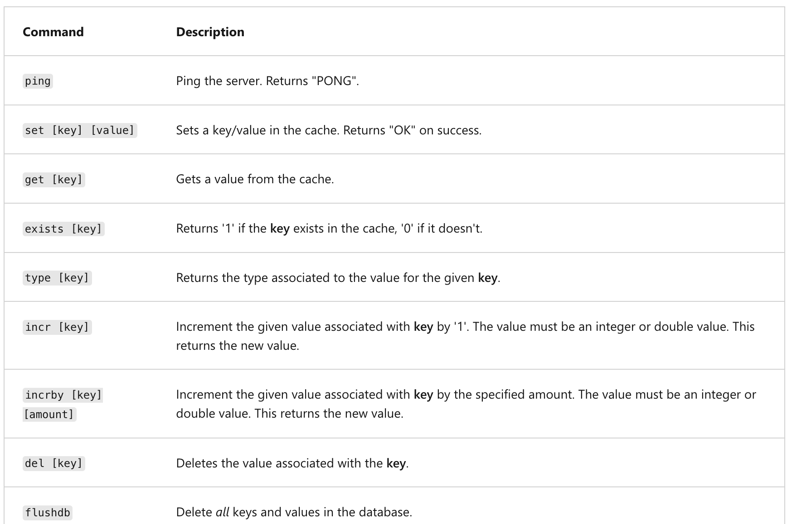

## Azure Cache for Redis

Azure Cache for Redis provides an in-memory data store based on the Redis software. Redis improves the performance and scalability of an application that uses backend data stores heavily. It's able to process large volumes of application requests by keeping frequently accessed data in the server memory, which can be written to and read from quickly. Redis brings a critical low-latency and high-throughput data storage solution to modern applications.

Azure Cache for Redis offers both the Redis open-source (OSS Redis) and a commercial product from Redis Labs (Redis Enterprise) as a managed service. It provides secure and dedicated Redis server instances and full Redis API compatibility. The service is operated by Microsoft, hosted on Azure, and usable by any application within or outside of Azure.


### Key scenarios

Azure Cache for Redis improves application performance by supporting common application architecture patterns. Some of the most common include the following patterns:

  * **Data cache** - Databases are often too large to load directly into a cache. It's common to use the cache-aside pattern to load data into the cache only as needed. When the system makes changes to the data, the system can also update the cache, which is then distributed to other clients.
  * **Content cache** - Many web pages are generated from templates that use static content such as headers, footers, banners. These static items shouldn't change often. Using an in-memory cache provides quick access to static content compared to backend datastores.
  * **Session store** - This pattern is commonly used with shopping carts and other user history data that a web application might associate with user cookies. Storing too much in a cookie can have a negative effect on performance as the cookie size grows and is passed and validated with every request. A typical solution uses the cookie as a key to query the data in a database. Using an in-memory cache, like Azure Cache for Redis, to associate information with a user is much faster than interacting with a full relational database.
  * **Job and message queuing** - Applications often add tasks to a queue when the operations associated with the request take time to execute. Longer running operations are queued to be processed in sequence, often by another server. This method of deferring work is called task queuing.
  * **Distributed transactions** - Applications sometimes require a series of commands against a backend data-store to execute as a single atomic operation. All commands must succeed, or all must be rolled back to the initial state. Azure Cache for Redis supports executing a batch of commands as a single transaction.

### Service tiers

Azure Cache for Redis is available in these tiers:

  * **Basic** - An OSS Redis cache running on a single VM. This tier has no service-level agreement (SLA) and is ideal for development/test and non-critical workloads.
  * **Standard** - An OSS Redis cache running on two VMs in a replicated configuration.
  * **Premium** - High-performance OSS Redis caches. This tier offers higher throughput, lower latency, better availability, and more features. Premium caches are deployed on more powerful VMs compared to the VMs for Basic or Standard caches.
  * **Enterprise** - High-performance caches powered by Redis Labs' Redis Enterprise software. This tier supports Redis modules including RediSearch, RedisBloom, and RedisTimeSeries. Also, it offers even higher availability than the Premium tier.
  * **Enterprise Flash** - Cost-effective large caches powered by Redis Labs' Redis Enterprise software. This tier extends Redis data storage to non-volatile memory, which is cheaper than DRAM, on a VM. It reduces the overall per-GB memory cost.

## Configure Azure Cache for Redis

You can create a Redis cache using the Azure portal, the Azure CLI, or Azure PowerShell.

### Create and configure an Azure Cache for Redis instance

There are several parameters you will need to decide in order to configure the cache properly for your purposes.


### Name

The Redis cache will need a globally unique name. The name has to be unique within Azure because it is used to generate a public-facing URL to connect and communicate with the service.

The name must be between 1 and 63 characters, composed of numbers, letters, and the '-' character. The cache name can't start or end with the '-' character, and consecutive '-' characters aren't valid.

### Location

You will need to decide where the Redis cache will be physically located by selecting an Azure region. You should always place your cache instance and your application in the same region. Connecting to a cache in a different region can significantly increase latency and reduce reliability. If you are connecting to the cache outside of Azure, then select a location close to where the application consuming the data is running.

### Pricing tier

As mentioned in the last unit, there are three pricing tiers available for an Azure Cache for Redis.

  * **Basic**: Basic cache ideal for development/testing. Is limited to a single server, 53 GB of memory, and 20,000 connections. There is no SLA for this service tier.
  * **Standard**: Production cache which supports replication and includes an SLA. It supports two servers, and has the same memory/connection limits as the Basic tier.
  * **Premium**: Enterprise tier which builds on the Standard tier and includes persistence, clustering, and scale-out cache support. This is the highest performing tier with up to 530 GB of memory and 40,000 simultaneous connections.

You can control the amount of cache memory available on each tier - this is selected by choosing a cache level from C0-C6 for Basic/Standard and P0-P4 for Premium. 

### Virtual Network support

If you create a premium tier Redis cache, you can deploy it to a virtual network in the cloud. Your cache will be available to only other virtual machines and applications in the same virtual network. This provides a higher level of security when your service and cache are both hosted in Azure, or are connected through an Azure virtual network VPN.

### Clustering support

With a premium tier Redis cache, you can implement clustering to automatically split your dataset among multiple nodes. To implement clustering, you specify the number of shards to a maximum of 10. The cost incurred is the cost of the original node, multiplied by the number of shards.

### Accessing the Redis instance

Redis has a command-line tool for interacting with an Azure Cache for Redis as a client. The tool is available for Windows platforms by downloading the [Redis command-line tools for Windows](https://github.com/MSOpenTech/redis/releases/). If you want to run the command-line tool on another platform, download Azure Cache for Redis from `https://redis.io/download`.

Redis supports a set of known commands. A command is typically issued as `COMMAND parameter1 parameter2 parameter3`.




|**Command** | **Description** |
| -------- | --------- |
|`ping`	| Ping the server. Returns "PONG".|
|`set [key] [value]`	| Sets a key/value in the cache. Returns "OK" on success. |
|`get [key]`	|Gets a value from the cache. |
|`exists [key]` | Returns '1' if the **key** exists in the cache, '0' if it doesn't.|
|`type [key]` | Returns the type associated to the value for the given **key**. |
|`incr [key]`	| Increment the given value associated with **key** by '1'. The value must be an integer or double value. This returns the new value. |
|`incrby [key] [amount]`	| Increment the given value associated with **key** by the specified amount. The value must be an integer or double value. This returns the new value.|
|`del [key]`	| Deletes the value associated with the **key**. |
|`flushdb`	|Delete all keys and values in the database.|

```azurecli-interactive
md az204-auth
cd az204-auth
```

