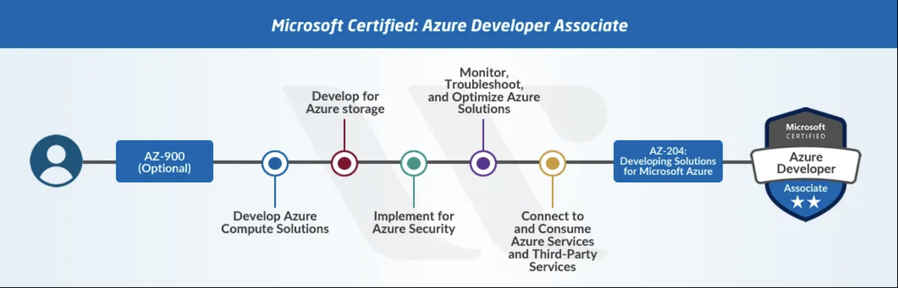

# Azure Journey - Learning Experience.

## Welcome

This repository is for training developers based on the content of the course AZ-204: Developing solutions for Microsoft Azure.

The objective of this course is to teach developers how to create end-to-end solutions in Microsoft Azure. Students will learn how to implement Azure compute solutions, create Azure Functions, implement and manage web apps, develop solutions utilizing Azure storage, implement authentication and authorization, and secure their solutions by using KeyVault and Managed Identities. Students will also learn how to connect to and consume Azure services and third-party services, and include event- and message-based models in their solutions. The course also covers monitoring, troubleshooting, and optimizing Azure solutions.

## Requirements

- **Azure Account** (https://docs.google.com/document/d/1XEkiGWUC4_AzngZQLQnVt8yWCb3dft1HzXglUnJcJzM/edit)
- **Azure Devops Account** (https://docs.google.com/document/d/12tL1KMNMq3IPNkeSPOVNTpzk0irfMFLNu68BLeUn-sI/edit?usp=sharing)
- Create a workspace for the course with the command: `$ mkdir $HOME\training-az204 && cd $HOME\training-az204`.
- Install Homebrew and type command `$ brew install wget` 
- Create a workspace for the course by executing the following command in a terminal: `mkdir $HOME\training-az204 && cd $HOME\training-az204`.
- Download the content into the workspace directory with `$ curl -o $HOME\training-az204\allfiles.zip https://github.com/MicrosoftLearning/AZ-204-DevelopingSolutionsforMicrosoftAzure/releases/download/v20210630.01/allfiles-v20210630.01.zip` and unzip with `$ unzip $HOME\training-az204\allfiles.zip`.

## About the AZ-204 Course

This course should help you understand what to expect on the exam and includes a summary of the topics the exam might cover and links to additional resources.

Exam AZ-204: Microsoft Azure Developer Associate – Skills Measured

 

## Develop Azure compute solutions (25-30%)

### [Implement IaaS solutions](M1/Implement%20Iaas%20solutions/README.md)

  * Provision virtual machines in Azure
  * Create and deploy Azure Resource Manager templates
  * Manage container images in Azure Container Registry
  * Run container images in Azure Container Instances

### [Create Azure App Service Web Apps](M1/Create%20Azure%20App%20Service%20Web%20Apps/README.md)

  * Create an Azure App Service Web App
  * Enable diagnostics logging
  * Configure web app settings
  * Implement autoscaling rules (schedule, operational/system metrics)

### [Implemente Azure functions](M1/Implement%20Azure%20functions/README.md)

  * Implement input and output bindings for a function
  * Implement function triggers by using data operations, timers, and webhooks
  * Implement Azure Durable Functions

 

## Develop for Azure storage (10-15%)

### [Develop solutions that use Cosmos DB storage](M2/Develop%20solutions%20that%20use%20Cosmos%20DB%20storage/README.md)

  * Select the appropriate API for your solution
  * Implement partitioning schemes
  * Interact with data using the appropriate SDK
  * Set the appropriate consistency level for operations
  * Create Cosmos DB containers

### [Develop solutions that use blob storage](M2/Develop%20solutions%20that%20use%20blob%20storage/README.md)

  * Move items in Blob storage between storage accounts or containers
  * Set and retrieve properties and metadata
  * Interact with data using the appropriate SDK
  * Implement data archiving and retention

 

## Implement Azure security (15-20%)

### [Implement use authentication and authorization](M3/Implement%20use%20authentication%20and%20authorization/README.md)

  * Implement OAuth2 authentication
  * Create and implement shared access signatures
  * Register apps and use Azure Active Directory to authenticate users

### [Implement secure cloud solutions](M3/Implement%20secure%20cloud%20solutions/README.md)

  * Secure app configuration data by using the App Configuration and KeyVault API
  * Manage keys, secrets, and certificates by using the KeyVault API
  * Implement Managed Identities for Azure resources

 

## Monitor, troubleshoot, and optimize Azure solutions (10-15%)

### [Integrate caching and content delivery within solutions](M4/Integrate%20caching%20and%20content%20delivery%20within%20solutions/README.md)

  * Develop code to implement CDN’s in solutions
  * Configure cache and expiration policies
  * Store and retrieve data in Azure Redis cache

### [Instrument solutions to support monitoring and logging](M4/Instrument%20solutions%20to%20support%20monitoring%20and%20logging/README.md)

  * Configure instrumentation in an app or service by using Application Insights
  * Analyze and troubleshoot solutions by using Azure Monitor
  * Implement Application Insights Web Test and Alerts
  * Implement code that handles transient faults

 

## Connect to and consume Azure services and third-party services (25-30%)

### [Develop an App Service Logic App](M5/Develop%20an%20App%20Service%20Logic%20App/README.md)

  * Create a Logic App
  * Create a custom connector for Logic Apps
  * Create a custom template for Logic Apps

### [Implement API Management](M5/Implement%20API%20Management/README.md)

  * Create an APIM instance
  * Configure authentication for APIs
  * Define policies for APIs

### [Develop event-based solutions](M5/Develop%20event-based%20solutions/README.md)

  * Implement solutions that use Azure Event Grid
  * Implement solutions that use Azure Notification Hubs
  * Implement solutions that use Azure Event Hub

### [Develop message-based solutions](M5/Develop%20message-based%20solutions/README.md)

  * Implement solutions that use Azure Service Bus
  * Implement solutions that use Azure Queue Storage queues
